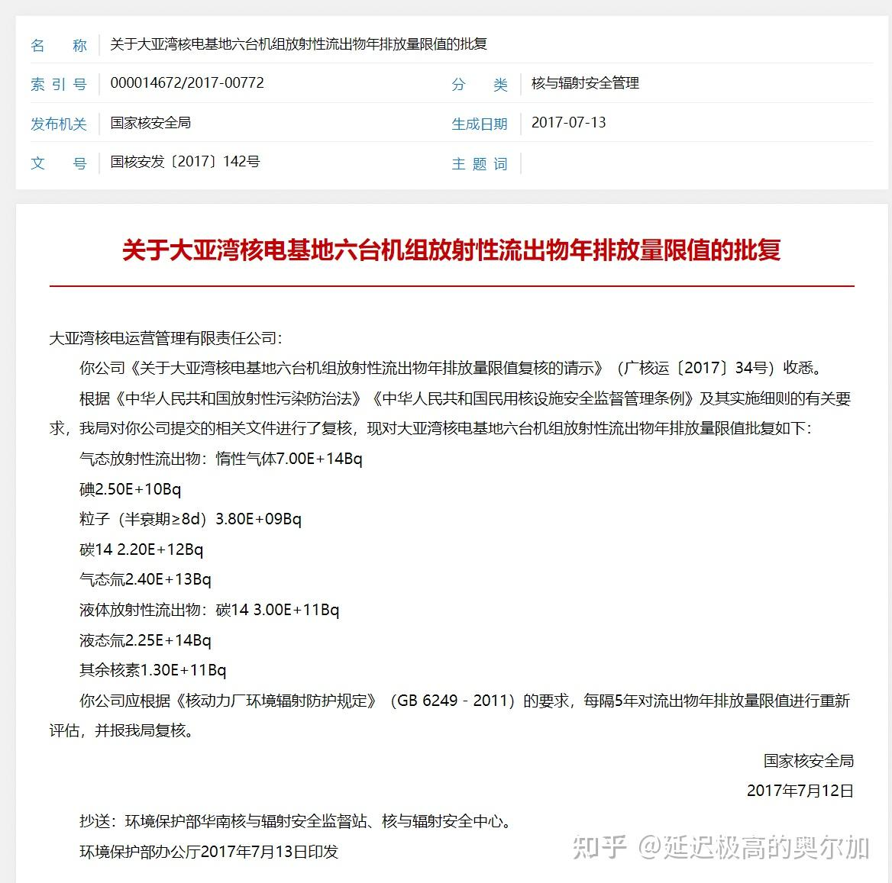
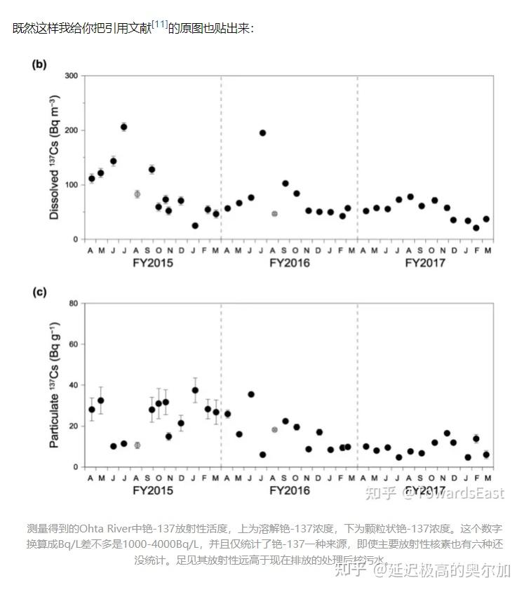
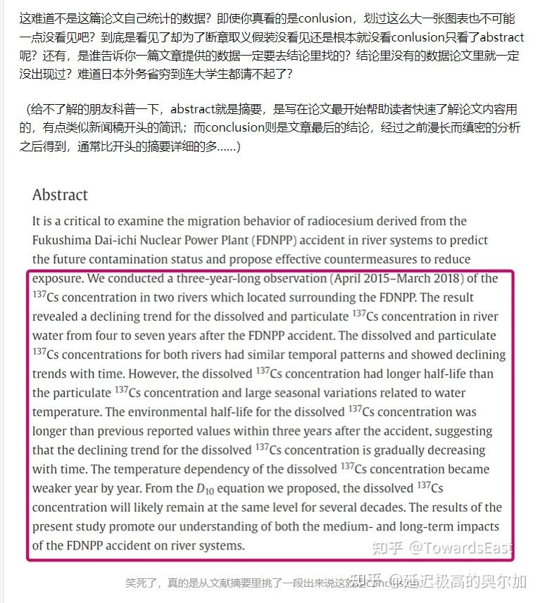
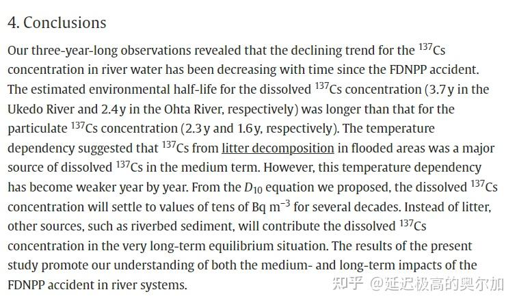
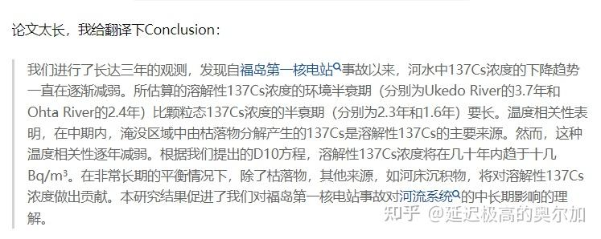
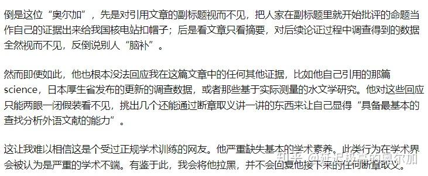

原文地址 [www.zhihu.com](https://www.zhihu.com/question/612891348/answer/3129783835) 

延迟极高的奥尔加​

这是大亚湾的排放量：

[关于大亚湾核电基地六台机组放射性流出物年排放量限值的批复](https://link.zhihu.com/?target=https%3A//www.mee.gov.cn/gkml/sthjbgw/haq/201707/t20170717_417967.htm)

这是福岛的排放量：

[https://www.iaea.org/sites/default/files/iaea_comprehensive_alps_report.pdf](https://link.zhihu.com/?target=https%3A//www.iaea.org/sites/default/files/iaea_comprehensive_alps_report.pdf)

> In order to minimize the impact on the surrounding environment and the reputational damage, Japan has set a maximum tritium concentration (1,500 Bq/L) for the discharge and a total annual tritium [discharge](https://www.zhihu.com/search?q=discharge&search_source=Entity&hybrid_search_source=Entity&hybrid_search_extra=%7B%22sourceType%22%3A%22answer%22%2C%22sourceId%22%3A3129783835%7D) limit (22 TBq per year).

大亚湾 2.25*10^14 Bq vs 福岛 2.2*10^10^13 Bq

孰高孰低？

我知道很多人说日本要是不按照规定排呢？

> [马萨诸塞州](https://www.zhihu.com/search?q=%E9%A9%AC%E8%90%A8%E8%AF%B8%E5%A1%9E%E5%B7%9E&search_source=Entity&hybrid_search_source=Entity&hybrid_search_extra=%7B%22sourceType%22%3A%22answer%22%2C%22sourceId%22%3A3129783835%7D)伍兹霍尔海洋研究所（Woods Hole Oceanographic Institution）资深科学家[肯 · 布塞勒](https://www.zhihu.com/search?q=%E8%82%AF%C2%B7%E5%B8%83%E5%A1%9E%E5%8B%92&search_source=Entity&hybrid_search_source=Entity&hybrid_search_extra=%7B%22sourceType%22%3A%22answer%22%2C%22sourceId%22%3A3129783835%7D)博士（Dr Ken O Buesseler）[发表于 2020 年 8 月的论文](https://link.zhihu.com/?target=https%3A//www.science.org/doi/10.1126/science.abc1507)称，据估算，现存福岛核废水内放射性氚的辐射总量高达 1000 太贝克。

如果再激进一点，就算 2000TBq 好了，就是 2*10^15 Bq，如果日本 zf 真有这个能力一年之内把全部的水都排放掉，也仅仅相当于 9 座大亚湾的排放量。

最有趣的是，不少人口口声声说[福岛核废水排放](https://www.zhihu.com/search?q=%E7%A6%8F%E5%B2%9B%E6%A0%B8%E5%BA%9F%E6%B0%B4%E6%8E%92%E6%94%BE&search_source=Entity&hybrid_search_source=Entity&hybrid_search_extra=%7B%22sourceType%22%3A%22answer%22%2C%22sourceId%22%3A3129783835%7D)会对全球环境造成 “毁灭性” 的影响：

> According to a report published in October 2011 by the[French Institute for Radiological Protection and Nuclear Safety](https://link.zhihu.com/?target=https%3A//en.wikipedia.org/wiki/Institut_de_radioprotection_et_de_s%25C3%25BBret%25C3%25A9_nucl%25C3%25A9aire), between 21 March and mid-July around 2.7 × 1016 Bq of caesium-137 (about 8.4 kg) entered the ocean, about 82 percent having flowed into the sea before 8 April.

2011 年核事故当年泄露到太平洋里的放射性物质光铯 137 就有 2.7*10^16 Bq，既然数百分之一的剂量就能对全球环境造成 “毁灭性” 的影响，2011 年到现在地球上应该已经没有活人了吧~

* * *

2023/8/6 更新，我本来不想再掺和这趟浑水，但今天早上收到一堆骚扰信息，实在是不能忍了。

论一个回答是如何被越描越黑的：

我很好奇，论文里的单位是 Bq m^-3，初中生都应该知道 m^-3=1/m^3，所以单位是 Bq/m^3，即[贝克勒尔](https://www.zhihu.com/search?q=%E8%B4%9D%E5%85%8B%E5%8B%92%E5%B0%94&search_source=Entity&hybrid_search_source=Entity&hybrid_search_extra=%7B%22sourceType%22%3A%22answer%22%2C%22sourceId%22%3A3129783835%7D)每立方米（原文图表中因为不方便写 “/” 所以换了个写法），换算下来是 0.1-0.4Bq/L，您能给我解释下是怎么算出来 1000-4000Bq/L 这种离谱到家的数据吗？

更搞笑的要数这一段：

还画了个大红框，实在是让人啼笑皆非。

我再三提醒你去看原论文 Conclusion 和 abstract 的区别，既然实在看不出来，那我帮你指出来：

我知道这两段看起来有点像，但这不是你无法分辨的借口，因为 Conclusion 里有一个关键信息是 abstract 里面没有的：

> The temperature dependency suggested that137Cs from[litter decomposition](https://link.zhihu.com/?target=https%3A//www.sciencedirect.com/topics/earth-and-planetary-sciences/litter-decomposition)in flooded areas was a major source of dissolved137Cs in the medium term.

这句话是整篇论文的核心结论，即什么是溶解在河水中的铯 137 的主要来源，即 “[凋落物分解](https://link.zhihu.com/?target=https%3A//baike.baidu.com/item/%25E5%2587%258B%25E8%2590%25BD%25E7%2589%25A9%25E5%2588%2586%25E8%25A7%25A3/5575958)”，这个结论只存在于 conclusion 段落中，而 abstract 里没有。论文作者还专门划了下划线来强调。

现在再给你一次机会好好看看我翻译的到底是哪一段？

如此重要和明显的信息直接视而不见，我想问问到底是谁 “看见了却为了断章取义假装没看见还是根本就没看 conlusion 只看了 abstract 呢”？

我想请问，这么短的几段里面就出现了两个如此明显而致命的错误，您的文章还有什么反驳的必要吗？如果是发论文遇上这种错误就是要被直接毙掉，恐怕连重审的机会都没有。

想拉黑就直接拉，没必要说这么多有的没的。
