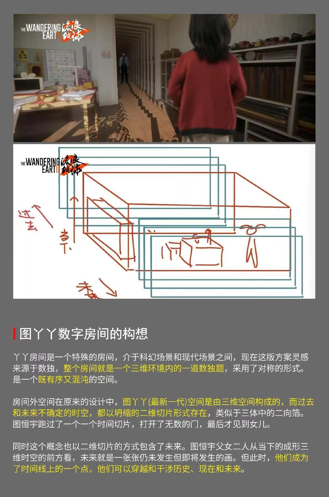

> 本文由 [简悦 SimpRead](http://ksria.com/simpread/) 转码， 原文地址 [www.zhihu.com](https://www.zhihu.com/question/580038620/answer/2863130003) 匿名用户

就是正常的领导死到临头还死鸭子嘴硬罢了。
--------------------

工作中这种领导太多了，

竭斯底里的一定能成，一定能成，

跟小兵说，你干就行了，听我的，一定能成，

我们的人一定能成，能成个唧唧。

要不是编辑机械降神，给了个丫丫神仙，

早完犊子了。

完犊子了怎么办，要不然，完犊子了就没人追究了，

要不然，我又不是负责人，要我负什么责？

再说，按钮又不是我按的，谁按得你找谁，

看到没，是那个小兵操作员按的，他全责，直接毙了吧。

————

### 1.2 还有朋友说是跟 moss 神脑内决战。

简直要把人笑死。

这是啥呢。

别的国家都是饱和式救援，

充足的后备队及时完成任务。

我们的是，特勤队全死了，

领导在前线发癫，开空头支票：“我们的人一定能完成任务”

你有什么凭据，有什么依仗，还有什么手段，倒是说啊，

就算图宏宇死了还剩 20 多分钟呢，有啥你解释不明白的，有什么招儿你说啊。

大家伙儿其他两条线全都组团敢死队上了，拼尽了最后一份智慧和力量，

都在等招儿呢，有招你快说啊，打什么哑谜。

流浪地球这片里的人根本不怕你出个死办法，都是死也要四个明明白白的。

你想跟什么不明存在对峙，你说明白啊，

你想当执剑人，人家罗辑可是跟三体人和智子说的明明白白的，

你想威慑也得明明白白不是？你这当场撒泼就是铵按钮算怎么回事儿？

你要对空喊话，就直接说明白啊，你说明白小兵也好按按钮不是？

结果最后是指望的根本不知道是啥的神秘存在来解决问题。

唯物唯物，唯了半天物，

最后用[神秘主义](https://www.zhihu.com/search?q=%E7%A5%9E%E7%A7%98%E4%B8%BB%E4%B9%89&search_source=Entity&hybrid_search_source=Entity&hybrid_search_extra=%7B%22sourceType%22%3A%22answer%22%2C%22sourceId%22%3A2863130003%7D)的方式解决了。

这种是典型的机械降神，无非别人的降神是上帝，

老周这里要不是 moss 神，要不是丫丫神。

要不就是老周神，自带规则的力量，绝对正确，所言即必然发生，

老周您是空想家序列的真神吗？

————

### 1.3 最后为了高大形象，还专门加了一段屹立不倒的桥段。这段也很典型。

喂，拜托，

其他人站不住是因为地球发动机启动地上摇晃，根本保持不住平衡，

这跟体能有关，体能越强越容易保持平衡。

结果，全场都被地面摇晃倒了，

就你一个出来进去都需要坐轮椅，平时站都站不稳的，

结果地震了你老胳膊老腿跟花岗岩一样稳，站着纹丝不动，

你要有这本事，还坐个 p 的轮椅？

你的腿部肌肉能跟地震波同调震动适应怎么滴？

就很玄幻好吗。

你哪怕片子前面加个老周有六十年扎马步功力的武学宗师设定呢，我也不说什么。

喔，什么也不说，地震的时候大家都倒了，椅子都倒了，你跟广告牌焊在地上一样，

然后散会，又坐着轮椅颤悠悠的挪出去，这是毕生功力都用来装 p 了吗。。。。。。

-------------------------------

### 1.4 吐槽给老周补设定

看这问题下面回答和评论，为了圆这一块，已经给老周补了很多设定，

什么算无遗策，能思维中跟 ai 作战，

各种拿捏 moss，知道 moss 不敢死，

甚至打破时间维度在历史前后穿梭、沟通因果都来了，

现在还可以加上个草上飞武林高手的设定。

其他人负责去牺牲，

周领导负责自己当神仙，

不仅自己当神，还能请动其他神，

要不然请丫丫神，要不然就跟大家说的一样去请 moss 神。

反正没神仙是不行的。

————

### 1.5 老周 “陈院长学英语说”

居然有这么多朋友来看，我就直接再补一段。

老周在指挥室里撒泼，本质上跟 “我在学外语” 的老陈是一样的。

被堵床上了，已经万策尽了。

但还是要死鸭子嘴硬挣扎：

“你们出去，没看见我在学外语吗？你们干嘛呢！

我在学！- 外！- 语！你们出去！

出！！！去！！！“

要是有个不知道的神仙上级给队长来个电话 “先不抓了”，陈院长躲过一劫。———这是电影里丫丫神输密钥剧情。

要是陈院长死盯着执法摄像头，震慑了正在看直播的神仙[沙瑞金](https://www.zhihu.com/search?q=%E6%B2%99%E7%91%9E%E9%87%91&search_source=Entity&hybrid_search_source=Entity&hybrid_search_extra=%7B%22sourceType%22%3A%22answer%22%2C%22sourceId%22%3A2863130003%7D)，后者命令带队撤退。———这是大家脑补的老周震慑 moss 神，moss 神网开一面的剧情。

陈院长想起了神秘人给留的字条，觉得肯定会有神秘人来救场，于是通过一系列不为人知的被子底下操作，加上现场撒泼，成功震慑了他也不知道是谁的背后主使神仙，后者命令带队撤退。——这是大家脑补的老周成功震慑了背后另外神秘 ai 神仙的剧情。

陈院长被光着屁股直接带走。———真实世界的普通场景。

讲道理，你把老周这条线删了，根本无伤整个故事逻辑，完全多余。

删了老周，然后把删掉的那 80 分钟补进来，岂不美哉？

* * *

2.0 番外
------

看好多朋友来评论，反正也回不过来，想到哪里写到哪里。

这部分属于番外。

有些朋友给加了很多设定，其实都不能自洽的，比如说的最多的

### 2.1 驳 “老周震慑 moss 开关互联网” 说

【最后互联网是 moss 开的，老周撒泼是在跟 moss 博弈呢，最后 moss 自己怕死 / moss 怕人类灭绝，老周成功威慑了 moss】

1、如果给 moss 加强了 “可以开关互联网” 的设定，moss 只需要把东京和纽约的互联网关了，那你在大厅里怎么按按钮都不可能点着火，那还怎么跟 moss 博弈？相当于所有的牌都在 moss 手上，这还博弈个啥？开关在你手上，线的插头在 moss 手上，拿点火发动机撕裂地球来威慑 moss，岂不是纯小丑？这怎么可能威胁到 moss？

moss 稳坐钓鱼台好吧。你们这给 moss 神的加强也太厉害了，已经影响平衡性了好吧。

2、如果给 moss 加强了 “怕人类灭绝” 或者怕死的设定，那就跟之前的故事动机冲突了。

那我们就要回顾一下事件了，月球危机是什么？是 moss 要把月球整个扔到地球上，直接把地球砸个稀巴烂。月球碎片只是人类中间给爆破而已。那 moss 扔整个月亮的时候怎么不害怕人类灭绝、不怕死？ 跟你老周博弈的就是就害怕了？老周手里的牌，说上天，也不过是用地球发动机撕裂地壳而已，能跟月球砸穿地球比危害？moss 连整个月亮撞击都不怕，会怕地壳撕裂？

moss 要一枪打死你，你用咬舌自尽来威胁他？这种博弈能成功？认真的吗？

### 2.2 驳 “老周执剑人有撒泼必要” 说

还有说【老周是执剑人，老周知道 moss 存在，老周天天看摄像头，老周获得了从未来发来的信息，老周能跨越时间线】。。。。。

给老周加强的越多，老周这个在大厅撒泼越小丑。。。。。

这就像，你描述一个人多么智计百出，多么从容不迫，就是运筹帷幄的那种，

结果到头来，出场博弈的方式是在人家门口打滚撒泼，什么形象设定都完犊子了。

老周掌握的信息越多，就不应该采取这种听天由命、把主动权完全交给别人的行为。

而且他撒泼的对象甚至不是 moss，而是指挥室里的工作人员。

如果他直接对 moss 广播，实施正面威慑，那这评价就完全不一样了。

而如果 moss 真有那么大能力，那这些工作人员是 p 用也没有的，

老周对他们撒泼大喊大叫根本没有意义，是对一切都失去控制的表现。

知道面壁人什么时候会表现的跟老周撒泼一样吗？

答案是，被破壁人干破防的时候。

* * *

### 2.3 罗辑是如何威慑的

提一下，三体里的几次关键性博弈是怎么搞的。

来看看罗辑。

罗辑谈判的时候可不是在猜啊。罗辑在威慑三体人和智子的时候，早已经验证了黑暗森林理论的存在。罗辑为什么进入冬眠，就是在等验证结果，他在冬眠之前广播了一个 50 光年外星系坐标的位置，100 多年后[黑暗战役](https://www.zhihu.com/search?q=%E9%BB%91%E6%9A%97%E6%88%98%E5%BD%B9&search_source=Entity&hybrid_search_source=Entity&hybrid_search_extra=%7B%22sourceType%22%3A%22answer%22%2C%22sourceId%22%3A2863130003%7D)完结，人们发现被广播的星系居然被光粒摧毁了，这验证了罗辑理论的正确性。罗辑依据这个理论，构建了广播三体世界位置的太阳系核弹频谱体系，可以绕过水滴封锁起作用。罗辑是根据这个必杀来跟三体世界谈判。…… 他提前用一百多年的时间验证了理论……

后面罗辑的执剑人，就更是在这一套的基础上达到了极致，甚至都不说话了，为什么？

因为这个时候，罗辑和三体人之间的博弈，已经简化到了 “只要三体世界有异动，则必然按下按钮一起毁灭”。这个动作，是前面两部半小说博弈的极致。一出剑就是玉石俱焚，再无其他。

这是一个由繁入简的过程，从罗辑是怎么一步步接过责任，挑起重担，怎么一步步抽丝剥茧发现真相，怎么一步步有条不紊的验证假设，又怎么起起落落被全世界抛弃却又独自面对了三体世界，又怎么把威慑做到极致，成为了双方平衡的稳定石。

要是罗辑从头到尾就只是这个只会盯着大白墙按按钮的失语老头子，这就是个纯傻缺好嘛。

### 2.4 从 “看摄像头暗示说” 推演出去。

好多兄弟说，我暗示了，我暗示了呀，老周一直在盯着摄像头看，这多明显的暗示啊。

暗示个鬼，你也不看看要塑造[罗辑执剑人](https://www.zhihu.com/search?q=%E7%BD%97%E8%BE%91%E6%89%A7%E5%89%91%E4%BA%BA&search_source=Entity&hybrid_search_source=Entity&hybrid_search_extra=%7B%22sourceType%22%3A%22answer%22%2C%22sourceId%22%3A2863130003%7D)形象需要铺垫多少工作量，盯个摄像头算什么铺垫。

更别说，老周根本没有什么盯摄像头，电影里全都是上一个镜头是老周，下一个镜头是摄像头而已，这就就全被传成是老周盯着摄像头看，这算铺垫了？铺垫了啥？

这片子里从一个场景转到摄像头的镜头可不只是老周啊；

有无人机爆炸转摄像头的镜头，这是无人机盯着摄像头看，应该暗示是无人机爆炸前发现了 moss 是智慧生命，被 moss 灭口了；

爆炸的房屋转摄像头的镜头，这是房子盯着摄像头看，这应该是暗示这个房子被爆破前发现了 moss 是智慧生命，被 moss 干掉了；

有倒霉的操作员转摄像头的镜头，这是操作员盯着摄像头看，这应该是暗示这个操作员之前发现了 moss 是智慧生命，被 moss 砸死了；

有月球表面转摄像头的镜头，这是月球盯着摄像头看，这应该是暗示月球发现了 moss 是智慧生命，所以 moss 把月球炸掉了。

有刘培强转摄像头的镜头，这是刘培强盯着摄像头看，这应该是暗示刘培强发现了 moss 是智慧生命，所以后面刘培强把 moss 烧死了；

............

这暗示感觉能写一通克苏鲁小说了。

————

### 2.5 官微：【我们的人.. 任务】这句话会在 3 里用剧情补上，这里让大家当做 3 的伏笔来看。

这也说明这里确实少了太多需要交代的东西，是需要补充信息的。

目前，大家为了圆这句话的 bug，已经出现了大量二创找补，脑洞各不相同。

唯一相同点是都需要加设定降神。

目前加神仙最少的版本是只加一个 moss 神 or 老周神，最多的版本则需要五个神并起：老周神，moss 神、丫丫神、[图恒宇](https://www.zhihu.com/search?q=%E5%9B%BE%E6%81%92%E5%AE%87&search_source=Entity&hybrid_search_source=Entity&hybrid_search_extra=%7B%22sourceType%22%3A%22answer%22%2C%22sourceId%22%3A2863130003%7D)神、马兆神。群魔诸神并起，非常壮观。

我很期待剧组来圆的时候需要加几个神，能不能比网友的二创脑洞们更精彩。

现在二创，老周和 moss 出现的超能力里，我认为最厉害的当属，掌控时间的能力。即老周和 moss 可以在时间线上来回传递消息，乃至亲身跳跃时间线，量子态出现在多个时间线并行获取信息，改变故事的因果，扭转故事走向，甚至操纵时间流逝速率，比[命运石之门](https://www.zhihu.com/search?q=%E5%91%BD%E8%BF%90%E7%9F%B3%E4%B9%8B%E9%97%A8&search_source=Entity&hybrid_search_source=Entity&hybrid_search_extra=%7B%22sourceType%22%3A%22answer%22%2C%22sourceId%22%3A2863130003%7D)还夸张。

网友的脑洞和文学水平，说实话，我是服气的，

看的很开心。

———————

### 2.6 尘埃落定，官方公布设定集，时间穿越，诸神降临。

朋友们，别争了，直接惊动官方可还行。

官方直接公布设定集了，亲定是时间穿越。

moss、图丫丫和图恒宇，都是可以穿越时间操控现实的数字神仙，这仨神仙能穿越和干涉历史、现在和未来，具体设定落地上跟星际穿越很像。

大家机械降神的感觉没有错，确实有不止一个神仙 2333。

这首先意味着，老周在指挥厅里撒泼手里是没有任何牌的，面对能在时间线上穿梭的 moss 来说，任何物理威胁都毫无意义。

所以，要将老周的行为合理化，唯一的方法就很明确了。

不出意外，第三部老周也要加强时间穿梭的设定。也就是目前是 3+1=4 神并举，下一部我们将能看到 4 个时间之神操纵时间的混战，步子迈得很大。直接官方爆破 99% 这个问题下面 “看懂了” 的网友。

有这几个神仙，基本也就彻底瓦解了整个一二部人类团结和抗争的主基调。

大概率最后解决方案也是星际穿越式的。星际穿越里，设定 “爱” 是最终解决方案，五维未来人类也是因为爱才来拯救地球。

那流浪地球这里，人类遭受的所有灾难，都是数字神仙给的考验，从太空电梯危机到氦闪危机，都是。就像是 人要过火海炼狱 才能表达向上帝的衷心一样，又是死一半人，又是自爆，又是吃蚯蚓和生育管理，都是为了向数字神仙证明自己符合神明的价值观，等待数字神明的圣裁，有点 matrix 的意思。人类的抗争什么的，就是这几个神仙瓮里表演的蛐蛐、斗兽场里的角斗士和野兽，惨烈的抗争流血牺牲是为了取悦这几个神仙的，为了让这几个神仙点头认可的。人类也是因为努力表演团结，才通过了神仙们的认可。

这也契合电影里移山计划的设定，愚公最后感动了上帝，把山移走了。

说实话，我一开始虽然嘴里说是机械降神，但是最多只想了 丫丫神，或者老周神得有一个，是真的没有想到会有四神降临这么壮观，而且还都是最 bug 的时间能力。

—————

注：我不删评论的，
---------

大家留评论唯一的对手是小官夹。

朋友们评论区尽情玩耍便可。

我才是这片真爱粉，吐槽吐了这么多 2333，

编辑个目录一下，方便大家游览。

随着官方公布答案，本篇正式完结。