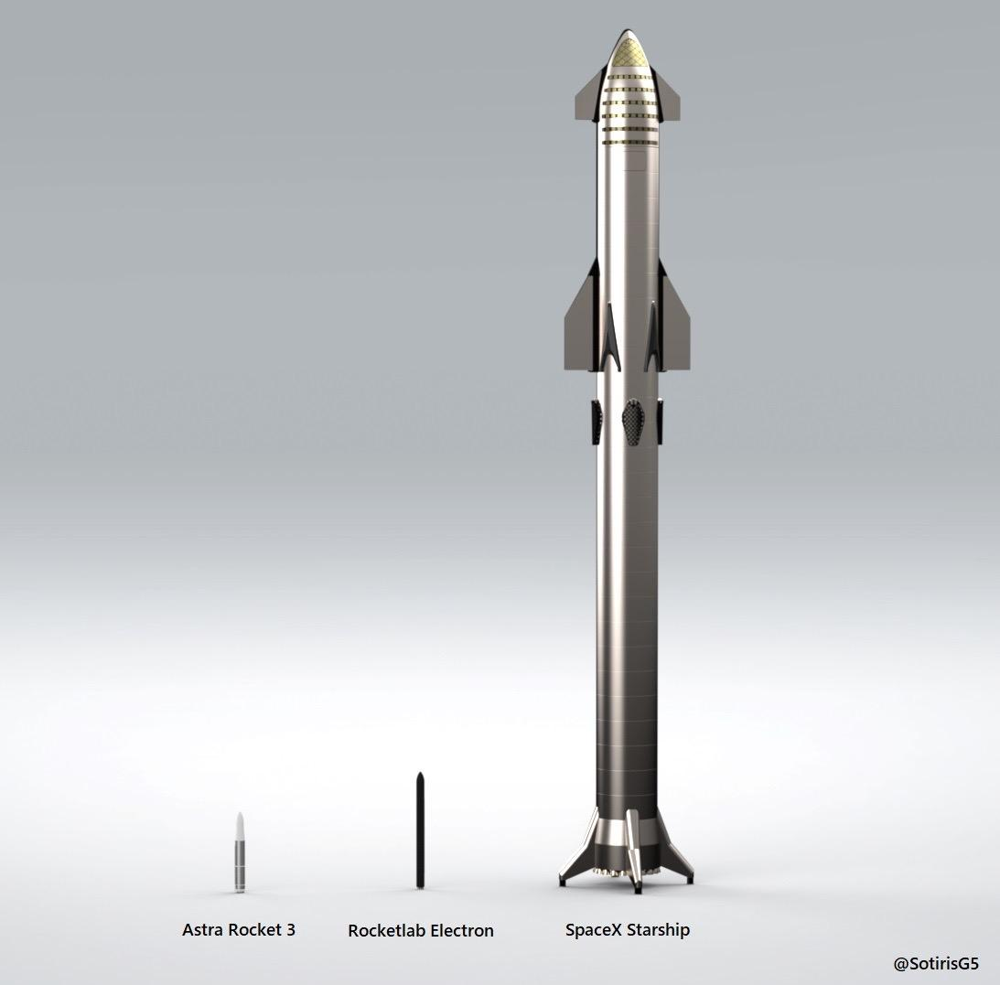
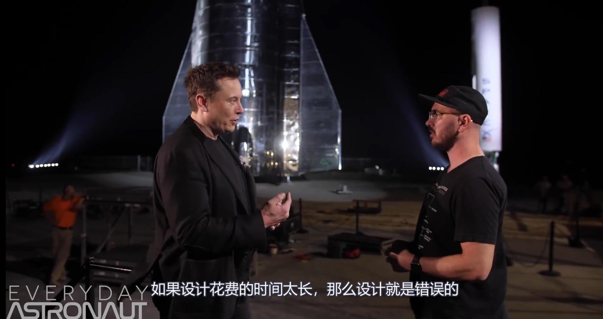
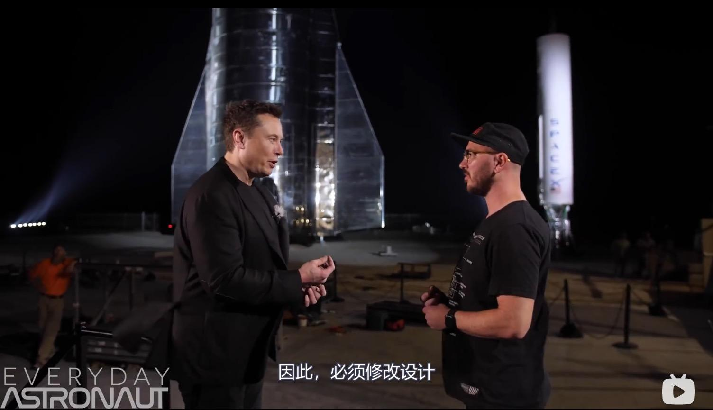
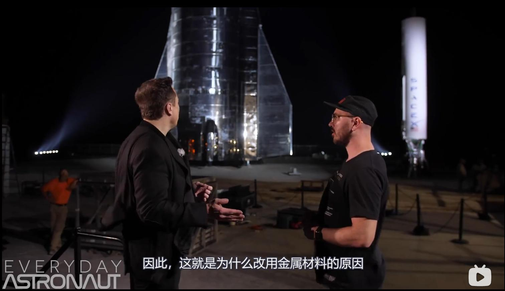
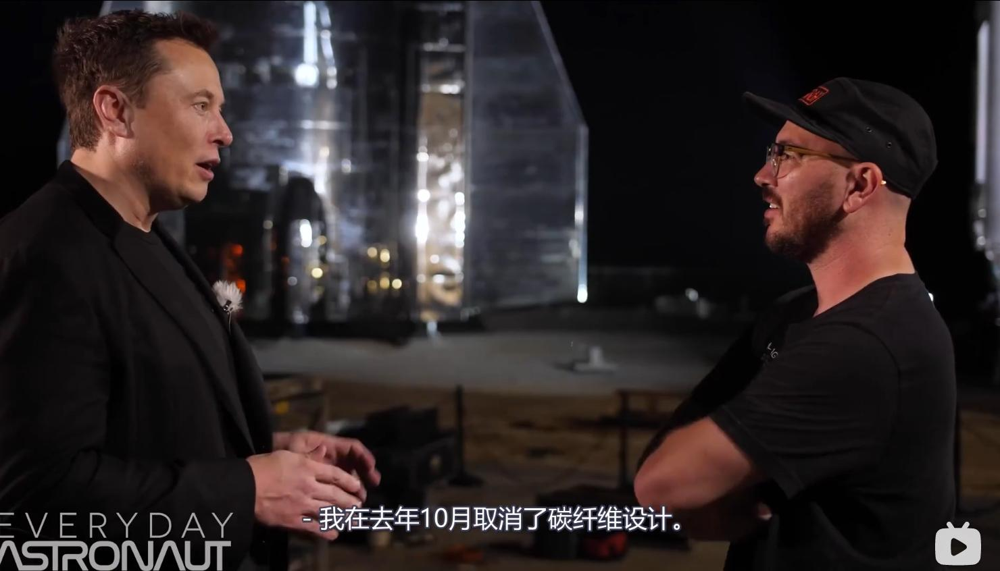
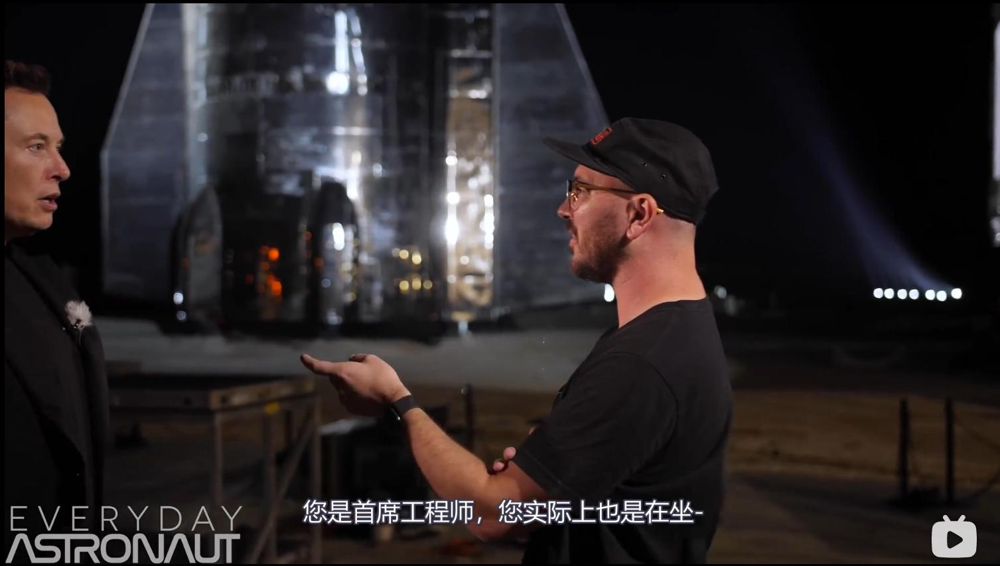
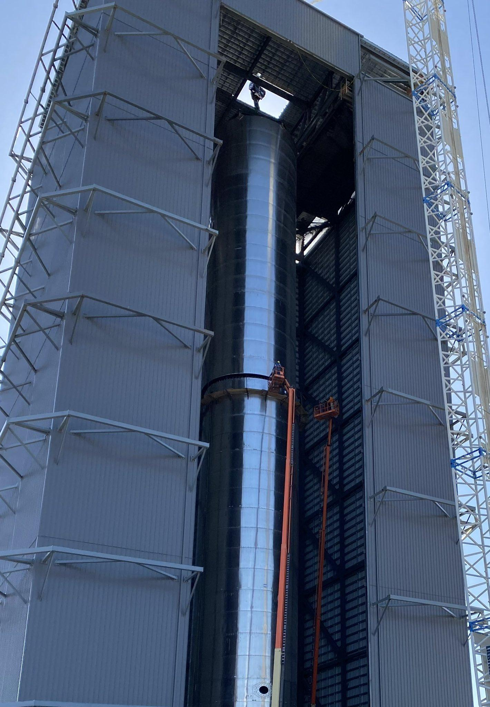
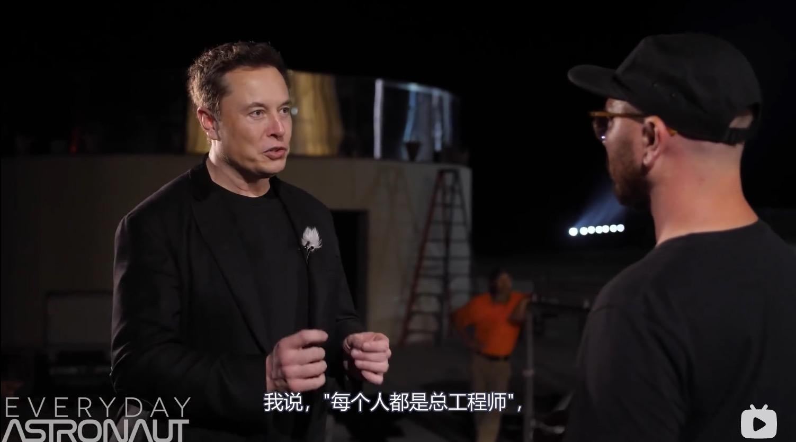

> 本文由 [简悦 SimpRead](http://ksria.com/simpread/) 转码， 原文地址 [www.zhihu.com](https://www.zhihu.com/question/381402762/answer/1793889940) 德谟克利特

因为从小受过的[唯物主义](https://www.zhihu.com/search?q=%E5%94%AF%E7%89%A9%E4%B8%BB%E4%B9%89&search_source=Entity&hybrid_search_source=Entity&hybrid_search_extra=%7B%22sourceType%22%3A%22answer%22%2C%22sourceId%22%3A1793889940%7D)教育，中国人大多数是 “[英雄人物](https://www.zhihu.com/search?q=%E8%8B%B1%E9%9B%84%E4%BA%BA%E7%89%A9&search_source=Entity&hybrid_search_source=Entity&hybrid_search_extra=%7B%22sourceType%22%3A%22answer%22%2C%22sourceId%22%3A1793889940%7D)虚无主义”，遇到问题就大谈历史背景，时代因素，客观条件，政策，人才等等，大家也更喜欢听这样的答案。但是这里往往忽略了 “英雄人物” 的因素。这里也一样，在极少数玩家的航天领域，[马斯克](https://www.zhihu.com/search?q=%E9%A9%AC%E6%96%AF%E5%85%8B&search_source=Entity&hybrid_search_source=Entity&hybrid_search_extra=%7B%22sourceType%22%3A%22answer%22%2C%22sourceId%22%3A1793889940%7D)这样的老板就是最大的变数。如果没有马斯克，知乎可能都不会有[商业航天](https://www.zhihu.com/search?q=%E5%95%86%E4%B8%9A%E8%88%AA%E5%A4%A9&search_source=Entity&hybrid_search_source=Entity&hybrid_search_extra=%7B%22sourceType%22%3A%22answer%22%2C%22sourceId%22%3A1793889940%7D)这个问题，历史评价就是一个 NASA 失败的提案而已，中国也不会跟着搞商业航天。

很多回答大谈美国政府对商业航天的大力资助，政策，人才。但是实际上除了 SpaceX，美国现在其他家入轨的商业航天现在是什么水平？我可以只用一张实际尺寸图来解释：

这就是南非佬的航天技术和另外两家商业航天的差距。差距大到什么概念？打个比方，美国商业航天相当于一所中学，其他公司都是考上了专科和三本，SpaceX 考上了清华经管姚班。现在非要来客观的分析这个中学老师多好，教育方法多好，风水多好实在没太大意义。

请问如果没有英雄人物马斯克知乎可能有偶尔会一个冷门小众问题，谈到美国 NASA 的商业航天政策，回答会怎么说那？

**“废拉不堪，航天这样[举国体制](https://www.zhihu.com/search?q=%E4%B8%BE%E5%9B%BD%E4%BD%93%E5%88%B6&search_source=Entity&hybrid_search_source=Entity&hybrid_search_extra=%7B%22sourceType%22%3A%22answer%22%2C%22sourceId%22%3A1793889940%7D)的还私人？”，**

**“帝国走上了邪路，绝路，丢弃了土星五，[航天飞机](https://www.zhihu.com/search?q=%E8%88%AA%E5%A4%A9%E9%A3%9E%E6%9C%BA&search_source=Entity&hybrid_search_source=Entity&hybrid_search_extra=%7B%22sourceType%22%3A%22answer%22%2C%22sourceId%22%3A1793889940%7D)，被私人骗了钱”，**

**“商业航天？发一发蚊子卫星就好”**

**“商人目光短浅，就能搞点小不点[太空垃圾](https://www.zhihu.com/search?q=%E5%A4%AA%E7%A9%BA%E5%9E%83%E5%9C%BE&search_source=Entity&hybrid_search_source=Entity&hybrid_search_extra=%7B%22sourceType%22%3A%22answer%22%2C%22sourceId%22%3A1793889940%7D)骗点政策补助”**

**“就那点迷你火箭，长三一发顶十个，[中国航天](https://www.zhihu.com/search?q=%E4%B8%AD%E5%9B%BD%E8%88%AA%E5%A4%A9&search_source=Entity&hybrid_search_source=Entity&hybrid_search_extra=%7B%22sourceType%22%3A%22answer%22%2C%22sourceId%22%3A1793889940%7D)垄断全球订单”**

**“帝国航天技术倒退 60 年”**

比尔盖茨，乔布斯，[井深大](https://www.zhihu.com/search?q=%E4%BA%95%E6%B7%B1%E5%A4%A7&search_source=Entity&hybrid_search_source=Entity&hybrid_search_extra=%7B%22sourceType%22%3A%22answer%22%2C%22sourceId%22%3A1793889940%7D)，马斯克，还有任正非，[张忠谋](https://www.zhihu.com/search?q=%E5%BC%A0%E5%BF%A0%E8%B0%8B&search_source=Entity&hybrid_search_source=Entity&hybrid_search_extra=%7B%22sourceType%22%3A%22answer%22%2C%22sourceId%22%3A1793889940%7D)，都对商业历史产生重大影响，他们个人的影响远超过一个什么 “国家政策”，不要英雄人物虚无主义，认为国家开个会，搞一个政策才是一切，一个举措，或者是国家有人才就影响一切了。没有乔布斯美国到现在根本就不会有手机产业了，没有张忠谋台湾就不会有芯片代工业，马斯克更是创造风口的人。

南非佬首先有梦想，是真的实干。没有躺在 [falcon 9](https://www.zhihu.com/search?q=falcon%209&search_source=Entity&hybrid_search_source=Entity&hybrid_search_extra=%7B%22sourceType%22%3A%22answer%22%2C%22sourceId%22%3A1793889940%7D) 的成功上赚钱，而是去研究 8000 吨级超重型全复用火箭。其次也是最重要的，本身就是技术天才。他对于工程有着近乎邪路的观点，曾经这个路边随机采访完美的说明了一切，SpaceX 从来不花费巨大成本解决工程中的难题，从来都是使用大开脑洞的歪门邪道解决。SpaceX 每天都在干传统从业人员看起来离经叛道的事情。搞过制造业的人都知道设计团队拍脑门搞一个牛逼的设计，工艺制造团队有多难。SpaceX 反过来逼迫设计团队用[计算机模拟](https://www.zhihu.com/search?q=%E8%AE%A1%E7%AE%97%E6%9C%BA%E6%A8%A1%E6%8B%9F&search_source=Entity&hybrid_search_source=Entity&hybrid_search_extra=%7B%22sourceType%22%3A%22answer%22%2C%22sourceId%22%3A1793889940%7D)快速迭代修改设计来加快工程进度，绝对是异类。

对话[埃隆马斯克](https://www.zhihu.com/search?q=%E5%9F%83%E9%9A%86%E9%A9%AC%E6%96%AF%E5%85%8B&search_source=Entity&hybrid_search_source=Entity&hybrid_search_extra=%7B%22sourceType%22%3A%22answer%22%2C%22sourceId%22%3A1793889940%7D) 了解关于星舰计划的更多细节 【Everyday Astronaut 中字】_[哔哩哔哩](https://www.zhihu.com/search?q=%E5%93%94%E5%93%A9%E5%93%94%E5%93%A9&search_source=Entity&hybrid_search_source=Entity&hybrid_search_extra=%7B%22sourceType%22%3A%22answer%22%2C%22sourceId%22%3A1793889940%7D) (゜ - ゜) つロ 干杯~-bilibiliaaaaa

马斯克是离经叛道的人，有困难就直接修改原始设计，咋工程实现方便咋来。实则所有决定都是老板快速拍板决定。也确实是[马斯克一言堂](https://www.zhihu.com/search?q=%E9%A9%AC%E6%96%AF%E5%85%8B%E4%B8%80%E8%A8%80%E5%A0%82&search_source=Entity&hybrid_search_source=Entity&hybrid_search_extra=%7B%22sourceType%22%3A%22answer%22%2C%22sourceId%22%3A1793889940%7D)担任总设计师。

发现碳纤维设计太难，直接变成金属火箭。如果不是马斯克排版，现在别说看到星舰在飞，[碳纤维](https://www.zhihu.com/search?q=%E7%A2%B3%E7%BA%A4%E7%BB%B4&search_source=Entity&hybrid_search_source=Entity&hybrid_search_extra=%7B%22sourceType%22%3A%22answer%22%2C%22sourceId%22%3A1793889940%7D)巨型火箭的难度至今都造不出原型机。现在可好，掌握了大棚焊接火箭技术，现在星舰不复用都已经能把人类火箭发射再降低一个数量级了，到一二百美元一公斤的价格。

SpaceX 做了无数的创新，无数离经叛道的事情，再疯狂的想法老板都会拍板决定。SpaceX 最大的问题就是全体员工对于老板的盲目崇拜，没有制衡，老板如果出错了就会走很大的弯路。

至于有多少离经叛道的事情那？我就说这周末干的事情吧：

**注意，仅仅是这一个周末的[野路子](https://www.zhihu.com/search?q=%E9%87%8E%E8%B7%AF%E5%AD%90&search_source=Entity&hybrid_search_source=Entity&hybrid_search_extra=%7B%22sourceType%22%3A%22answer%22%2C%22sourceId%22%3A1793889940%7D)！！！**

1.  现在是发射场，组装厂，火箭，发动机等等一起迭代。修建 Super heavy 超重星舰助推器太高了，组装房尺寸不够了，加高总装房要一个月，为了不影响火箭试验进度怎么做那？我想再坐所有人都会先走手续加高组装车间再组装，然而 SpaceX 直接把组装房的屋顶拆掉，巨型吊车代替屋顶的吊车，敞篷露天吊着制造，除了 SpaceX，世界可能没有哪家公司会这么干：

还有更绝的，直接把液氧储箱段已经去掉一圈不锈钢环，火箭变矮了，就可以在里面集成了。集成房子太矮了，就竟然直接拆火箭变矮。反正测试[静态点火](https://www.zhihu.com/search?q=%E9%9D%99%E6%80%81%E7%82%B9%E7%81%AB&search_source=Entity&hybrid_search_source=Entity&hybrid_search_extra=%7B%22sourceType%22%3A%22answer%22%2C%22sourceId%22%3A1793889940%7D)并不需要满油量，这样也凑合。绝对是正常工程师看着就发指的行为。

2. 现在立刻需要修建一个地面甲烷存储箱，传统天然气建造时间需要几个月，SpaceX 竟然直接拿火箭实验还没用的边角料几天时间直接凑了一个火箭燃料箱一样的甲烷存储箱。顺便还让新招聘的技工们练了手。

3。 同步在发射场修了众多从未有过的设备，包括诸多洛马 波音工程师在内的网友没一个能猜出是什么的。（4 月更新，原来是[月球电梯](https://www.zhihu.com/search?q=%E6%9C%88%E7%90%83%E7%94%B5%E6%A2%AF&search_source=Entity&hybrid_search_source=Entity&hybrid_search_extra=%7B%22sourceType%22%3A%22answer%22%2C%22sourceId%22%3A1793889940%7D)）

这样的事情太多了，完全反常规了。

总结一下，就是各个时代总会出这样的英雄人物，他们有着辉煌的成就，真正的改变了世界，创造了历史。他们有着巨大的成功，把有能力的人团聚到一起，形成强大的团队，做出了伟大的成就。

那些天天写广告推送追踪 APP 的工程师真的比 SpaceX 工程师差了？笑话。美国人长了三头六臂还是智商 140？然而让你天天研究绕过协议追踪用户信息未必比火箭[控制软件](https://www.zhihu.com/search?q=%E6%8E%A7%E5%88%B6%E8%BD%AF%E4%BB%B6&search_source=Entity&hybrid_search_source=Entity&hybrid_search_extra=%7B%22sourceType%22%3A%22answer%22%2C%22sourceId%22%3A1793889940%7D)简单，只不过没有马斯克这样的人你就只能找到为普通商人写广告推送的工作，不会有人受到华尔街的追捧，再把大家团聚起来实现有价值的目标。

如果没有马斯克，那些郁郁不得志的工程师不可能全身心的投入在航天创新上，比方说 1 号员工[穆勒](https://www.zhihu.com/search?q=%E7%A9%86%E5%8B%92&search_source=Entity&hybrid_search_source=Entity&hybrid_search_extra=%7B%22sourceType%22%3A%22answer%22%2C%22sourceId%22%3A1793889940%7D)就退休在家，他们或者可能去开家洗车店了，或者写一个个性化广告推送系统了，或者当公务员去了，或者直接退休天天钓鱼了。但是传奇人物创造了这一切，懂技术懂营销懂金融懂炒作，让华尔街心甘情愿为航天掏钱，创造出环境让有智力有能力的人人尽其才，聚在一起开创伟大的成就：

* * *

更新： 不知道说了啥关键词就被自动关了七天，终于关出来了。我不会回复任何一个抬杠的，稍稍一个词关键字了违规了就又是 7 天 14 天。你们的唯物史观说的都对，唯物史观永远都对，唯物史观告诉我们美国没有马斯克 SpaceX 还会有牛斯克 SpaceY，美国没有乔布斯[苹果手机](https://www.zhihu.com/search?q=%E8%8B%B9%E6%9E%9C%E6%89%8B%E6%9C%BA&search_source=Entity&hybrid_search_source=Entity&hybrid_search_extra=%7B%22sourceType%22%3A%22answer%22%2C%22sourceId%22%3A1793889940%7D)还有乔寿司的葡萄手机，台湾没有[台积电](https://www.zhihu.com/search?q=%E5%8F%B0%E7%A7%AF%E7%94%B5&search_source=Entity&hybrid_search_source=Entity&hybrid_search_extra=%7B%22sourceType%22%3A%22answer%22%2C%22sourceId%22%3A1793889940%7D)还会有弯积电，中国 5G 没有任正非也会有任斜非的。

实际上没有乔布斯美国不会再有手机产业了，举美国的例子会被骂，那我举一个你们最爱的华为的例子：唯物史观论述了没有任正非最终人类也终将会产生任斜非引领通讯行业，然而在日新月异的具体的某个高科技产业上，对于某个国家这套理论就完全不适用。没有任正非就没有中国 5G 的稍稍领先，替代华为的那个企业几乎不可能去聘请俄罗斯数学家、土耳其数学家搞出 5G 的基本的理论的，[平行世界](https://www.zhihu.com/search?q=%E5%B9%B3%E8%A1%8C%E4%B8%96%E7%95%8C&search_source=Entity&hybrid_search_source=Entity&hybrid_search_extra=%7B%22sourceType%22%3A%22answer%22%2C%22sourceId%22%3A1793889940%7D)里的知乎谈到这个问题就会说，哎，基础教育不行啊，数学不行啊，5G 需要顶尖数学家，唯物史观告诉我们因为基础教育不行所以 5G 上我国落后了。

但凡多读两本课本之外的书，也知道现在的高科技公司技术扯唯物主义多么扯。教育我的人来帮我唯物解释一下为什么[光刻机](https://www.zhihu.com/search?q=%E5%85%89%E5%88%BB%E6%9C%BA&search_source=Entity&hybrid_search_source=Entity&hybrid_search_extra=%7B%22sourceType%22%3A%22answer%22%2C%22sourceId%22%3A1793889940%7D)在荷兰啊？是荷兰各方面的人才世界最多还是政策最好？或者来解释一下 “五人团队[戴森球](https://www.zhihu.com/search?q=%E6%88%B4%E6%A3%AE%E7%90%83&search_source=Entity&hybrid_search_source=Entity&hybrid_search_extra=%7B%22sourceType%22%3A%22answer%22%2C%22sourceId%22%3A1793889940%7D)，百亿大厂十连抽”？

多看点[商业故事](https://www.zhihu.com/search?q=%E5%95%86%E4%B8%9A%E6%95%85%E4%BA%8B&search_source=Entity&hybrid_search_source=Entity&hybrid_search_extra=%7B%22sourceType%22%3A%22answer%22%2C%22sourceId%22%3A1793889940%7D)就会发现压根不是政治教科书上写的那样，英雄人物才是最大影响的因素。同一个政策，一群废拉不堪的商人很多政策变成了骗补贴，遇到传奇人物一个大企业就站起来了，某一个国家的一个产业就彻底活了。某个国家的一个产业存活可能只是取决于一个订单，甚至一个饭局，客户一念之差。和什么唯物主义 唯物史观没啥关系，在这里应用唯物主义纯属胡扯。**我反正是无法用唯物分析出来为什么会在[芬兰](https://www.zhihu.com/search?q=%E8%8A%AC%E5%85%B0&search_source=Entity&hybrid_search_source=Entity&hybrid_search_extra=%7B%22sourceType%22%3A%22answer%22%2C%22sourceId%22%3A1793889940%7D)出现电信巨头诺基亚，而光刻机会出现在荷兰，乐高为啥又是丹麦而不是挪威，[沃尔沃爱立信](https://www.zhihu.com/search?q=%E6%B2%83%E5%B0%94%E6%B2%83%E7%88%B1%E7%AB%8B%E4%BF%A1&search_source=Entity&hybrid_search_source=Entity&hybrid_search_extra=%7B%22sourceType%22%3A%22answer%22%2C%22sourceId%22%3A1793889940%7D)为什么在瑞典而不是瑞士？各位政治课学的好的教教我**