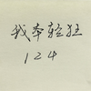

> 本文由 [简悦 SimpRead](http://ksria.com/simpread/) 转码， 原文地址 [www.zhihu.com](https://www.zhihu.com/question/620286466/answer/3198502732) 轻狂 124​

因为最初这么说的公知太天真了，一是高估了民意在特色社会中的分量，二是高估了多数人的记性与逻辑能力，三是低估了各项管制的作用。

事实上，比起公知，建制派确实更通晓历史，他们深知与本能印象相反，**深刻的变革往往不会发生在管制与压迫加重的时刻，而是发生在管理者或是有心无力、或是出于天真主动放权，管制逐渐放松之时。**

所以应对所谓舆情、所谓质疑的方式，恰恰应当是严加管理，而非自以为得计地退让。在社会矛盾无法简单解决，隐性地雷遍布的时候，你的每一步退让都反而会在短暂平静后引发更大声浪的质疑，最终让你退无可退、甚至一夕崩塌。

就如偌大个苏联，自戈氏提出新思维后，一年之内就再也无法逆转解散的趋势了，而哪怕领导人不能理事，单凭惯性运转，说不定都能再续二十年。反过来，我们的东北邻国为何连最基本的对 “可信任邻国” 开放市场都不敢尝试，也是因为体制越高压越荒唐，越是容不得一丝外来的风。

因此，**你以为是公信力一次次受质疑甚至崩塌，但实际上却是权威在被一次次树立。**如果不强调新闻站位，你所看到的负面热点广度与烈度都会数十倍于今日，如果每一起热点都为了展现所谓公正去彻查追责，**那等于是在消耗能掌控的嫡系力量，并让群众在追问中自发形成组织、助长不良风气。**

所以，为了安定和谐，固然要主动地尽可能创造面上清平的社会（实际操作就是特权不断收归于上，特权扩张的同时，力求运用特权的人数减少），但公平我来给是一回事，你主动去要那就是另外一回事了。