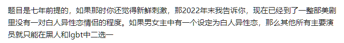
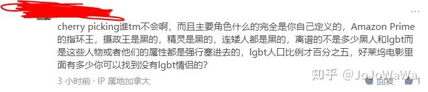

> 本文由 [简悦 SimpRead](http://ksria.com/simpread/) 转码， 原文地址 [www.zhihu.com](https://www.zhihu.com/question/28697822/answer/2821851217) 皮蛋瘦肉

[为什么几乎每个美剧里都有 gay 的存在？](https://www.zhihu.com/question/28697822/answer/2821816642)

说 “黑人和 lgbt 的比例...... 屏幕占 90%”，那就让我们来看看 2022 今年 Netflix 最热门的 5 部英语剧 * 中主要角色 ** 的情况：

*   Stranger Things 第四季: 主要角色 16 人，其中 2 人（Will，Robin）为 LGBTQ***，2 人黑人
*   Wednesday 第一季：主要角色 13 人，没有 LGBTQ，1 人黑人
*   DAHMER：主要角色 5 人，其中 1 人 (Jeffrey, 主角）为 LGBTQ，1 人黑人 （注：此剧集为真实事件改编）
*   Bridgerton 第二季：主要角色 22 人，没有官宣 LGBTQ 角色（Benedict 可能为双性恋），5 人黑人
*   Inventing Anna: 主要角色 10 人，没有 LGBTQ，2 人黑人（注：此剧集为真实事件改编）

算一算，66 个主要角色，3 个半 **** 的 LGBTQ 刚过 5%，11 个黑人 16% 多，加起来不到 22%，大致符合人口比例。哪来的 “令人发指”“扭曲现实”？

* 最热门英语剧：来自下面链接：[https://www.whats-on-netflix.com/news/netflix-releases-list-of-most-popular-shows-and-movies-in-2022/](https://link.zhihu.com/?target=https%3A//www.whats-on-netflix.com/news/netflix-releases-list-of-most-popular-shows-and-movies-in-2022/)

** 主要角色：因 IMDb 演员表不分季，以该剧集该季 Wikipeida 为准；Bridgerton 第二季由于没有自己的 Wikipeida 页面，以 Fandom Wiki [Bridgerton Season 2](https://link.zhihu.com/?target=https%3A//bridgerton.fandom.com/wiki/Season_2) 为准。

*** 指该角色在剧中或官方采访中明示为 LGBTQ 群体成员；下同。

****Benedict 姑且算半个。

回答原问题：

直接原因 - 能够扩大观众群体：

1.  LGBTQ 观众对 representation 的渴望；
2.  欧美主流非 LGBTQ 观众对 LGBTQ 人物与剧情不反感；
3.  美剧主演 cast 不小，加进去一两个 LGBTQ 符合人口 representation（大约 5-15% 人口）；

间接原因 - LGBTQ 人群在欧美有较高的社会资本 (social capital)：

1.  欧美娱乐业从业者中 LGBTQ 比例相对较高；
2.  美国 LGBTQ 人群可支配收入相对高；年轻且集中在东西海岸大城市，文化话语权较高。

* * *

Dec 31, 2022: 回答被建议修改了。删除以下内容：

*   认为原答主回答存在种族歧视与性取向歧视；
*   对原答主在哪里看到 90% 以上黑人或 LGBTQ 内容的猜测；该猜测来自另一个回答：

[为什么几乎每个美剧里都有 gay 的存在？](https://www.zhihu.com/question/28697822/answer/2820165070)

* * *

Dec 31, 2022: 这个评论我觉得有必要解释一下：

我现实生活中是 [data scientist](https://www.zhihu.com/search?q=data%20scientist&search_source=Entity&hybrid_search_source=Entity&hybrid_search_extra=%7B%22sourceType%22%3A%22answer%22%2C%22sourceId%22%3A2821851217%7D), 这个评论质疑我的职业操守我就有点坐不住了。

我的回答注释的这么细致，把所有的来源与定义全部明示，就是为了数据的相对客观。为了这个客观性，我都是选取的最容易证实、最直观的数据点。当然，也要平衡工作量的大小，因为每个人我都是要去一个个阅读他们的介绍 + 看整体剧情 + 关键词搜索看是不是 LGBTQ 来手动 tag, 毕竟我也不是都看过。

选的剧集是 Netflix 前五，不是前十前一百，是希望可以在业余时间完成的工作量，相对客观的反映大部分欧美观众的观感。而且这个问题问的是 “美剧”，而不是电影。同时如果您点进去我的数据源，会发现第五与第六与之后之间有一个接近一倍的观看量差距。 回答这个问题已经花了我接近 2-3 个小时，您给发钱我就继续统计。

“主要角色”定义完全来自 Wikipedia. 没有选择一般更权威的 IMDb 是因为 IMDb 没有分季演员数据；没有选择全部角色是因为工作量。没有选择统计 “情侣数量” 是因为 1）很难定义什么叫情侣；2）工作量；3）证实困难。没有选择您的“强加”，因为这个完全无法定义。[精灵矮人](https://www.zhihu.com/search?q=%E7%B2%BE%E7%81%B5%E7%9F%AE%E4%BA%BA&search_source=Entity&hybrid_search_source=Entity&hybrid_search_extra=%7B%22sourceType%22%3A%22answer%22%2C%22sourceId%22%3A2821851217%7D)您怎么知道是黑人白人 - 人家就根本不是人。不能不符合您的刻板印象就是 “强加” 吧？

最后，我的数据是我在定义之后得出的，算出 LGBTQ 比例后我没有对任何定义进行调整。实话说我自己都对这个比例与现实黑人 / LGBTQ 比例的接近觉得吃惊。不过这点就只能是清者自清。LGBTQ 比例 5% 是应该在所有 / 大部分电影中都有 5% 的演员演 LGBTQ 才是真实，而不是 95% 的电影一个 LGBTQ 没有，5% 全 LGBTQ。

Btw 最新 GALLUP 统计美国 GenZ (大概 95 年以后生人，也就是一般语境下的年轻人；这是第一代成长在社会对 LGBT 接受程度显著提高的人）已经有 20% 左右认为自己是 LGBT，不要守着那个 5% 了（社会整体 7%LGBT）。比例这么高是因为很多人自我认同为双性恋 (15% 的 GenZ 认为自己是双性恋）。

[https://news.gallup.com/poll/389792/lgbt-identification-ticks-up.aspx](https://link.zhihu.com/?target=https%3A//news.gallup.com/poll/389792/lgbt-identification-ticks-up.aspx)

这个回答希望反应的是一个大致比例趋势，而不是一篇论文。如果您对我的定义或者数据量有任何的异议，您可以直接提出来哪个定义有问题，或在评论区补充更多的数据，或自己开一个答案。上来说我 [cherry pick](https://www.zhihu.com/search?q=cherry%20pick&search_source=Entity&hybrid_search_source=Entity&hybrid_search_extra=%7B%22sourceType%22%3A%22answer%22%2C%22sourceId%22%3A2821851217%7D) 我是不接受的。

而且我问了，我妈妈不会。