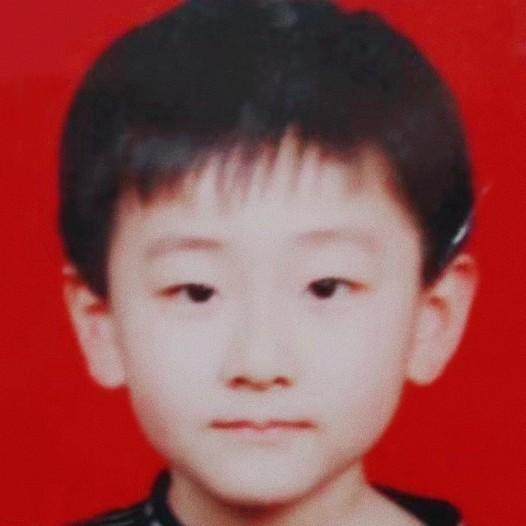

> 本文由 [简悦 SimpRead](http://ksria.com/simpread/) 转码， 原文地址 [www.zhihu.com](https://www.zhihu.com/question/418915978/answer/3004669253) 猴姆​​

我先实名支持一下

@托卡马克之冠 的回答，虽然她只是给出了一个大的理由，未必是全部，但已经足够令人觉得赞同。

而且她所讲的其实是有一个可以延伸的番外，就是为什么这个世界上的蠢人那么多。

蠢人最大的特点，就是愿意为一个既定现实，想出一个听起来最符合自己价值观的理由，而忽略其他所有因素。

扫黄，包括安乐死，总是有人将其想当然的归纳为：如果不严厉禁止，最后就是你家的女儿 / 你家的老人 / 你自己，在遇到什么情况下，会身不由己的 “[被自愿](https://www.zhihu.com/search?q=%E8%A2%AB%E8%87%AA%E6%84%BF&search_source=Entity&hybrid_search_source=Entity&hybrid_search_extra=%7B%22sourceType%22%3A%22answer%22%2C%22sourceId%22%3A3004669253%7D)”。

但却从来不考虑，这种被自愿的情况，每天都在发生，还有被[交通肇事](https://www.zhihu.com/search?q=%E4%BA%A4%E9%80%9A%E8%82%87%E4%BA%8B&search_source=Entity&hybrid_search_source=Entity&hybrid_search_extra=%7B%22sourceType%22%3A%22answer%22%2C%22sourceId%22%3A3004669253%7D)导致创死的呢，难道以后不许开车了？

当然不可能，但假如真的有一天，禁止机动车上道，那这路人是第一个会把交通肇事的惨状照片综合起来拿来给你看，告诉你 “如果不禁止机动车，照片上被创死的可能就是你家人”，然后你还没法反驳，反驳了就是你觉得这些死者死的不惨，或者你觉得你家人是天生好命。

实际上一件事在中国只要想加大力度管，就没有管不成的。除非是非常偏僻的乡村，因为监控不力，执法成本也相对更高。

但似乎现在大家讨论的无论是扫黄还是安乐死导致的 “[幻想式压迫](https://www.zhihu.com/search?q=%E5%B9%BB%E6%83%B3%E5%BC%8F%E5%8E%8B%E8%BF%AB&search_source=Entity&hybrid_search_source=Entity&hybrid_search_extra=%7B%22sourceType%22%3A%22answer%22%2C%22sourceId%22%3A3004669253%7D)”，都是城市里才会大面积发生的事。

我不评价这类事到底该不该合法，只是非常明确的反对相关的观点，因为这明显是在既定事实无法改变的情况下，硬往靠谱的地方圆。

当然，有些人不是不懂，而是装傻。因为扫黄对什么人有利，对什么人没利，是非常一眼可见的。

我本人很不喜欢黄这个产业，甚至有不少朋友请我去 “见见世面” 我都没答应过。

但这是个人兴趣问题，而不是因为我多[正经](https://www.zhihu.com/search?q=%E6%AD%A3%E7%BB%8F&search_source=Entity&hybrid_search_source=Entity&hybrid_search_extra=%7B%22sourceType%22%3A%22answer%22%2C%22sourceId%22%3A3004669253%7D)，我觉得有点不托底，而且总觉得这样跟人睡，对方是强颜欢笑在骗我，这个心理活动导致我不喜欢这种事。

但为什么我还是很讨厌以 “怕产业化了导致更多[无辜者](https://www.zhihu.com/search?q=%E6%97%A0%E8%BE%9C%E8%80%85&search_source=Entity&hybrid_search_source=Entity&hybrid_search_extra=%7B%22sourceType%22%3A%22answer%22%2C%22sourceId%22%3A3004669253%7D)受害” 这种理由，来反对这类事情的人呢？

因为他们太有主人翁意识了，总觉得地球是围着自己转的。有啥举措都是为了保护你，你是圆明园铜首吗？

帽子姐写的最好的地方，就是一针见血的把整个婚姻带来的成本，与性的垄断给联系在了一起。这个才是真正不能放开黄色的原因，保护的是整个社会的经济，而不是你个人或者你姐姐妹妹。你们没这么值得被[杞人忧天](https://www.zhihu.com/search?q=%E6%9D%9E%E4%BA%BA%E5%BF%A7%E5%A4%A9&search_source=Entity&hybrid_search_source=Entity&hybrid_search_extra=%7B%22sourceType%22%3A%22answer%22%2C%22sourceId%22%3A3004669253%7D)的保护。

[黄色](https://www.zhihu.com/search?q=%E9%BB%84%E8%89%B2&search_source=Entity&hybrid_search_source=Entity&hybrid_search_extra=%7B%22sourceType%22%3A%22answer%22%2C%22sourceId%22%3A3004669253%7D)开不开放，我没有诉求。但不开放是为了什么，一定要有个清醒的认识。

就像被人卖了数钱，或许是一种悲剧，因为卖的过程里你没什么[主观能动性](https://www.zhihu.com/search?q=%E4%B8%BB%E8%A7%82%E8%83%BD%E5%8A%A8%E6%80%A7&search_source=Entity&hybrid_search_source=Entity&hybrid_search_extra=%7B%22sourceType%22%3A%22answer%22%2C%22sourceId%22%3A3004669253%7D)去改变，只能赔着数钱。

你被人卖了还以为自己挣钱，或者你明知道别人被卖了，还告诉对方，骗你是为了怕你有钱了瞎花。这是一个畸形的[逻辑](https://www.zhihu.com/search?q=%E9%80%BB%E8%BE%91&search_source=Entity&hybrid_search_source=Entity&hybrid_search_extra=%7B%22sourceType%22%3A%22answer%22%2C%22sourceId%22%3A3004669253%7D)观念，也很容易影响民智。

[全文完](https://www.zhihu.com/search?q=%E5%85%A8%E6%96%87%E5%AE%8C&search_source=Entity&hybrid_search_source=Entity&hybrid_search_extra=%7B%22sourceType%22%3A%22answer%22%2C%22sourceId%22%3A3004669253%7D)。