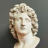
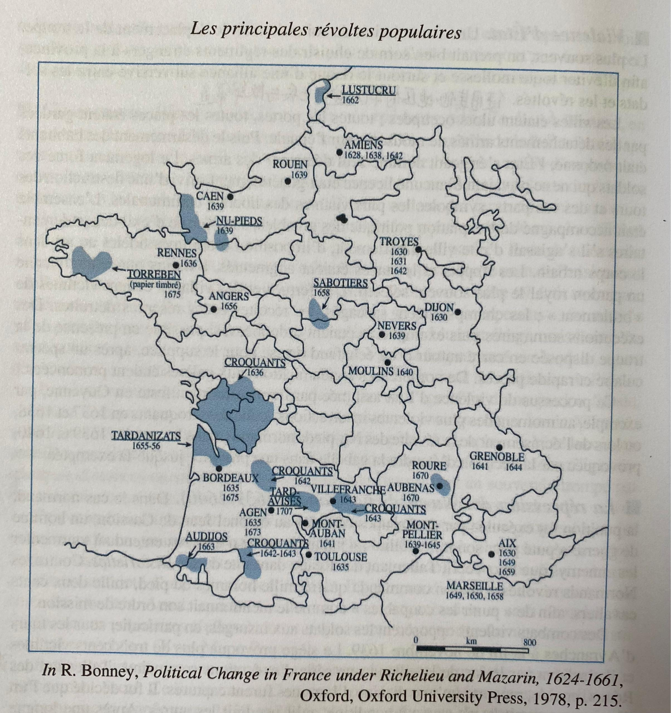
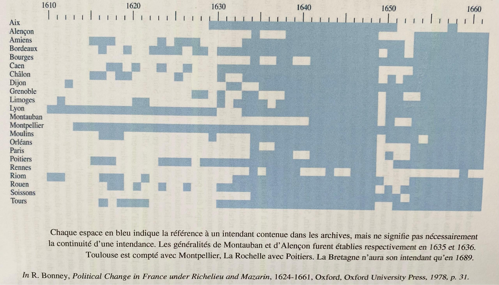

> 本文由 [简悦 SimpRead](http://ksria.com/simpread/) 转码， 原文地址 [www.zhihu.com](https://www.zhihu.com/question/24939855/answer/1863400147) Aosa

先问是不是再问为什么。题主说明末，那就拿同时期的法国举个例子：

地图上的一个年份就是一次大的农民起义，[黎塞留和马萨林](https://www.zhihu.com/search?q=%E9%BB%8E%E5%A1%9E%E7%95%99%E5%92%8C%E9%A9%AC%E8%90%A8%E6%9E%97&search_source=Entity&hybrid_search_source=Entity&hybrid_search_extra=%7B%22sourceType%22%3A%22answer%22%2C%22sourceId%22%3A1863400147%7D)执政时期（1624-1661）

地区[总督](https://www.zhihu.com/search?q=%E6%80%BB%E7%9D%A3&search_source=Entity&hybrid_search_source=Entity&hybrid_search_extra=%7B%22sourceType%22%3A%22answer%22%2C%22sourceId%22%3A1863400147%7D)数量的增加：有蓝方块的首府表示设置了总督。设置总督主要就是为了镇压农民起义和收税。（至于为啥 1648 年后有一大片空档是因为一次更大的起义，[投石党运动](https://www.zhihu.com/search?q=%E6%8A%95%E7%9F%B3%E5%85%9A%E8%BF%90%E5%8A%A8&search_source=Entity&hybrid_search_source=Entity&hybrid_search_extra=%7B%22sourceType%22%3A%22answer%22%2C%22sourceId%22%3A1863400147%7D)。王后迫于投石党人压力撤销了总督，然而之后又添回来了 - -）

原因嘛往大了说其实都一样，[苛政猛于虎](https://www.zhihu.com/search?q=%E8%8B%9B%E6%94%BF%E7%8C%9B%E4%BA%8E%E8%99%8E&search_source=Entity&hybrid_search_source=Entity&hybrid_search_extra=%7B%22sourceType%22%3A%22answer%22%2C%22sourceId%22%3A1863400147%7D)。吃不饱饭只能玩命。