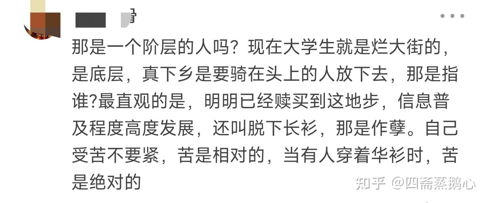

> 本文由 [简悦 SimpRead](http://ksria.com/simpread/) 转码， 原文地址 [www.zhihu.com](https://www.zhihu.com/question/516428687/answer/2976433255) 四斋蒸鹅心

知青好歹真去农村呆了几年，今天叫你们脱下长衫就已经哀嚎遍地了。

几十年前一群青少年被迫停止学业被赶去农村，现在铁拳只是提个建议，蝶味冲了点，还没出强制性政策，就叫的比知青还凶了，恨不得把自己受得那点委屈让所有人看见，现在的蝶味有几十年前大吗？那时候是真骑恁头上做蝶。

部分人既批判伤痕文学又不愿脱下长衫，见不见啊？又见又双标，对另一个群体所受的苦难毫无怜悯之心，当铁拳悬在自己头上就开始到处传播伤痕，这叫什么，这 tm 不就是你们口中的精致利己。铁拳只是建议你们读书人脱下长衫当工人而已，比当农民好了不知道多少倍，你们显然知道当工人日子苦所以不想去，你连工人都不愿当，也配批判伤痕文学？人知青好歹真去农村呆了几年。

* * *

农民和知青虽然不是一个阶层，但农民的苦难和知青无关。是谁在疯狂提取农业剩余？不会是一群毛都没长齐的小孩吧。还是说你认为几千万知青都是干部子弟？城里干部也太能生了吧。

