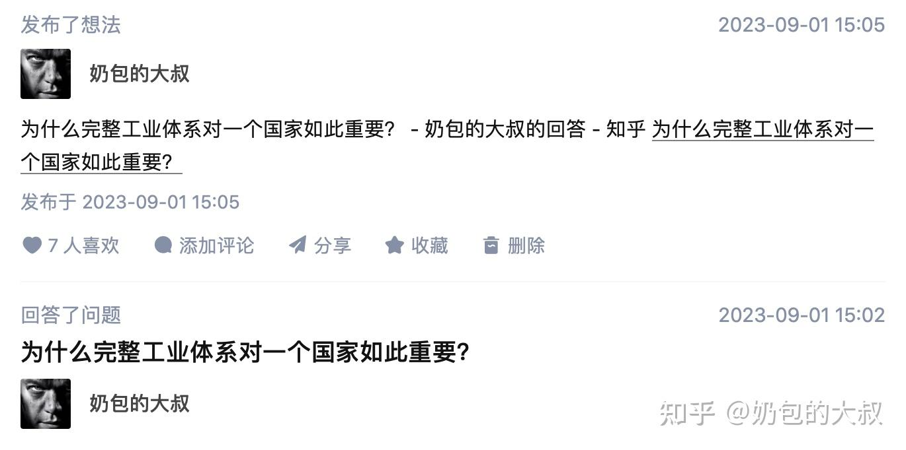

原文地址 [www.zhihu.com](https://www.zhihu.com/question/322375013/answer/3193674532) 

奶包的大叔

事实上，这个问题的核心关键词并不是 “完整[工业体系](https://www.zhihu.com/search?q=%E5%B7%A5%E4%B8%9A%E4%BD%93%E7%B3%BB&search_source=Entity&hybrid_search_source=Entity&hybrid_search_extra=%7B%22sourceType%22%3A%22answer%22%2C%22sourceId%22%3A3193674532%7D)”，而是 “唯一一个”。

原因很简单，因为全世界只有一个国家会对工业体系是否完整而感到如此焦虑。

那么，为什么工业体系的完整性会让这个国家如此焦虑呢？

因为没有安全感。

* * *

首先，在进一步讨论核心关键词之前，需要先深刻领悟一下中文的博大精深。

尤其值得指出的是，” 东方大国是全世界唯一拥有完整工业体系的国家” 的说法并不是国际公认的结果，而是简中网络自封的结果。

该说法的源头来源于 2015 年，最初的原始版本是 “CN 拥有联合国产业分类中的所有工业门类，成为具备完整工业体系的国家”。

随后，又变成了第二个版本：“只有 CN 和美国是拥有联合国产业分类中所有工业门类的国家。”

在中美毛衣战前后，又变成了第三个版本：“CN 是唯一拥有联合国产业分类中所有工业门类的国家。”

而东方大国官方媒体的宣传口径，则来自于原工信部部长 4 年前在国新办新闻发布会上说的话 [1](1)(#ref_1)：

> “我国高度重视工业体系的建设，经过 70 年的发展，已经拥有 41 个工业大类、207 个[工业中类](https://www.zhihu.com/search?q=%E5%B7%A5%E4%B8%9A%E4%B8%AD%E7%B1%BB&search_source=Entity&hybrid_search_source=Entity&hybrid_search_extra=%7B%22sourceType%22%3A%22answer%22%2C%22sourceId%22%3A3193674532%7D)、666 个工业小类，是全世界唯一拥有联合国产业分类中所列全部工业门类的国家。”

而之所以要使用 “全世界唯一拥有” 这样的说法，因为当时的场合是 70th [anniversary](https://www.zhihu.com/search?q=anniversary&search_source=Entity&hybrid_search_source=Entity&hybrid_search_extra=%7B%22sourceType%22%3A%22answer%22%2C%22sourceId%22%3A3193674532%7D)。

然鹅，这其中还有很多的 critical 问题，苗部长没说。

* * *

2017 年，东方大国参照联合国《[所有经济活动的国际标准行业分类](https://www.zhihu.com/search?q=%E6%89%80%E6%9C%89%E7%BB%8F%E6%B5%8E%E6%B4%BB%E5%8A%A8%E7%9A%84%E5%9B%BD%E9%99%85%E6%A0%87%E5%87%86%E8%A1%8C%E4%B8%9A%E5%88%86%E7%B1%BB&search_source=Entity&hybrid_search_source=Entity&hybrid_search_extra=%7B%22sourceType%22%3A%22answer%22%2C%22sourceId%22%3A3193674532%7D)》的分类标准，制定并发布了 CN 版本的国标：《国民经济行业分类》（GB/T 4754-2017）[2](2)(#ref_2)。

那么问题来了。

拥有联合国或国标（GB/T 4754-2017）里列出来的所有工业大类和小类，是否就能够 100% 拥有 “完整的工业体系” 呢?

这时，中文的博大精深又一次震撼了所有歪果仁。

在国标（GB/T 4754-2017）中，分类原则是先分大类，而不容易归类的则都被统一划归到第 9 项（“其他”）。也就是说，国标第四级分类里的所有子类都不会超过 9 个。

例如，一级门类 “C、制造业” 之下的二级分类 “33、金属制品业”，其下面的三级分类“332、金属工具制造” 中，“3321、切削工具制造”就已经是该[分类目录](https://www.zhihu.com/search?q=%E5%88%86%E7%B1%BB%E7%9B%AE%E5%BD%95&search_source=Entity&hybrid_search_source=Entity&hybrid_search_extra=%7B%22sourceType%22%3A%22answer%22%2C%22sourceId%22%3A3193674532%7D)中第四级的最终分类了。

而 “3321、[切削工具](https://www.zhihu.com/search?q=%E5%88%87%E5%89%8A%E5%B7%A5%E5%85%B7&search_source=Entity&hybrid_search_source=Entity&hybrid_search_extra=%7B%22sourceType%22%3A%22answer%22%2C%22sourceId%22%3A3193674532%7D)制造” 在国标中的（全部）定义则仅仅只是：“手工或机床用可互换的切削工具的制造”。

See？在博大精深的中文里，[手工钻头](https://www.zhihu.com/search?q=%E6%89%8B%E5%B7%A5%E9%92%BB%E5%A4%B4&search_source=Entity&hybrid_search_source=Entity&hybrid_search_extra=%7B%22sourceType%22%3A%22answer%22%2C%22sourceId%22%3A3193674532%7D)、机床钻头等切削工具竟然都被简单的归为了一类。

显然，不论是对于金属制品行业、还是机床行业来说，这都是一种极其粗糙的分类。

实际上，这两类产品存在着天壤之别的差距：手工钻头 low 到直接在普通五金商店就可以买到、而机床钻头则高端到有钱都不一定能买到。

如果考虑到机床刀具的复杂性 [3](3)(#ref_3)、以及被称为 “工业之母” 的高端机床对于整个工业的极端重要性，那么这个问题将更加不言而喻。

事实上，不论是东方大国军工航天制造中所需要的高端机床（以及刀具和刀具材料），还是手机、汽车、医疗设备等行业所需要的 CNC 加工中心，都高度依赖于进口。

* * *

由此，也形成了一个极其尴尬的画面：

当把国标里这些工业产业进行更细的划分后就会发现，很多工业技术和产品都是 DFDG 本土无法自给自足的。

事实上，在联合国定义的工业分类中，每一个最小的子类都不能算作一个市场、更无法定义某一类具体的产品或技术，只能作为宏观经济的统计门类。

因此，如果把这些产业分类不断细化，那么在精细化程度更高的分类中，[CN 制造](https://www.zhihu.com/search?q=CN%E5%88%B6%E9%80%A0&search_source=Entity&hybrid_search_source=Entity&hybrid_search_extra=%7B%22sourceType%22%3A%22answer%22%2C%22sourceId%22%3A3193674532%7D)不仅无法包括大部分门类，反而存在着大量 “卡脖子” 的尴尬现实。

至于为什么要将联合国的 “宏观经济统计门类” 标准作为“完整工业体系”，则是一个具有东方 special color 的送分题。

* * *

那么，什么样的标准才算是 “完整工业体系” 的标准呢？

如果将现有国标中的四级分类继续进一步精细划分，那么子集的个数将会呈指数级增长。

例如，如果扩展细分至第 8 级子类，那么苗部长所说的 “666 个工业小类” 将变成总数超过 436 万个 [4](4)(#ref_4) 子类（最大值 [5](5)(#ref_5)）。

显然，对于 21 世纪的人类工业来说，只有划分到这样的精度，评价一个国家的工业完整性才具有可操作性。

至于东方大国现有的工业体系是否能够覆盖这 400 多万个细分行业、以及对于这 400 多万个细分行业的覆盖程度究竟是多少，则是一个在东方大国本土连提都不敢提的问题。

如果考虑到东方大国的工业企业绝大多数都是扎堆在[红海市场](https://www.zhihu.com/search?q=%E7%BA%A2%E6%B5%B7%E5%B8%82%E5%9C%BA&search_source=Entity&hybrid_search_source=Entity&hybrid_search_extra=%7B%22sourceType%22%3A%22answer%22%2C%22sourceId%22%3A3193674532%7D)里拼价格成本、同类产品的同质化问题严重而对细分市场的开发严重不足，那么这个问题就更加不忍直视了。

实际上，当工业体系的分级细致程度从目前的四级增加到更高级别之后，发达经济体的优势也会体现得更加明显。

因为[发达国家](https://www.zhihu.com/search?q=%E5%8F%91%E8%BE%BE%E5%9B%BD%E5%AE%B6&search_source=Entity&hybrid_search_source=Entity&hybrid_search_extra=%7B%22sourceType%22%3A%22answer%22%2C%22sourceId%22%3A3193674532%7D)的工业品生产企业，往往都是针对细分市场。尤其是拥有大量[隐形冠军企业](https://www.zhihu.com/search?q=%E9%9A%90%E5%BD%A2%E5%86%A0%E5%86%9B%E4%BC%81%E4%B8%9A&search_source=Entity&hybrid_search_source=Entity&hybrid_search_extra=%7B%22sourceType%22%3A%22answer%22%2C%22sourceId%22%3A3193674532%7D)和独家技术特色（中小）企业的德国和日本。

以 “工业之母” 的机床行业为例。

在[口罩事件](https://www.zhihu.com/search?q=%E5%8F%A3%E7%BD%A9%E4%BA%8B%E4%BB%B6&search_source=Entity&hybrid_search_source=Entity&hybrid_search_extra=%7B%22sourceType%22%3A%22answer%22%2C%22sourceId%22%3A3193674532%7D)爆发之前的 2019 年，全球机床行业消费额为 821 亿美元。其中，机床消费额 Top 3 的国家分别为：

> CN（223 亿美元，在全球需求市场中占比为 27.2％）、美国（97 亿美元，11.8%）、德国（79 亿美元，9.6%）。

也就是说，东方大国进口机床的规模相当于美国 + 德国总和的 1.3 倍。

而全球 Top 10 [数控机床](https://www.zhihu.com/search?q=%E6%95%B0%E6%8E%A7%E6%9C%BA%E5%BA%8A&search_source=Entity&hybrid_search_source=Entity&hybrid_search_extra=%7B%22sourceType%22%3A%22answer%22%2C%22sourceId%22%3A3193674532%7D)制造商则全部被日本、德国、美国企业占据，其中[山崎 · 马扎克](https://www.zhihu.com/search?q=%E5%B1%B1%E5%B4%8E%C2%B7%E9%A9%AC%E6%89%8E%E5%85%8B&search_source=Entity&hybrid_search_source=Entity&hybrid_search_extra=%7B%22sourceType%22%3A%22answer%22%2C%22sourceId%22%3A3193674532%7D) 2019 年的市场规模更是高达 52.8 亿美元。

显然，对于东方大国来说，“工业之母” 的[机床行业](https://www.zhihu.com/search?q=%E6%9C%BA%E5%BA%8A%E8%A1%8C%E4%B8%9A&search_source=Entity&hybrid_search_source=Entity&hybrid_search_extra=%7B%22sourceType%22%3A%22answer%22%2C%22sourceId%22%3A3193674532%7D)是一个根本不用细分至第 8 级就会被卡脖子的行业。

* * *

再例如，机床领域里非常成熟的加工技术：[激光切割](https://www.zhihu.com/search?q=%E6%BF%80%E5%85%89%E5%88%87%E5%89%B2&search_source=Entity&hybrid_search_source=Entity&hybrid_search_extra=%7B%22sourceType%22%3A%22answer%22%2C%22sourceId%22%3A3193674532%7D)[6](6)(#ref_6)。

东方大国从事这个产业门类的企业数量众多、大型企业也很多。如果按照国标的分类规则，激光切割大致可以进一步细分至第 6 级或第 7 级。

然鹅，当把分类进一步细化至第 8 级时，就会发现东方大国的激光切割设备企业基本上都集中某几个中低端门类，而大功率、特殊光源等高端激光切割设备则高度依赖于进口。

如果进一步细分至第 9 级，那么就会发现该领域里的[高功率激光芯片](https://www.zhihu.com/search?q=%E9%AB%98%E5%8A%9F%E7%8E%87%E6%BF%80%E5%85%89%E8%8A%AF%E7%89%87&search_source=Entity&hybrid_search_source=Entity&hybrid_search_extra=%7B%22sourceType%22%3A%22answer%22%2C%22sourceId%22%3A3193674532%7D)、有源光纤和特种光纤、激光头、运控系统、数控设备、[系统软件](https://www.zhihu.com/search?q=%E7%B3%BB%E7%BB%9F%E8%BD%AF%E4%BB%B6&search_source=Entity&hybrid_search_source=Entity&hybrid_search_extra=%7B%22sourceType%22%3A%22answer%22%2C%22sourceId%22%3A3193674532%7D)、仪器仪表等核心零部件，基本上都被德国 TRUMPF，美国 IPG、Coherent、II-VI、nLIGHT，瑞士 Bystronic，意大利 Prima 等国际巨头垄断。

目前，【此处删除 1080 字】

* * *

如果再进一步细分至第 10 级，那么就会涉及到激光芯片 [7](7)(#ref_7) 的核心制造设备：MOCCVD。

1968 年，北美航空公司（[罗克韦尔公司](https://www.zhihu.com/search?q=%E7%BD%97%E5%85%8B%E9%9F%A6%E5%B0%94%E5%85%AC%E5%8F%B8&search_source=Entity&hybrid_search_source=Entity&hybrid_search_extra=%7B%22sourceType%22%3A%22answer%22%2C%22sourceId%22%3A3193674532%7D)的前身）发明了生产 VSCEL[8](8)(#ref_8) 的 [MOCVD 工艺](https://www.zhihu.com/search?q=MOCVD%E5%B7%A5%E8%89%BA&search_source=Entity&hybrid_search_source=Entity&hybrid_search_extra=%7B%22sourceType%22%3A%22answer%22%2C%22sourceId%22%3A3193674532%7D)。1980 年代初，该技术开始进入实用化。

但 VSCEL 真正开始起飞的时间，却是在 2017 年。

当时，苹果在 iPhone X 的人脸识别模块中加入了这一组件，不仅为地球人的手机 “3D 传感” 铺平了道路，还直接促进了 VSCEL 的飞速发展。

2021 年，被称为东方大国 “激光芯片第一股” 的长光华芯，其 VCSEL 系列产品才刚刚实现小批量量产，营收仅 820 万元，在其 2021 全年营收中的占比几乎可以忽略不计（仅 1.9%）。

2022 年，长光华芯高调官宣成为 “国内首家引入 6 寸晶圆高功率激光芯片[垂直整合](https://www.zhihu.com/search?q=%E5%9E%82%E7%9B%B4%E6%95%B4%E5%90%88&search_source=Entity&hybrid_search_source=Entity&hybrid_search_extra=%7B%22sourceType%22%3A%22answer%22%2C%22sourceId%22%3A3193674532%7D)产线的公司”，并表示该产线集 MOCVD [外延生长](https://www.zhihu.com/search?q=%E5%A4%96%E5%BB%B6%E7%94%9F%E9%95%BF&search_source=Entity&hybrid_search_source=Entity&hybrid_search_extra=%7B%22sourceType%22%3A%22answer%22%2C%22sourceId%22%3A3193674532%7D)、晶圆制造、器件组装、测试于一体。

而这条生产线上最核心的设备，就是德国 AIXTRON 公司生产的 [Aixtron 2800 G4 多腔反应器](https://www.zhihu.com/search?q=Aixtron%202800%20G4%E5%A4%9A%E8%85%94%E5%8F%8D%E5%BA%94%E5%99%A8&search_source=Entity&hybrid_search_source=Entity&hybrid_search_extra=%7B%22sourceType%22%3A%22answer%22%2C%22sourceId%22%3A3193674532%7D)。

至于这 [9](9)(#ref_9) 对于一个自称 “完整工业体系” 的国家来说究竟是一种什么样的卡脖子，则是一个妥妥的送分题。

到了 2023 年 1 月，德国 AIXTRON 已经正式发布了最新一代、用于生产 8 英寸晶圆的 [G10 系列](https://www.zhihu.com/search?q=G10%E7%B3%BB%E5%88%97&search_source=Entity&hybrid_search_source=Entity&hybrid_search_extra=%7B%22sourceType%22%3A%22answer%22%2C%22sourceId%22%3A3193674532%7D)[10](10)(#ref_10)，主要面向 Micro LED 和激光领域。

而 Micro LED 正是苹果、三星、[台积电](https://www.zhihu.com/search?q=%E5%8F%B0%E7%A7%AF%E7%94%B5&search_source=Entity&hybrid_search_source=Entity&hybrid_search_extra=%7B%22sourceType%22%3A%22answer%22%2C%22sourceId%22%3A3193674532%7D)正在全力推广的下一代 LED 技术。从 2020 年至今，东方大国 Micro LED 项目投资额已超千亿元。

但尴尬的是，目前全球 MOCVD 设备市场却基本上都被美国 Veeco、德国 AIXTRON、日本 NIPPON Sanso 和 Nissin Electric 垄断 [11](11)(#ref_11)。

如果考虑到 VCSEL 的其他重量级应用（包括 AR/VR、汽车激光雷达、车内传感、[工业机器人](https://www.zhihu.com/search?q=%E5%B7%A5%E4%B8%9A%E6%9C%BA%E5%99%A8%E4%BA%BA&search_source=Entity&hybrid_search_source=Entity&hybrid_search_extra=%7B%22sourceType%22%3A%22answer%22%2C%22sourceId%22%3A3193674532%7D)、[军事陀螺仪](https://www.zhihu.com/search?q=%E5%86%9B%E4%BA%8B%E9%99%80%E8%9E%BA%E4%BB%AA&search_source=Entity&hybrid_search_source=Entity&hybrid_search_extra=%7B%22sourceType%22%3A%22answer%22%2C%22sourceId%22%3A3193674532%7D)等），那么在这个万亿美元级别的市场中，美国 Veeco、德国 AIXTRON 的核心制造设备的卡脖子效应就更加明显了。

* * *

那么，就只剩下最后一个问题了。

对于[瑞典](https://www.zhihu.com/search?q=%E7%91%9E%E5%85%B8&search_source=Entity&hybrid_search_source=Entity&hybrid_search_extra=%7B%22sourceType%22%3A%22answer%22%2C%22sourceId%22%3A3193674532%7D)、意大利、瑞士、新加坡这些工业和高科技强国来说，其工业体系的完整性显然比不上美国、日本、德国，为什么这些国家却从来没有为是否具备 “完整工业体系” 而焦虑过呢？

事实上，在全球主要经济体中，绝大部分国家都不会因为卡脖子问题而焦虑。

由此，也引申出了一个最核心的问题：为什么只有一个 country 会为了其他主流国家根本不存在的问题而焦虑？

由于涉及 highly sensitive 内容，【此处删除 2999 字】

[拉罗什福科](https://www.zhihu.com/search?q=%E6%8B%89%E7%BD%97%E4%BB%80%E7%A6%8F%E7%A7%91&search_source=Entity&hybrid_search_source=Entity&hybrid_search_extra=%7B%22sourceType%22%3A%22answer%22%2C%22sourceId%22%3A3193674532%7D)在《[道德箴言录](https://www.zhihu.com/search?q=%E9%81%93%E5%BE%B7%E7%AE%B4%E8%A8%80%E5%BD%95&search_source=Entity&hybrid_search_source=Entity&hybrid_search_extra=%7B%22sourceType%22%3A%22answer%22%2C%22sourceId%22%3A3193674532%7D)》中写道，骗人而不为人知异常困难，相反，自欺而不自知却十分容易。

楼下保安则说，当你发现全世界都在逆行的时候，那么就算拥有了地球上最完整的【此处删除 4 字】，也依然不会有安全感。

* * *

⚠️以上内容节选自《钢的国》、《红龙》，所有 sensitive 内容均已删除，感兴趣的童鞋可以在 new base[12](12)(#ref_12) 中查看原稿。

参考
--

1.  [^](#ref_1_0)[http://www.xinhuanet.com/politics/2019-09/20/c_1125020250.htm](http://www.xinhuanet.com/politics/2019-09/20/c_1125020250.htm)
2.  [^](#ref_2_0)[http://www.stats.gov.cn/xxgk/tjbz/gjtjbz/201710/t20171017_1758922.html](http://www.stats.gov.cn/xxgk/tjbz/gjtjbz/201710/t20171017_1758922.html)
3.  [^](#ref_3_0) 功能分类包括车刀、铣刀、钻刀、磨轮、镗刀等不同刀具；刀具的材料又分为工具钢、硬质合金、立方氮化硼，等等。
4.  [^](#ref_4_0) 八级分类的最终子类总数（最大值）为：666 x 9 的 4 次方 =4369626。
5.  [^](#ref_5_0) 有些工业门类并不仅仅只是细分到第 8 级为止，而有些工业门类则并不能细分到第 8 级。
6.  [^](#ref_6_0) 激光器在材料加工领域的应用占比约 40%，其主要的应用领域则是通信和光储存领域（应用占比达 55%）。
7.  [^](#ref_7_0) 工业激光器多使用激光二极管进行泵浦。激光二极管由高功率半导体激光芯片、热沉、相关结构件等封装而成。
8.  [^](#ref_8_0) 半导体激光器可以分为两大类型：EEL（边界发射激光器，主要用于高数据速率的长距离传输）、VCSEL（垂直腔面发射激光器，广泛应用于光通信、光存储、光打印、汽车激光雷达、手机 3D 感应等领域）。
9.  [^](#ref_9_0) 以及为什么长光华芯不采用中微或中晟光电的产品
10.  [^](#ref_10_0) 目前，该设备已获得 ams OSRAM 的验证使用，用于生产 8 英寸 Micro LED 晶圆。
11.  [^](#ref_11_0) 其中，由于日本政府对 MOCVD 设备实行出口限制政策（仅限日本市场销售），因此全球 MOCVD 市场基本被 Veeco、AIXTRON 垄断。
12.  [^](#ref_12_0) 通过 WX（naibaodedashu）加入。
