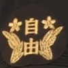

原文地址 [www.zhihu.com](https://www.zhihu.com/question/58134850) 

Vincent Yeung

在 1974 年广州话获得香港[官方语言](https://www.zhihu.com/search?q=%E5%AE%98%E6%96%B9%E8%AF%AD%E8%A8%80&search_source=Entity&hybrid_search_source=Entity&hybrid_search_extra=%7B%22sourceType%22%3A%22answer%22%2C%22sourceId%22%3A620577570%7D)地位之前，其已经成为香港社会的主流通用语言。数据如下：

根据 1961、1971 年的香港人口及住房[调查报告](https://www.zhihu.com/search?q=%E8%B0%83%E6%9F%A5%E6%8A%A5%E5%91%8A&search_source=Entity&hybrid_search_source=Entity&hybrid_search_extra=%7B%22sourceType%22%3A%22answer%22%2C%22sourceId%22%3A620577570%7D)，原籍广州、澳门等泛广府地区的比例一直最高，且 1961 年香港居民将广州话作为常用语言的比例已达八成:

1971 年报告的原数据 (全英):

△1971 年将广州话作为常用语言的比例已经高达 88.13%

更早年的人口调查报告没有包含详细的祖籍和语言统计数据，只有学者的估算数据，显示 1949 年香港以[广府](https://www.zhihu.com/search?q=%E5%B9%BF%E5%BA%9C&search_source=Entity&hybrid_search_source=Entity&hybrid_search_extra=%7B%22sourceType%22%3A%22answer%22%2C%22sourceId%22%3A620577570%7D)粤语为母语的人口比例为 48.8%，仍显著高于其它方言:

而香港流失速度最快的方言也不是[围头话](https://www.zhihu.com/search?q=%E5%9B%B4%E5%A4%B4%E8%AF%9D&search_source=Entity&hybrid_search_source=Entity&hybrid_search_extra=%7B%22sourceType%22%3A%22answer%22%2C%22sourceId%22%3A620577570%7D)、[客家话](https://www.zhihu.com/search?q=%E5%AE%A2%E5%AE%B6%E8%AF%9D&search_source=Entity&hybrid_search_source=Entity&hybrid_search_extra=%7B%22sourceType%22%3A%22answer%22%2C%22sourceId%22%3A620577570%7D)，而是[四邑话](https://www.zhihu.com/search?q=%E5%9B%9B%E9%82%91%E8%AF%9D&search_source=Entity&hybrid_search_source=Entity&hybrid_search_extra=%7B%22sourceType%22%3A%22answer%22%2C%22sourceId%22%3A620577570%7D)，锐减速度最快。

在一个移民社会，语言的替换有诸多复杂的因素，但在香港的例子中，以广州话为母语的移民数量长期占据压倒性优势，且在粤语区广州话也具有类似通语的地位，因此广州话成为香港社会的主流语言合情合理，并且有较长的历史了。

资料来源:

Census and Statistics Department, ''Hong Kong Population and Housing Census 1971 Main Report'', Hong Kong: Government Printer, 1972

Fan Shuh Ching, ''The Population of Hong Kong'', Department of Statistics, University of Hong Kong, 1974

刘镇发，[苏咏昌](https://www.zhihu.com/search?q=%E8%8B%8F%E5%92%8F%E6%98%8C&search_source=Entity&hybrid_search_source=Entity&hybrid_search_extra=%7B%22sourceType%22%3A%22answer%22%2C%22sourceId%22%3A620577570%7D)，“从方言杂处到以广府话为主: 1949-1971 年间香港社会语言转用的初步探讨”

李柰​

香港在开埠前，渔民说疍家话，香港本岛上有限的人口就是这些疍民居多。疍民讲的语言是一种乡下广府话，没有 oe、yu，Hong Kong 应该就是他们的语言。新界的平原农民讲的是围头话，是一种莞宝片粤语。客家人相对这些人是后来者，形成的社区基本分布在丘陵山地进行山地农业，清代因为新作物和人口过密化，山地农业是一个新的发展点，所以现代统计到的客家围跟本地围基本能平分秋色。

不过问题跟这些关系都不大，明清全球化进程展开，海洋贸易的发展催化珠三角人口的城市化和商业化，清代广州一口通商，更让他如虎添翼。广府话由此占领了一个围绕「现代」形式的贸易产生的商人、市民的生态位。目前可以观察到的材料，在这个时期里，在整个西江流域的广府粤语逐渐驱逐了这个区域传统的政治消费型城市里的权威语言平话、乃至官话，这个趋势一致延续到改革开放以后，普通话挟另一种权威与粤语在现代城市语言的生态位里展开争斗。

回到香港，英国人租借香港的目的就是为了用他当对接广州的贸易站，中国人都是广州商人背景和其周边产业的人口，新生香港城市的语言成为广州话自然而然。与此同时，新界农民的生活方式并没有改变，新界太公和客佬的围头话、客家话在 1970 年代以前，使用情况没有怎么萎缩，此后香港经济起飞，大量年轻人口被吸纳进城市转用广州话，香港各种乡下本土语言才逐渐枯萎。

林虚谷​

关于粤语，简中网流传着几大谣言，需要破除。

其实我不知道为什么这种谣言会流行，但目的似乎是【消除】【淡化】粤语的历史地位。

就觉得很夸张，推普还需要用谣言来做配合吗？

A、香港原先流行国语电影，是 1970 年强制推行粤语。==>【错】

香港从 1933 年开始拍电影，到 1965 年左右，几千部电影 90% 以上都是粤语片（广州话），1965~1975 有一个粤语黑白片衰落期，这段时期国语彩色片票房超过粤语，但 1975 之后粤语彩色片重新崛起，奠定香港现代电影语言。

B、香港原先语言混杂，没有主要语言，是 1970 年强制推行粤语。==>【错】

香港 1960 年的人口普查，广州话人口占 79%，闽潮话（闽南 + 潮州）占 6%，客家话占 5%。

不论是 79% 的比例，还是 90% 电影的语言，广州话被香港选为大众教育、传媒的语言都是最合理的选择，有助于绝大多数儿童用自己最熟悉的语言学习知识、绝大多数市民最有效接收信息。

C、香港原先讲客家话。==>【半对半错】

香港的最早语言分三块：1 - 香港岛的渔民，讲广州话的疍家分支；2 - 新界西的农民，讲东莞话（莞宝话）；3 - 新界东的农民，讲客家话（类似惠阳话）。

D、深圳在国语化之前，讲客家话。==>【错】

深圳的语言生态跟香港很类似：

1 - 深圳镇（罗湖街），从 1911 年广九铁路全线通车开始，就讲广州话，到 1949 升格为宝安县城，到后面改开、直到深圳人口突破 200 万的时候，深圳市区的主要沟通语言仍然是广州话，所以深圳 90-95 这批深二代会讲广州话的比例极高。后来深圳一路超过 800 万、1000 万，就国语化了。

2、深圳西的农民，讲东莞话（莞宝话）；3 - 深圳东的农民，讲客家话（类似惠阳话）；这个跟新界一模一样，因为本来就同属新安县。

siny

先说一下宝安县，即今天深圳市的前身

如果是说带有香港的宝安县，那是广州府的地盘，现在深圳客家人集中的龙岗、坪山等地区，那时候还没有划入宝安县，还在惠州府那边的惠阳，龙岗一带划入宝安县，那是后来的事了

当时的宝安县县治在南头镇，即今天的南山，那一带是围头人集中区，几乎没有客家人，围头人属广府民系分支，说围头话，属粤语莞宝片，与东莞口音接近，是香港和深圳的本土粤语

当时的宝安和现在的深圳一样是粤客混居，但是不同的是，当时围头人占多数，主流语言也是围头话，客家人在当时属于少数群体

建国后，宝安县曾短暂划入惠阳地区，后来又把客家人占多数的龙岗一带划入宝安县，才导致客家人的数量超过围头人的，现在深圳的原住民广府（围头）和客家的比例大概是 4：6

再说回，割让前的香港，是围头人和客家人混居，一个广府（围头）客家混居的地方怎么就成为了以客家人为主的区域了？

你当广府（围头）人不存在是吧？

知乎用户 5YH3U5

经常出现 “客家深圳” 的谬论。不排除有不了解深圳（宝安县），以讹传讹，但更多的是某些人的别有用心，妄图达到 “谎言重复一百遍就是真理”，将广府和客家混居的深圳染成“客家” 色！

真实的情况是，历史上的宝安县（包括香港）属于广州府，直至上世纪五十年代，县治一直在南头镇（今南山区）。宝安县城南头镇的居民都是讲广府白话，宝安县（包括香港）土著居民以讲粤语围头话为。自古以来，广府白话就是宝安县的主流语言。1957 年以前，宝安县的广府人占居民的绝大多数。而现在的客家人主要聚居地——龙岗区——上世纪五十年代还属于惠阳县，不属于宝安县。另一个客家人聚居地——观澜镇，还属于东莞管辖。客家人是清朝康熙年间 “迁海复界”，从兴梅、归善等地迁到现在的聚居地。

排除 1979 年成立深圳市后的新移民，原深圳（宝安县）土著居民约 30 万人，客家人和广府人的分布如下：

1、

深圳镇（1957 年后的宝安县城，居民 3 万人，讲广府白话为主，客家人约 2000 人）

2、

附城公社（约 1.5 万人，粤语人口 1.4 万，包括湖贝、[黄贝岭](https://www.zhihu.com/search?q=%E9%BB%84%E8%B4%9D%E5%B2%AD&search_source=Entity&hybrid_search_source=Entity&hybrid_search_extra=%7B%22sourceType%22%3A%22answer%22%2C%22sourceId%22%3A511521083%7D)、向西、田贝、罗湖、渔民村、蔡屋围、南塘、笋岗、上步、福田、赤尾、泥岗、[水库新村](https://www.zhihu.com/search?q=%E6%B0%B4%E5%BA%93%E6%96%B0%E6%9D%91&search_source=Entity&hybrid_search_source=Entity&hybrid_search_extra=%7B%22sourceType%22%3A%22answer%22%2C%22sourceId%22%3A511521083%7D)。除水库新村客家人口约 1000 人讲客家话，渔民村居民是解放后的海上渔民定居村，籍贯不一，但以白话为主要语言，其余的村都是粤语围头村）

3、

[沙头公社](https://www.zhihu.com/search?q=%E6%B2%99%E5%A4%B4%E5%85%AC%E7%A4%BE&search_source=Entity&hybrid_search_source=Entity&hybrid_search_extra=%7B%22sourceType%22%3A%22answer%22%2C%22sourceId%22%3A511521083%7D)（约 1.1 万人，岗厦、水围、皇岗、上下梅林、埔尾、渔农、沙嘴、上沙、下沙。除上梅林约 800 人讲客家话，其余的讲粤语围头话）

4、

南头公社 (约 1.8 万人。除了蛇口几个渔业队，语言混杂（海陆丰话居多），其余的粤语白话 1.3 万人)

5、

西乡公社（1.6 万人，除了靠近石岩的九围等两三个村。其余的都是讲粤语。粤人 1.4 万，客家人 2000 人）

6、

福永公社（1.2 万人，广府人）

7、

[沙井公社](https://www.zhihu.com/search?q=%E6%B2%99%E4%BA%95%E5%85%AC%E7%A4%BE&search_source=Entity&hybrid_search_source=Entity&hybrid_search_extra=%7B%22sourceType%22%3A%22answer%22%2C%22sourceId%22%3A511521083%7D)（1.2 万人，广府人）

8、

[松岗公社](https://www.zhihu.com/search?q=%E6%9D%BE%E5%B2%97%E5%85%AC%E7%A4%BE&search_source=Entity&hybrid_search_source=Entity&hybrid_search_extra=%7B%22sourceType%22%3A%22answer%22%2C%22sourceId%22%3A511521083%7D)（1.3 万人，广府人）

9、

公明公社（1.3 万人，广府人）

10、

[石岩公社](https://www.zhihu.com/search?q=%E7%9F%B3%E5%B2%A9%E5%85%AC%E7%A4%BE&search_source=Entity&hybrid_search_source=Entity&hybrid_search_extra=%7B%22sourceType%22%3A%22answer%22%2C%22sourceId%22%3A511521083%7D)（1.1 万人，客家人）

11、

[龙华公社](https://www.zhihu.com/search?q=%E9%BE%99%E5%8D%8E%E5%85%AC%E7%A4%BE&search_source=Entity&hybrid_search_source=Entity&hybrid_search_extra=%7B%22sourceType%22%3A%22answer%22%2C%22sourceId%22%3A511521083%7D)（1.2 万人。客家人 1 万，清湖、白石龙等 3 个粤语围头村 2000 人）

12、

[观澜公社](https://www.zhihu.com/search?q=%E8%A7%82%E6%BE%9C%E5%85%AC%E7%A4%BE&search_source=Entity&hybrid_search_source=Entity&hybrid_search_extra=%7B%22sourceType%22%3A%22answer%22%2C%22sourceId%22%3A511521083%7D)（1.3 万人。客家人 1.2 万。[樟阁坑](https://www.zhihu.com/search?q=%E6%A8%9F%E9%98%81%E5%9D%91&search_source=Entity&hybrid_search_source=Entity&hybrid_search_extra=%7B%22sourceType%22%3A%22answer%22%2C%22sourceId%22%3A511521083%7D)、岗头、新田（半）等几个村粤语围头人 2 千）

13、

[平湖公社](https://www.zhihu.com/search?q=%E5%B9%B3%E6%B9%96%E5%85%AC%E7%A4%BE&search_source=Entity&hybrid_search_source=Entity&hybrid_search_extra=%7B%22sourceType%22%3A%22answer%22%2C%22sourceId%22%3A511521083%7D)（1.1 万人。粤语围头人 1 万，唯一的[客家木古村](https://www.zhihu.com/search?q=%E5%AE%A2%E5%AE%B6%E6%9C%A8%E5%8F%A4%E6%9D%91&search_source=Entity&hybrid_search_source=Entity&hybrid_search_extra=%7B%22sourceType%22%3A%22answer%22%2C%22sourceId%22%3A511521083%7D) 1000 人）

14、

布吉公社（1.3 万人。客家人）

15、

横岗公社（1.3 万人，客家人 1 万人，广府村有荷坳村、[黄阁坑](https://www.zhihu.com/search?q=%E9%BB%84%E9%98%81%E5%9D%91&search_source=Entity&hybrid_search_source=Entity&hybrid_search_extra=%7B%22sourceType%22%3A%22answer%22%2C%22sourceId%22%3A511521083%7D)、长表等村 3000 人）

16、

[龙岗公社](https://www.zhihu.com/search?q=%E9%BE%99%E5%B2%97%E5%85%AC%E7%A4%BE&search_source=Entity&hybrid_search_source=Entity&hybrid_search_extra=%7B%22sourceType%22%3A%22answer%22%2C%22sourceId%22%3A511521083%7D)（1.5 万人。客家人 1.45 万，围头话村 500 人）

17、

[坪山公社](https://www.zhihu.com/search?q=%E5%9D%AA%E5%B1%B1%E5%85%AC%E7%A4%BE&search_source=Entity&hybrid_search_source=Entity&hybrid_search_extra=%7B%22sourceType%22%3A%22answer%22%2C%22sourceId%22%3A511521083%7D)（1.2 万人。客家人）

18、

坪地公社（1.1 万人，客家人）

19、

坑梓公社（1 万人。客家人）

20、

大鹏公社（包括南澳，10000 人，客家 6000 人。军话 2000 人）

21、

[葵涌公社](https://www.zhihu.com/search?q=%E8%91%B5%E6%B6%8C%E5%85%AC%E7%A4%BE&search_source=Entity&hybrid_search_source=Entity&hybrid_search_extra=%7B%22sourceType%22%3A%22answer%22%2C%22sourceId%22%3A511521083%7D)（1.1 万人。客家人）

22、

沙头角公社（10000 人，客家人）

23、

光明华侨农场（5000 人，籍贯不一。以粤语白话为主要语言）

以上数据，是 1979 年以前，深圳原居民民系分布的状况。粤语人口 15 万略强，客家人口接近 15 万略弱，其他语言人口不到 1 万。深圳镇、附城公社、沙头公社即是如今的深圳市中心城区福田、罗湖两区，粤语白话人口占绝大多数。

左犬牙

因为**组成 "香港人" 的人大多都不是本地人** (使用客家话、围头话的人)，而是来自中国各地的移民。在这些移民各自的方言都不占优势，但因为**早期华人社会中上层人士主要是使用广州话，所以广州话很快成为香港市区的通用语**。

***

香港开埠后，市区除原住民外，更涌入来自四邑、东莞、潮州等地的人民，各族群没有形成统一的交际语。至太平天国战争漫延至广州，大批广州市民涌进香港市区，才使广州话开始立足香港。

由于**当时说广州话的都是经济地位较高的人**，加上来港定居的广州人中不乏商人和知识分子等上流社会人物，使**广州话很快成为香港市区的通用语**。**这种情况到第一次世界大战前已基本定型**。然而，在新界和今日九龙北部的农村和海上艇户，各种方言依然是当地的主要语言。

二次大战后至国共内战后的一段时期，大量难民涌入香港，其中包括数量极多的非广州话人口，使香港市区于 1950 年代变得方言纷陈，其中以随资本家来港的上海话和随政要来港的官话势力较大。

**由于平民社会中各种方言都不占优势，因此彼此间要以广州话为交际语**，而本地出生的移民第二代便多转用广州话，使广州话逐步从不具垄断地位的主流语言变成占绝对垄断地位的华人惯用语言，而各种方言（客家话、围头话、蜑家话、四邑话、潮州话、闽南话、上海话）则只保留在家庭内部使用。

***

个人并不同意匿名用户的观点（港英政府为了割裂香港与大陆，防止大陆对香港的意识形态渗透再次发生。因此独尊粤语，禁止国语）。

如果港英政府真的想禁止国语，在 1974 年香港通过《法定语文条例》，订明中文和英文是香港的法定语文的时候，就应该会将中文定为 "粤语 (广州话)"。但是该条例并没有定义哪一种 "中文"(国语 / 普通话 / 广州话 / 其他方言)。

**港英政府只是为了普及教育，而采用社会上的最普及的通用语作为沟通、教学和广播的语言，其中政治的考虑应该是微乎其微。**

玄平方

语言学家刘镇发， 曾经写过一篇论文叫《[香港两百年来语言生活的改变](https://zhuanlan.zhihu.com/p/83398346)》（收入李如龙、苏新春主编的书《[台湾及东南亚华文华语研究](https://www.zhihu.com/search?q=%E5%8F%B0%E6%B9%BE%E5%8F%8A%E4%B8%9C%E5%8D%97%E4%BA%9A%E5%8D%8E%E6%96%87%E5%8D%8E%E8%AF%AD%E7%A0%94%E7%A9%B6&search_source=Entity&hybrid_search_source=Entity&hybrid_search_extra=%7B%22sourceType%22%3A%22answer%22%2C%22sourceId%22%3A830591569%7D)》，由香港蔼明出版社 2004 出版），把香港从 1700 年以前以本地话为主，到复界后客家话流行，再到多语多方言且互不相干、“以粤语为主体，辅以多种方言沟通”，最后到 “几乎是粤语为单一语言” 的语言生活史介绍得一清二楚。刘镇发揭示：

在 1961-1971 的十年间，接近四成的非广州话人口改以广州话为日常语言。

从他的论文中，我们得以梳理以下史实：

本地话（围头话）——18 世纪以前唯一通行香港的语言，到 1911 年还是 15-16% 的香港居民的日常语言，到 70 年代以前还是新界的主要流行语言。在 70 年代以后，由于政府大力发展新界，新界人大量进入市区不再说原来的方言，新界房屋也大量对外出租变成广州话的天下，本地话迅速衰落。

客家话——18 世纪复界后由广东东北的客家人传入香港全境，势力和本地话相若，但没有融合，到 1961 年还有约 9% 的香港居民懂得，4.9% 的香港居民常说，在 1967 年前还有新闻广播节目，到 1970 年代以前还是新界的主要流行语言，后来同样受到新界开发影响而衰落，到 1996 年变成只有 4.9% 的香港人懂得、1.2% 常说。

广州话——在 19 世纪中叶英占开埠之后才由广州商人传入香港，到 1911 年有 65% 的香港居民说，成为中文学校的主要语言，但是在四五十年代之前都只是通行于香港市区。后来，由于战后难民潮的缘故，英国人规定中文中小学必须用粤语教学，老师要通过粤语考核才能任教官立和公立学校（私立学校不受规管），以使非粤语方言的华人下一代融合成一个语言团体，广州话得以开始在香港全境普及，并成为电台广播的主要语言。[1967 年](https://www.zhihu.com/search?q=1967%E5%B9%B4&search_source=Entity&hybrid_search_source=Entity&hybrid_search_extra=%7B%22sourceType%22%3A%22answer%22%2C%22sourceId%22%3A830591569%7D)暴动之后，港英政府取消非粤方言的广播，广播管理法限制香港的中文电视台只能使用粤语。70 年代起，香港电影界开始以粤语拍电影，粤语流行曲也开始和国语歌曲、英语歌曲并存，粤语也因为政府大力发展新界得以成为新界的主要语言。到 80 年代，香港进入一个几乎是粤语为单一语言的社会。

国语——在 20 世纪初之后就已经在香港的中文学校传习，学校设有国语科，学生可在中学会考报考国语，以便香港人到内地升学，有些非粤语人士开办的学校甚至只用国语授课，这种教学语言方式一直维持到 1960 年代初。1950 年之后，香港和中国大陆在深圳罗湖互设关卡，香港中文中学的学生已经不能往大陆升学，而香港政府又规定台湾的大学学位只等同于香港的高中毕业学历，因此国语教育的前景大受影响。1965 年，港英政府以报考人数不多为由，取消中学会考国语科。1967 年暴动后，港英政府不但取消包括国语在内的非粤方言广播电视，还阻止学校教 “国语”。尽管如此，国语在 1970 年代以前都是香港电影、流行曲的主要媒介，直至 80 年代才式微。

[潮州话](https://www.zhihu.com/search?q=%E6%BD%AE%E5%B7%9E%E8%AF%9D&search_source=Entity&hybrid_search_source=Entity&hybrid_search_extra=%7B%22sourceType%22%3A%22answer%22%2C%22sourceId%22%3A830591569%7D)——1920 年代由潮州苦力及其眷属传入香港市区，在 1961 年还有约 11% 的香港居民懂得，4.2% 的香港居民常说，在 1967 年以前都还有新闻广播节目，后来到 1996 年只有 5% 懂、1.1% 常说。

四邑话——主要由战后难民大量传入香港，到 1961 年居然有 20% 的香港居民懂得，但只有 4.4% 的香港居民以之为日常语言，在 1967 年前还有新闻广播节目，到 1996 年已经只剩 1.4% 懂得、0.3% 常说了。

福建话——主要由战后难民传入香港，到 1961 年有 2.1% 的香港居民常说，在 1967 年前还有新闻广播节目，到 1996 年仍有 1.9% 常说。

上海话——主要由战后难民传入香港，到 1961 年有 2.6% 的香港居民常说，在 1967 年前还有新闻广播节目，到 1996 年剩下 0.5% 的香港人常说。

（我已经将该论文的要点按时期整理成比较直观的表格，放到 Google Docs 去了，有兴趣的朋友不妨点击这里参考一下。当然，能找到原作更好。）

刘镇发和[苏咏昌](https://www.zhihu.com/search?q=%E8%8B%8F%E5%92%8F%E6%98%8C&search_source=Entity&hybrid_search_source=Entity&hybrid_search_extra=%7B%22sourceType%22%3A%22answer%22%2C%22sourceId%22%3A830591569%7D) 2005 年还合写了一篇《[从方言杂处到广府话为主](https://www.zhihu.com/search?q=%E4%BB%8E%E6%96%B9%E8%A8%80%E6%9D%82%E5%A4%84%E5%88%B0%E5%B9%BF%E5%BA%9C%E8%AF%9D%E4%B8%BA%E4%B8%BB&search_source=Entity&hybrid_search_source=Entity&hybrid_search_extra=%7B%22sourceType%22%3A%22answer%22%2C%22sourceId%22%3A830591569%7D)——1949 – 1971 年间香港社会语言转型的初步探讨》（香港理工大学中文及双语学系的网站提供了全文 doc 文件下载），对最关键的那二十几年的相关统计数据作了更深入的说明，指出：

“香港在 70 年代初仍然是一个多方言共存的社会，人口超过 1% 的方言组别有九个。”例如，“操国语的人口经常维持在 1%，而上海话在 1971 年则有 1.3%。”“除了英语和国语以外，在香港和内地分隔的头二十年间，非广府话方言严重萎缩，在头十年减得最急速的是四邑话和福佬话 (包括潮州话和闽南话)。在第二个十年中，四邑话人口继续高速流失，而上海话、客家话也不能幸免，但“福佬话” 的跌势反而缓和。”

值得说明的是，本地话（围头话）、四邑话虽然也能归入粤语的范畴，但是跟广州话差别很大，尤其是四邑话，根本不能通话。论文中引用的统计里，Cantonese 也是指广府话（本来 Cantonese 就是广东省城话的意思），不是指包含[四邑片](https://www.zhihu.com/search?q=%E5%9B%9B%E9%82%91%E7%89%87&search_source=Entity&hybrid_search_source=Entity&hybrid_search_extra=%7B%22sourceType%22%3A%22answer%22%2C%22sourceId%22%3A830591569%7D)、钦廉片、勾漏片等等子方言的粤语。潮州话、福建话属于闽语，和广州话差别就更大了。

——[图腾子](https://www.zhihu.com/search?q=%E5%9B%BE%E8%85%BE%E5%AD%90&search_source=Entity&hybrid_search_source=Entity&hybrid_search_extra=%7B%22sourceType%22%3A%22answer%22%2C%22sourceId%22%3A830591569%7D)《[广州话的语言扩张史——大粤语，小格局](https://zhuanlan.zhihu.com/p/83323722)》

[白平方：刘镇发：香港两百年来语言生活的演变](https://zhuanlan.zhihu.com/p/83398346)

牙擦雀

针对另一个答案说的是港英政府的有意为之，我从在那帖下的讨论有感欲发，干脆单开一答。

“我就是看懂你写的，所以才不同意。从你的正文和回复中，关于港英政府的目的，实际上是结论先行，然后[循环论证](https://www.zhihu.com/search?q=%E5%BE%AA%E7%8E%AF%E8%AE%BA%E8%AF%81&search_source=Entity&hybrid_search_source=Entity&hybrid_search_extra=%7B%22sourceType%22%3A%22answer%22%2C%22sourceId%22%3A510505533%7D)，实际上并没有论据。而且从你写的回复中，有几处明显的与事实不符和逻辑谬误。我套用[刑事法律](https://www.zhihu.com/search?q=%E5%88%91%E4%BA%8B%E6%B3%95%E5%BE%8B&search_source=Entity&hybrid_search_source=Entity&hybrid_search_extra=%7B%22sourceType%22%3A%22answer%22%2C%22sourceId%22%3A510505533%7D)的框架来捋一捋：

1. 动机：

这个就是我说的你结论先行。你的论述都是基于 “港英政府有意避免有效的语言沟通” 这个前提来展开的，然后用粤语为主流这一结果，再循环论证港英政府的这个目的。——我不认同的就是这点。

我给出两点质疑：[书同文](https://www.zhihu.com/search?q=%E4%B9%A6%E5%90%8C%E6%96%87&search_source=Entity&hybrid_search_source=Entity&hybrid_search_extra=%7B%22sourceType%22%3A%22answer%22%2C%22sourceId%22%3A510505533%7D)，交流口语并不影响，只从口语入手不改变文字，这个动机说不过去；为什么不选择其他方言（这里我的逻辑是，要阻隔融合，不应该选择事实上还与大陆最方便连接的语言）。

你给的回复：广播、电视、音乐、电影的扩张，语音比文字重要；成本问题。

我的继续反驳：a. 不符合历史事实。事实上在大陆，你提到的这些东西只有去到 80 年代才有很多人见到。而在香港，整个六七十年代的流行文化主流一直是英语、国语，[邵氏](https://www.zhihu.com/search?q=%E9%82%B5%E6%B0%8F&search_source=Entity&hybrid_search_source=Entity&hybrid_search_extra=%7B%22sourceType%22%3A%22answer%22%2C%22sourceId%22%3A510505533%7D)的武侠剧、嘉禾的李小龙（李小龙的也有粤语配音版，但流行版是国语），还有宝岛台湾的青山[姚苏蓉](https://www.zhihu.com/search?q=%E5%A7%9A%E8%8B%8F%E8%93%89&search_source=Entity&hybrid_search_source=Entity&hybrid_search_extra=%7B%22sourceType%22%3A%22answer%22%2C%22sourceId%22%3A510505533%7D)邓丽君等，全都是国语。你无法解释为什么在港英政府的刻意打压下，这些流行文化反而一直往上达到巅峰。b. 成本问题。我们肯定都承认，讲粤语的人口占六七十年代的人口大多数（五邑、[潮汕地区](https://www.zhihu.com/search?q=%E6%BD%AE%E6%B1%95%E5%9C%B0%E5%8C%BA&search_source=Entity&hybrid_search_source=Entity&hybrid_search_extra=%7B%22sourceType%22%3A%22answer%22%2C%22sourceId%22%3A510505533%7D)虽然有各自方言，但也很多懂白话）。如果推行粤语而不是推行其他方言是成本问题，为什么推行粤语而不推行国语就不是成本问题而是政治问题？这是不是太双标？！说白了，还是你的结论先行。换个角色来说，在明显推广成本更高的前提下，港英政府还要推行国语，就是为了你们华人沟通更方便，这是不是很低能的行为？事实证明，用粤语一样令到所有华人沟通方便。大陆跟香港不一样，因为大陆的官语区占多数，所以推广国语是最有效率；在彼时香港，粤语人口最多，当然推行粤语最有效率，这不是很正常吗！想想在国民党时期，定都南京，蒋又是浙江人，为什么没有全国推广吴语？这还不是因为成本高！

2. 行为。

在上面论述动机的时候，我也已经提到一些行为了。这里我想重点谈谈，如果从行为上要论证港英政府捧粤语压国语，必须给出证据在具体什么时间它做了什么。

首先，我需要指出你的一个谬误，[港英时代](https://www.zhihu.com/search?q=%E6%B8%AF%E8%8B%B1%E6%97%B6%E4%BB%A3&search_source=Entity&hybrid_search_source=Entity&hybrid_search_extra=%7B%22sourceType%22%3A%22answer%22%2C%22sourceId%22%3A510505533%7D)从来没有定过 Cantonese 是官方语言，而是 Chinese 是官方语言。这就呼应了我说的，“书同文” 才是这个官方语言的核心。从语言学角度，粤语根本不能构成一个独立语言，还是汉语的一个分支。

其次，作为殖民者，按照你的逻辑，如果要破坏和大陆的沟通联系，最应该做的一个事情是：改变汉字体系。关于这点，你可以参照韩语的文字变迁历史。如果你说这涉及成本，那就自相矛盾了，因为[政治动机](https://www.zhihu.com/search?q=%E6%94%BF%E6%B2%BB%E5%8A%A8%E6%9C%BA&search_source=Entity&hybrid_search_source=Entity&hybrid_search_extra=%7B%22sourceType%22%3A%22answer%22%2C%22sourceId%22%3A510505533%7D)阻隔和大陆联系是第一位原则，明知道书同文的威力，不做这个改变而仅仅影响口语，这个原则说不过去。

再次，比照大陆在方言区推普的做法，体制内、教育机构、传媒，都应该是粤语高国语一等。我原来写的 “去华” 其实是想表示“华语无法在上层生存”，你纠正得对，这个表述不是很好，应该是“贬华”。事实上，在体制内，根本不存在英语优先于粤语然后优先于国语的呈现，而是只认英语，管你会的是粤语还是国语，一律定位文盲，只要英语不行，就无法进入上流社会，这怎么体现官方捧粤语压国语的行为呢？此外，像我上面提到，电影、流行音乐，国语一直盛行到七十年代末，那岂不是说明官方定了原则但什么都没做？同样的，我记得 90 年代回归前广东能看到凤凰卫视，它是国语台，照你的逻辑，在回归前，搅屎棍政府应该更加丧心病狂地压制传播交流啊，但为什么会批这个电视牌照？学校也是，但这个无法“证是”，因为本来大量的基层人是粤语人口，除了强推英文，它想推国语教育也没那么多人才啊。难道明明讲粤语的老师多，港英政府没投钱培养他们讲国语这也是亡我中华[狼子野心](https://www.zhihu.com/search?q=%E7%8B%BC%E5%AD%90%E9%87%8E%E5%BF%83&search_source=Entity&hybrid_search_source=Entity&hybrid_search_extra=%7B%22sourceType%22%3A%22answer%22%2C%22sourceId%22%3A510505533%7D)？

最后，总结一句，在粤语人口本身占大多数的情况下，硬是要说港英政府没有推行国语是原则问题而不是成本问题，都是只有结论没有论据。

3. 结果。

只有到了结果，你才提了一个我认为有效的论据：其他方言的陨落。不过恰巧，对于这个问题我还是有点发言权的。我给你举个例子：深圳罗湖。在 80 年代到 90 年代中，这里有三大方言：粤语（因为在香港边界）、潮汕话、[客家话](https://www.zhihu.com/search?q=%E5%AE%A2%E5%AE%B6%E8%AF%9D&search_source=Entity&hybrid_search_source=Entity&hybrid_search_extra=%7B%22sourceType%22%3A%22answer%22%2C%22sourceId%22%3A510505533%7D)，各占据着几条街。20 年不到，今天你去罗湖东门，沟通首选清一色普通话。什么原因？大量外来人口产生的必然效果，这个跟政府推普没有多大关系。对照香港五六十年代一样情况，大量珠三角人员涌入，造成粤语成为主流是必然。我不相信，也不认为港英政府有这个能量逆潮流而动。一个很鲜活的例子，台湾，民国政府迁入的外省人树立了国语，但到今天的台中台南看看，闽南话和客家话还是那么强大。没有人口融合，没有人口融合，单靠政府推普，事倍功半而已。

至于你说的马来西亚，我不知道你研究有多深，至少在我旅游和身边的同事朋友来看，他们基本都会两门以上汉语和方言。必然选择国语？在大陆经济没有腾飞前，没有的事。那在大逃港时期，你一定要穿越过来认为港英政府那时面对着几十万难民涌入，还能预测到三十年后中国无比强大，故意阻碍他们沟通不捧国语，是不是想太多了？”