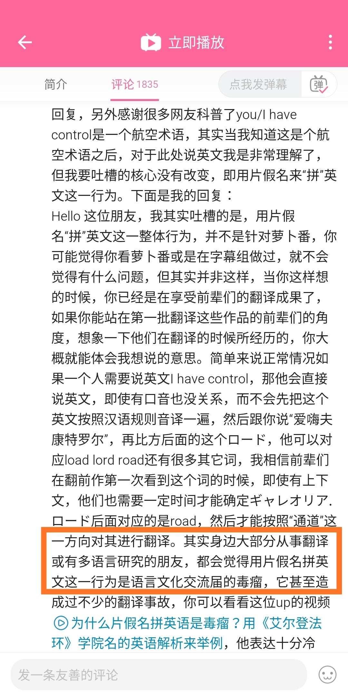

> 本文由 [简悦 SimpRead](http://ksria.com/simpread/) 转码， 原文地址 [zhuanlan.zhihu.com](https://zhuanlan.zhihu.com/p/502816847)

简中网上总归有人抱怨 / 批评日语中カタカナ外来語（例见图一），其中也不乏知乎上一些活跃的日语答主。甚至讲起日语语法、语音、历史等头头是道的优秀答主，也会在这个问题上表现得无知又可笑。

这是一种愚蠢的语言沙文主义，在日本人很平常地使用这些外来语时，中国人却试图要求日本人使用更多可以写成汉字的词汇，即和语和同样是外来语的汉语。如果说为什么全世界可能就中国大陆人有这么高比例的这种奇怪的想法，那自然就是因为这个地方有最强烈的认为汉字是表意 / 音义文字高于表音文字这个沙文想法了。

这个现象其实也可以回答一个知乎问题，大概叫有哪些典型的中国人思维。他其实涵盖了很多典型思维，除沙文主义，还包括家长式思维，觉得自己能管得到日本人用日语。

当然，偷懒也是原因之一。一些人学了日语的语法和惯用表达，发觉自己本来就会汉字，所以基本上已经能看懂一些日语了，然后就真的以为自己懂日语了，一看到自己不懂的カタカナ語，反而指责这是日语的不纯，而非自己还没把日语学全。就好像法国人学英语，把法语 / 罗曼语由来的词都学会了，可日耳曼由来的词还有好多不会的，觉得自己能读两篇论文了就声称自己学会了英语，贻笑大方。

