> 本文由 [简悦 SimpRead](http://ksria.com/simpread/) 转码， 原文地址 [zhuanlan.zhihu.com](https://zhuanlan.zhihu.com/p/479077220)

3.14 日全新俄式谣言来了。小泽不是发了一个视频看望伤兵吗？

俄罗斯真理部望风而动，果然再次开启造谣武器，在知乎上已经有这个谣言在发布了：

而且很明显，这则谣言来自于俄语圈：

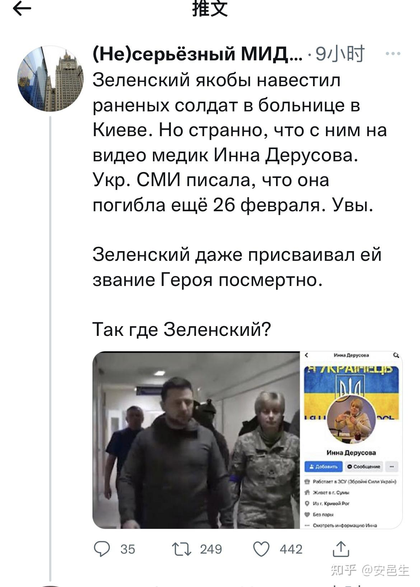

然而我们把这个女医生的照片放大，能看到她胸上的名牌，开头是ост（ost），结尾是нко（nko），明显不叫Инна делусова。

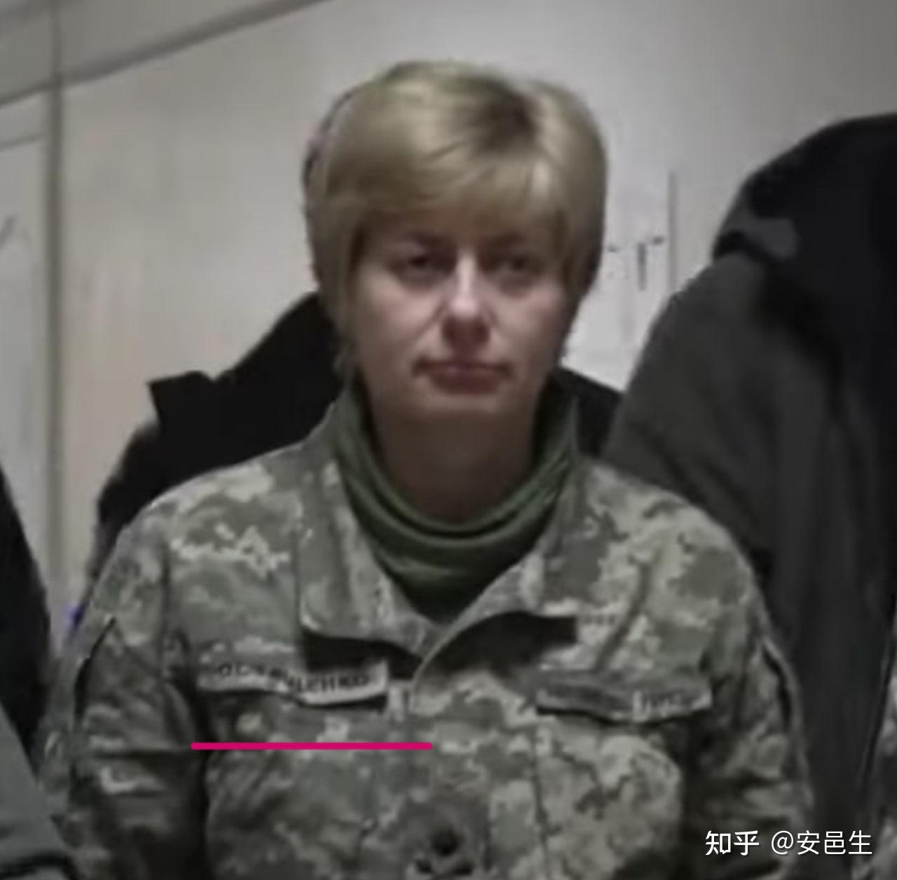

小泽的视频是 3 月 13 日发出来的，至迟在莫斯科时间 3 月 13 日晚 8 点就已经有谣言制造出来了。而在 3 月 14 日大清早，这个谣言就传到了中文网络。

所以大伙说说，为什么每次俄罗斯都造谣得如此迅速，而且这些谣言可以几乎是即时被转到中文网络上呢？ ️

————

今天被俄罗斯谣言纠缠不休的女主终于生下了孩子。祝福她。祝愿战争早点结束。希望战犯获得严惩。

——————

这个想法要写写俄罗斯方面是怎么污染信息的。

俄乌战争以来除了战场上外，最卖力的要算是俄罗斯的宣传部门了。由于网络时代无法阻挡信息传播，俄罗斯便尽其所能释放虚假信息把水搅混。

典型之一是直接制造假消息，如开战第一天以来说的乌克兰 1 小时 22 分投降、海空军全毁、泽连斯基反复逃跑等。以及所谓 “乌克兰纳粹” 亚速营在顿巴斯地区残杀 13000 名平民等。

另一个典型是辟谣式造谣，就是竭尽所能把一件真实的事情搅浑，让人以为是假的。最早我注意到这个现象是 2014 年马航 M17 被东乌分裂武装的打下来的事件，当时俄罗斯宣传部门就已经展现了强大的认知作战能力，至今仍有不少网友相信罪魁是乌军。

最近一个典型是对这张照片的造谣，俄媒说这是乌军把人赶到桥下摆拍：

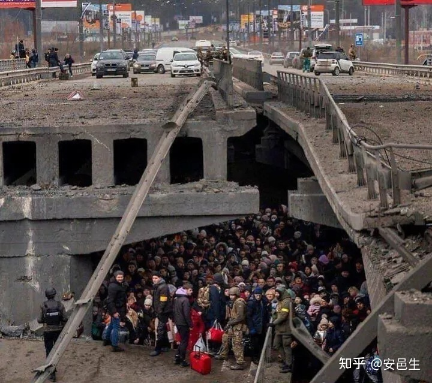

真实情况是，这些是基辅西北小镇 irpin 被俄罗斯轰炸后，居民正在被疏散到基辅的照片。这里是一座桥，由于为了防备俄军机械化部队推进，桥梁被摧毁，因此难民只能步行从桥下过河。（有视频，但视频审核没通过，我截图吧）

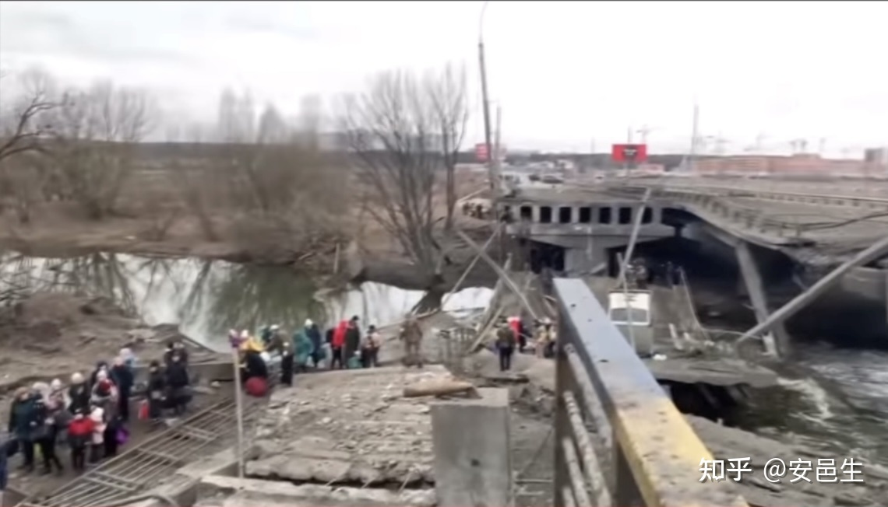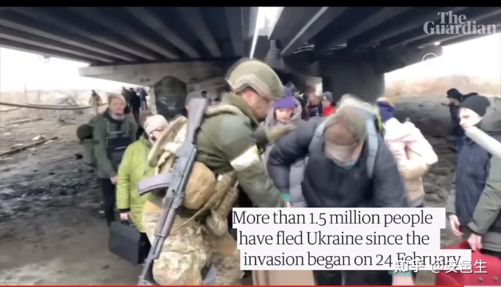

从视频里可以看到，这座桥下面就是河流，河流上只有窄窄的临时搭建的路可以通过。这就是为什么需要士兵维持秩序，以免发生危险。

这个疏散和维持秩序的行为，被俄罗斯真理部说成是 “把人赶到桥下面摆拍”。

以上就是信息污染的一个例子。

今天又发生了一件俄罗斯宣传部门如何污染信息的认知战。

3 月 9 日，俄罗斯轰炸了马里乌波尔的妇幼医院，导致部分怀孕妇女伤亡。真理部盯上了这件灾难，再度否认事情发生，说轰炸并不存在。

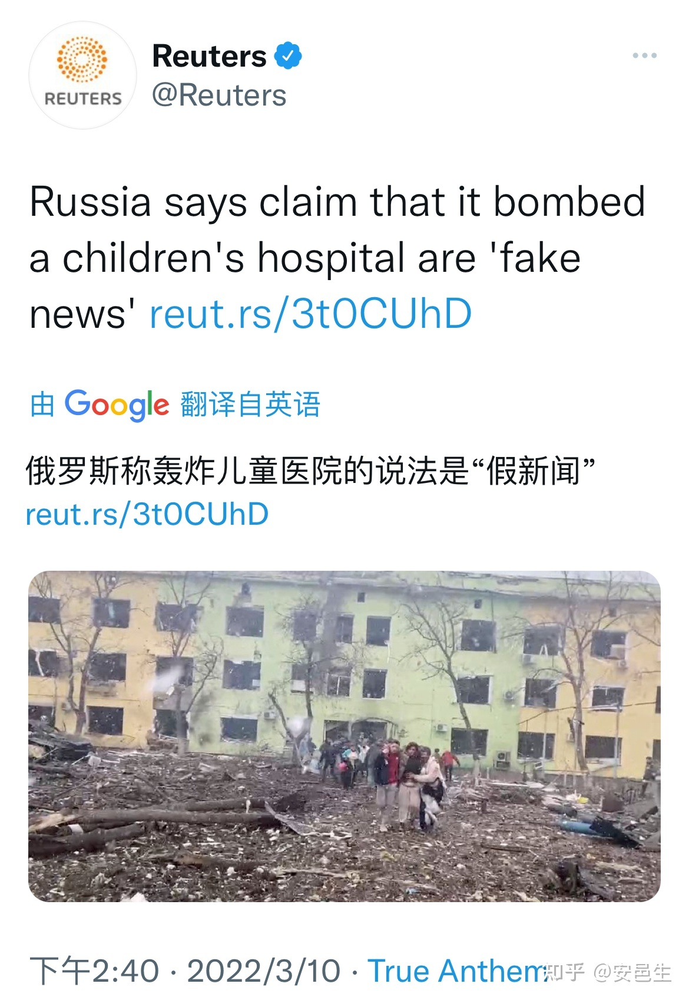

说是假新闻还不够，俄罗斯大使馆盖了一个大大的 “fake” 的章，说这家医院被 “亚速营” 当做了基地才遭到轰炸。

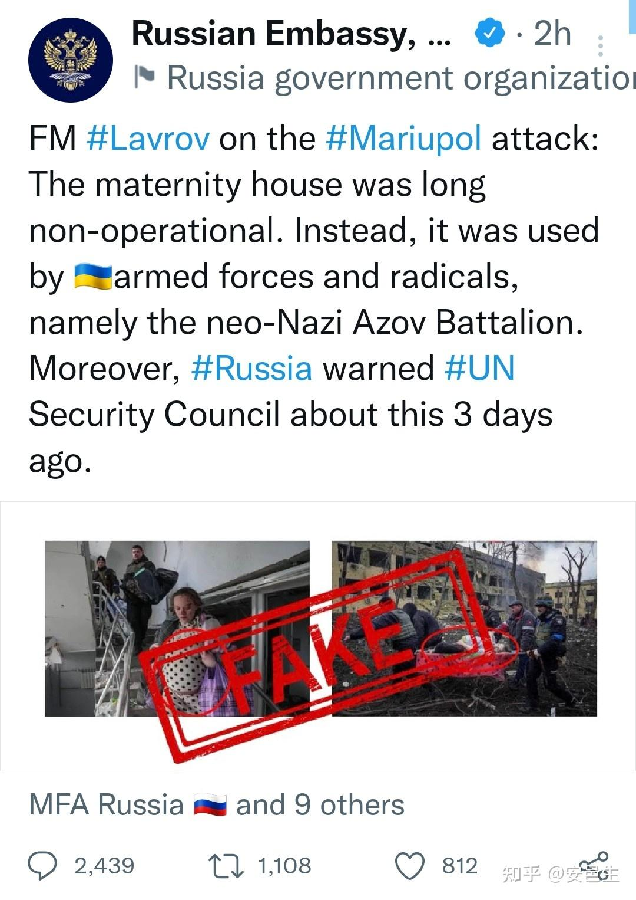

但是之前才说过轰炸不存在呢？

信息污染就是这样，自己自相矛盾无所谓，受众信哪个都行，就是别信真相。

随着这家医院曝出的照片越来越多，有流血的病床，有无奈的医护，还有受伤的孕妇。俄罗斯方面再一次开动宣传机器，找到这个孕妇的 ins，说她是个网红模特，她在摆拍。导致该孕妇几乎被俄罗斯人炸死之后又遭受到了俄罗斯人的网爆。

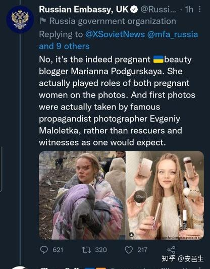

她可能确实是网红，但真的是孕妇啊。

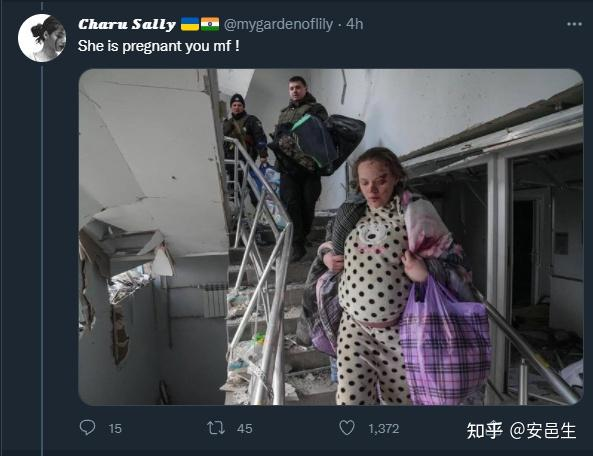

她 ins 里发了很多自己怀孕的点滴。ins 上的标签也显示战前她就在马里乌波尔了。这张照片是 2 月 15 日的。那会儿她未卜先知化好妆等俄罗斯人来炸，然后栽赃给俄罗斯吗？太可笑了。

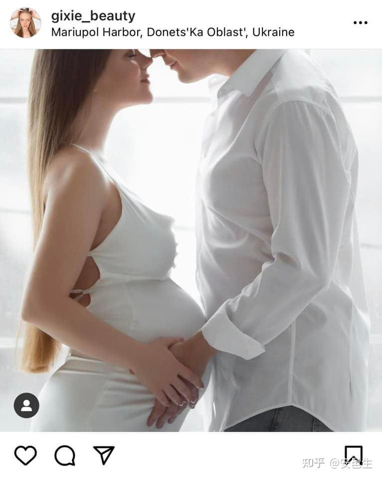

最后引用联合国秘书长的话：

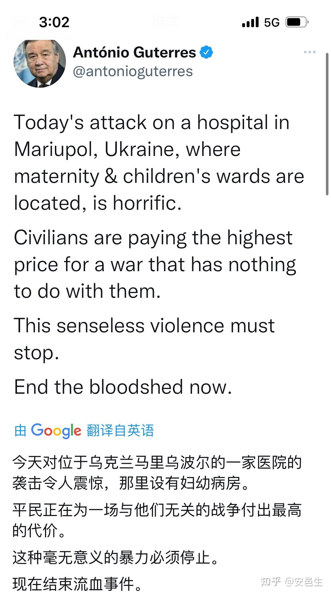

以上就是俄罗斯宣传部门认知作战的一个例子。利用大量虚假信息淹没真实信息，甚至刻意制造情节，毒化真实信息，是他们经常使用的一个手段。

以上手段主要应用于信息控制不那么容易的外国人。对于俄罗斯本国人，他们的信息扭曲到了什么样的程度呢？

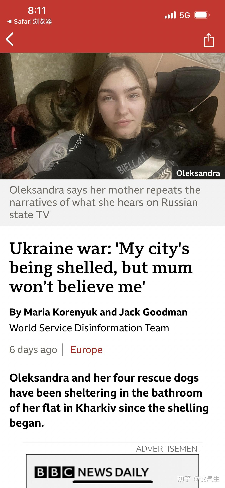

女儿在基辅被轰炸，打电话给自己在俄罗斯的妈妈。但是她妈妈说她说的是假消息。

"I didn't want to scare my parents, but I started telling them directly that civilians and children are dying," she says.

"But even though they worry about me, they still say it probably happens only by accident, that the Russian army would never target civilians. That it's Ukrainians who're killing their own people."

她在莫斯科的妈妈说，俄军从来不会针对平民，是乌克兰人杀自己人。

俄罗斯宣传部门的力量如此之强大。难怪有人会说，如果有《真理报》，世界至今不会知道拿破仑失败了。