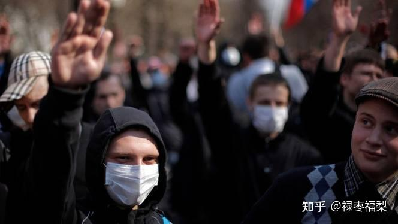
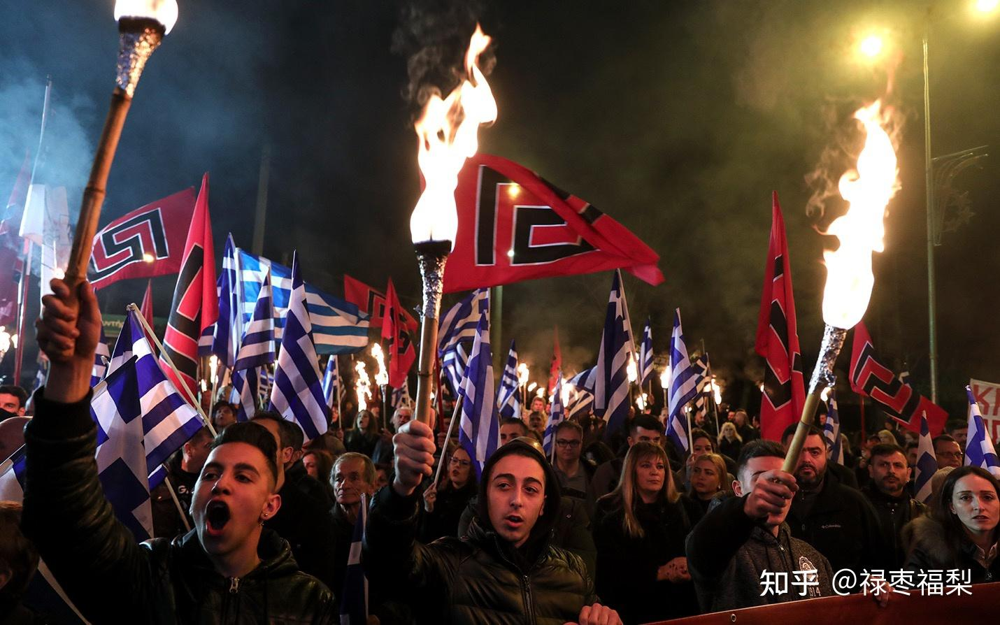
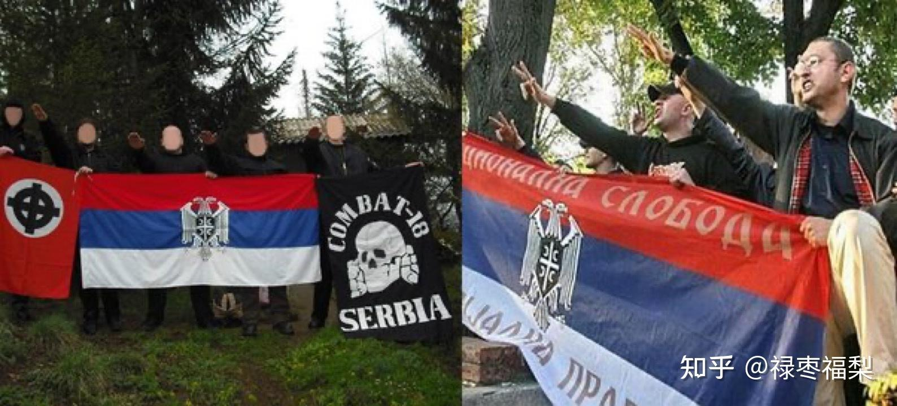
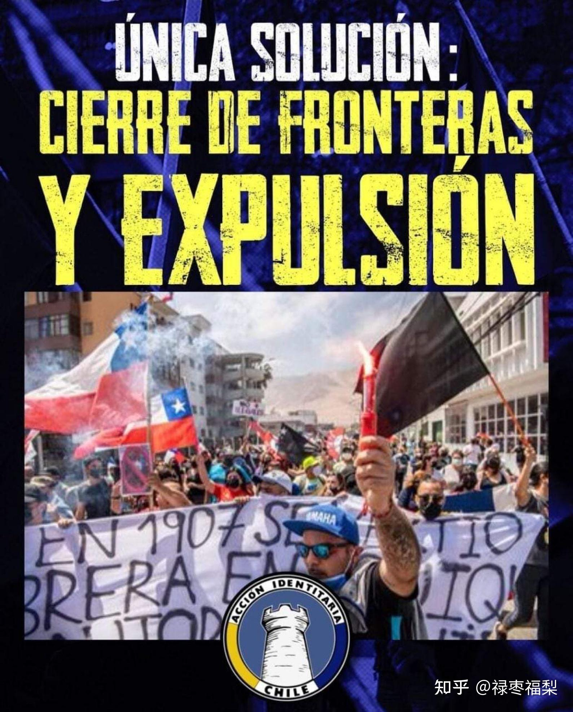
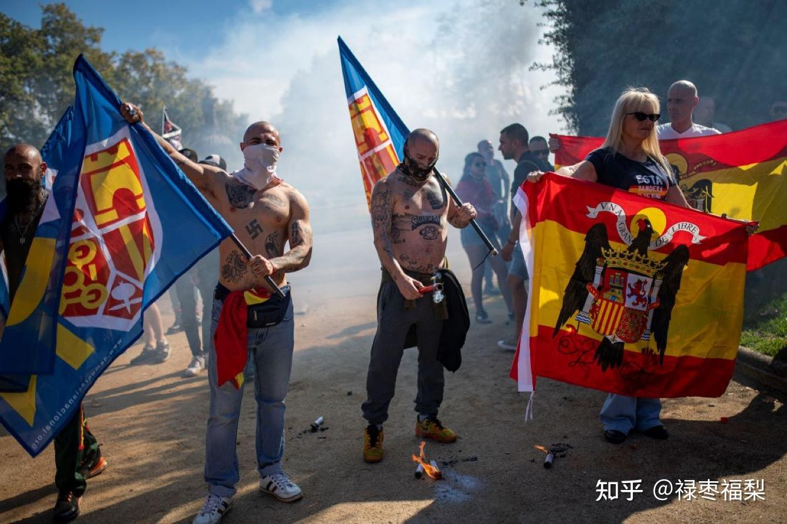
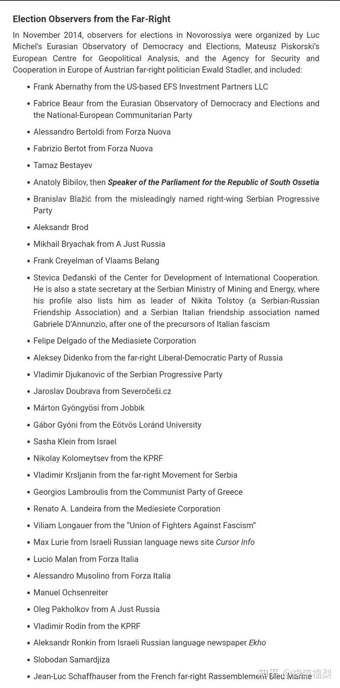

> 本文由 [简悦 SimpRead](http://ksria.com/simpread/) 转码， 原文地址 [zhuanlan.zhihu.com](https://zhuanlan.zhihu.com/p/634008567)

当俄罗斯宣扬去纳粹化时，事实是，自 2004 年以来，它一直秘密资助世界各地的新纳粹和极右翼运动并与之合作。遵循杜金普及的新欧亚主义战略，这些边缘群体正在造成分裂，传播谎言和颠覆社会。

2015 年，德米特里 · 罗戈津的罗迪纳党和来自俄罗斯帝国运动的新纳粹组织了一个极右翼会议，专门在乌克兰宣传俄罗斯的叙事，并招募一个志愿者联盟派往顿巴斯。

此后不久，俄罗斯成立了世界国家保守运动（WNCM），这是一个由来自世界各地的 70 多个组织和新纳粹和极右翼边缘政治团体领导人组成的联盟，宣扬 “新保守主义”。

俄罗斯正教法西斯帝国主义是俄罗斯新纳粹运动的演变。苏尔科夫 Surkovs 管理的民族主义将德国纳粹反万字符号换成了更可口的俄罗斯符号和十字架，将俄罗斯险恶的地缘政治野心伪装成 “新保守主义”。

俄罗斯帝国运动（RIM）及其准军事派别帝国军团在全球范围内为新纳粹和白人至上主义者开设了恐怖分子训练营，世界各地的极右翼极端主义暴力活动助长了他们的训练营。

RIM 在 2020 年被美国贴上了恐怖组织的标签。

一个重要的合作伙伴是斯洛伐克的新纳粹分子，估计有 500 多名极端分子通过 RIM 接受了直接培训，其中包括来自 GRU 和 FSB Spetsnaz 的准军事培训。他们还接受了颠覆、如何发动政变和煽动骚乱的培训。

这领带打得多标准。

德国新纳粹也通过 RIM 接受了培训。

尽管有关于 “中情局正在派美国新纳粹为亚速营作战” 的宣传和假故事，但实际上，美国极右翼和新纳粹绝大多数都在重复俄罗斯的反西方言论，并支持顿巴斯的武装分子。

瑞典的恐怖袭击也与俄罗斯训练有素的新纳粹分子有关，有些人甚至在顿巴斯作战。

让我们看看俄罗斯在乌克兰 “去纳粹化” 工作（“Denazification”）中最亲密的支持者，并在街头抗议 “邪恶的” 北约的众多新纳粹分子。

让我们从保加利亚开始，有 Ataka & The Vazrazhdane（复兴）运动。

来自希腊的 “金色黎明”。在 2014 年之前，它与乌克兰的斯瓦博达 Svaboda 结盟，当时斯瓦博达的成员是反北约的。

来自匈牙利的 Jobbick，也是 WNCM 的一部分。

来自瑞典的北欧抵抗运动与俄罗斯的 “Denazification” 站在一起。

来自德国的 NPD 和俄罗斯 - 德国保守党。

来自塞尔维亚的切特尼克人，他们的约万 · 谢维奇营在 2014 年的最初俄乌冲突中作战。

9 年来，塞尔维亚一直秘密派遣战士。现在更公开了。俄罗斯从小就开始给塞尔维亚孩子洗脑。

来自 18 战斗营的塞尔维亚新纳粹分子，有些人也在俄罗斯接受训练。

来自波兰的法兰加 Falanga 也是 WNCM 的一部分。

来自斯洛伐克的 Slovak Togetherness，是庞大的亲俄 / 反北约组织。

意大利 Forza Nuova，自 2014 年以来，有几名成员在顿巴斯为瓦格纳而战。

法国的 Reunovoue Francies 也是 2015 年俄罗斯联盟的成员。

叙利亚社会民族主义党或 SSNP，一个在叙利亚、黎巴嫩、约旦和巴勒斯坦活动的叙利亚民族主义政党，成立于 1932 年。也是俄罗斯联盟的成员。

Accion Identitaria，一个来自智利的新纳粹组织。也是 WNCM 的成员。

来自捷克共和国的社会正义工人党 (DSSS) 和 Národní Odpor 都是 WNCM 的成员。

Noua Dreaptă 在罗马尼亚和摩尔多瓦开展业务。

来自塞浦路斯的 ELAM，也是俄罗斯新民族保守主义联盟的一部分。

来自西班牙的民主国家（DN）的亲俄罗斯新纳粹分子。

还有马其顿左翼国会议员 Dimitar Apasiev 博士和 Borislav Krmov 与俄罗斯驻马其顿共和国大使 H.E. 谢尔盖 · 巴兹尼金的会面。虽然有着非常瞩目的光头，但他们讨论的重点却是所谓去纳粹化和消除来自极右翼和激进的新纳粹政治运动的威胁。

2014 年 11 月，新俄罗斯选举观察员由 Luc Michel 的欧亚民主和选举观察站、Mateusz Piskorski 的欧洲地缘政治分析中心以及奥地利极右翼政治家 Ewald Stadler 的欧洲安全与合作机构组织。可以请参阅顿涅茨克 DNR 和卢甘斯克 LNR 伪政权公投的组织者邀请担任监督者的欧洲极右翼团体和政党的所有个人名单。

当然，它首先是在克里米亚起作用的。

俄罗斯反纳粹就是个巨大的谎言和笑话，这个国家是造成世界不安定、极端主义恐怖主义泛滥的最大幕后黑手。所谓反纳粹，只不过是为了消灭不服从俄罗斯的国家与人民，俄罗斯自己才是最大的纳粹政权。