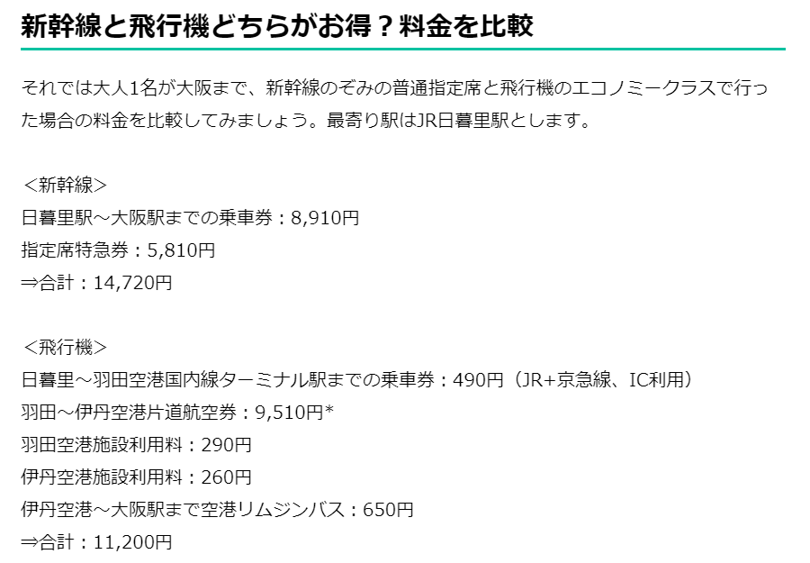
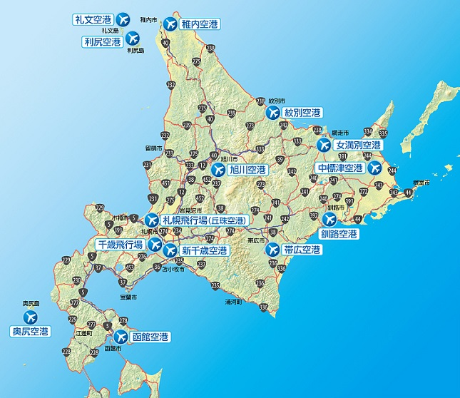

> 本文由 [简悦 SimpRead](http://ksria.com/simpread/) 转码， 原文地址 [www.zhihu.com](https://www.zhihu.com/question/565967442/answer/2759280746) 雨宫 Lin​

因为国外的飞机真的太方便了。有人说北海道到东京的新干线造不起来，以此来黑日本。要我说，哪怕造起来我也不会去坐。

哪怕是东京到大阪这种热门线路，飞机、高铁也是分庭抗礼的存在。

日本坐国内飞机可方便了，小机场的话，到达机场到登机基本上 15 分钟就够了。飞机又快又便宜，为什么不坐呢？

在中国，飞机场是大城市的象征，但是在日本，即便人口有限，造一个小机场问题还是不大的。

要知道，仅仅一个北海道就有这么多机场，而北海道的人口密度是很低的、且北海道的面积也就一个重庆市这么大。