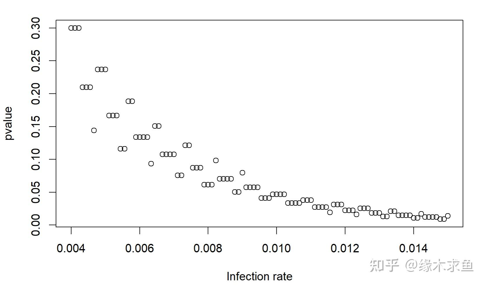

> 本文由 [简悦 SimpRead](http://ksria.com/simpread/) 转码， 原文地址 [www.zhihu.com](https://www.zhihu.com/question/530881524/answer/2469503570) 缘木求鱼​

这个问题充分反应了新闻是如何被人刻意扭曲的，新闻原稿

**【服用 Paxlovid 5 天的受试者发生感染的风险下降了 32%，而服用该药物 10 天的人感染风险下降了 37%。但辉瑞表示，这些结果在统计学上并不显著，未能达到研究的主要目标】**

知乎提问

**【如何看待 4 月 29 日辉瑞公司公布了其新冠口服药 Paxlovid 不能预防感染？】**

辉瑞明明说的是【现有数据没法证明防感染】，怎么到了有些人嘴里就成了【没法防感染】？黑人问号. jpg

你问我怎么看，我只能说知乎下沉市场做的真好，一堆连显著性都不知道是啥的人都敢答题。

=================================================

回到事情本身，这个只能说辉瑞对感染率可能有些误判，30%+ 的风险降低竟然没做出显著性，于是我就随手算了下整个实验里到底有多少人感染

假设辉瑞每组人数相等，使用的是卡方检验，如果实验组相对对照组风险下降 32% 的话，那么随着实验组的感染率上升，整个实验的 p-value 是这样变化的

我不知道辉瑞所谓的不显著是有多不显著，但是可以看出，感染率在 1% 时 p 值已经小于 0.05 了，如果严格点的话， 那么感染率 1.5% 的时候 p 值可以小于 0.01

换句话说，在实验进行的三个月内，3500 人里面最多也就感染了 50 人左右，这种级别的数据确实没啥可以证明的