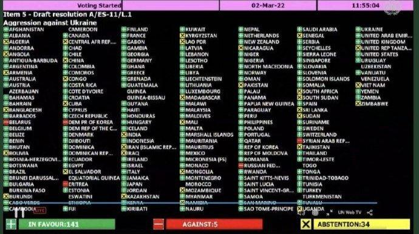
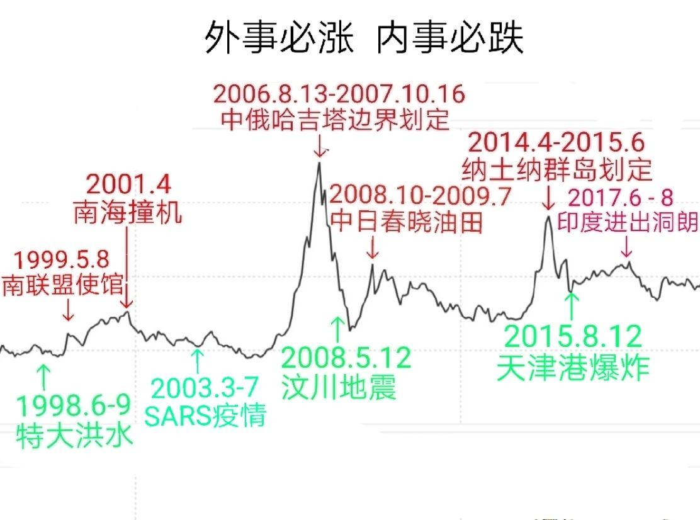

> 本文由 [简悦 SimpRead](http://ksria.com/simpread/) 转码， 原文地址 [www.zhihu.com](https://www.zhihu.com/question/519727437/answer/2372258101) 无概率的绝对随机

高赞回答，故意混淆普通决议和特别紧急决议，联大 11 次紧急特别决议，都是讨论 “大欺小”，都 100% 灵验，结局都是小国赢：

1956 年第 2 次《[苏联入侵匈牙利](https://www.zhihu.com/search?q=%E8%8B%8F%E8%81%94%E5%85%A5%E4%BE%B5%E5%8C%88%E7%89%99%E5%88%A9&search_source=Entity&hybrid_search_source=Entity&hybrid_search_extra=%7B%22sourceType%22%3A%22answer%22%2C%22sourceId%22%3A2372258101%7D)》，匈牙利最终点燃了华沙 - 苏联解体的导火索，将前华沙和波罗的海，变成北约里最反俄的一部分

1960 年第 4 次《刚果金镇压刚果布》，刚果的比利时语区（[刚果金](https://www.zhihu.com/search?q=%E5%88%9A%E6%9E%9C%E9%87%91&search_source=Entity&hybrid_search_source=Entity&hybrid_search_extra=%7B%22sourceType%22%3A%22answer%22%2C%22sourceId%22%3A2372258101%7D)）屠杀法语区（刚果布），金的面积人口均超过布的 10 倍，结局 刚果布独立

1980 年第 6 次《苏联入侵阿富汗》，阿富汗成了压垮苏联的最后一根稻草

1981 年第 8 次《南非镇压西南非洲》西南非洲独立为[纳米比亚](https://www.zhihu.com/search?q=%E7%BA%B3%E7%B1%B3%E6%AF%94%E4%BA%9A&search_source=Entity&hybrid_search_source=Entity&hybrid_search_extra=%7B%22sourceType%22%3A%22answer%22%2C%22sourceId%22%3A2372258101%7D)，[南非白人](https://www.zhihu.com/search?q=%E5%8D%97%E9%9D%9E%E7%99%BD%E4%BA%BA&search_source=Entity&hybrid_search_source=Entity&hybrid_search_extra=%7B%22sourceType%22%3A%22answer%22%2C%22sourceId%22%3A2372258101%7D)政权瓦解

第 1、3、5、7 次《四次中东战争》，人口面积均超过以色列 10 倍的阿拉伯联军，对以色列不宣而战搞偷袭，4 次战争 以色列均反败为胜，扩大领土

第 9 届《[以色列入侵巴勒斯坦](https://www.zhihu.com/search?q=%E4%BB%A5%E8%89%B2%E5%88%97%E5%85%A5%E4%BE%B5%E5%B7%B4%E5%8B%92%E6%96%AF%E5%9D%A6&search_source=Entity&hybrid_search_source=Entity&hybrid_search_extra=%7B%22sourceType%22%3A%22answer%22%2C%22sourceId%22%3A2372258101%7D)》，国力远小于以色列的巴勒斯坦建国

本届 赞 /（反 + 弃），远远超过以往 10 届：

141 票赞成、5 票反对（俄罗斯、白俄罗斯、叙利亚、朝鲜、[厄立特里亚](https://www.zhihu.com/search?q=%E5%8E%84%E7%AB%8B%E7%89%B9%E9%87%8C%E4%BA%9A&search_source=Entity&hybrid_search_source=Entity&hybrid_search_extra=%7B%22sourceType%22%3A%22answer%22%2C%22sourceId%22%3A2372258101%7D)）、35 票弃权。

集安组织、欧亚经济联盟 ，除 2 个涉案国自己，没有一国投反对票，集安组织和欧亚联盟，已蜕变为突厥国家联盟

会议结束后，记者问如何评价反对票 5 国，乌克兰驻联合国大使[谢尔盖 Sergiy](https://www.zhihu.com/search?q=%E8%B0%A2%E5%B0%94%E7%9B%96Sergiy&search_source=Entity&hybrid_search_source=Entity&hybrid_search_extra=%7B%22sourceType%22%3A%22answer%22%2C%22sourceId%22%3A2372258101%7D) 说：“要把有尊严的俄罗斯人民和扑惊区别开。”

将谢尔盖回答应用到这国，反对票应该是 6 票：

如果按照多数人的意愿，第 6 票本该反对，而非弃权：开战之初乌拉的欢呼、外嫁将变娶乌的高潮…… 与俄白本国的反战形成鲜明对比。

如果按 “利益权势 “教的信仰，拜物教最该赞成，而非弃权：马来西亚、越南、伊朗、伊拉克、委内瑞拉、海湾国，他们都是弃权国，也都是原油出口国，因为俄乌战争让油价屡创新高，他们把油卖给世界上最虔诚的拜物教，马来西亚和越南卖的还是 9 段线油。

叙利亚、朝鲜、厄立特里亚，他们都是反对票，因为他们在战火中没人，但 “吓死宝宝” 们，却没吹到 “硬汉老公” 的枕边风，留下了人数最多的“不是吧！不是吧”

在战况最烈的哈尔科夫，其他外人不是到了[利沃夫](https://www.zhihu.com/search?q=%E5%88%A9%E6%B2%83%E5%A4%AB&search_source=Entity&hybrid_search_source=Entity&hybrid_search_extra=%7B%22sourceType%22%3A%22answer%22%2C%22sourceId%22%3A2372258101%7D)，就是到了基辅，只剩下 “家人们”，先被硬汉老公误会撞了腰，又被战斗老公否认撞了头。

爱家人土却翘起了兰花指，叉起了ф字腰：老公呀，不能再耽误了，慈不掌兵，快动大杀器，快上温鸭蛋。

不对不对，老公你好坏好坏，原来你要按每公里半个人的密度，合围乌东重兵集团呀，求抱抱

2022.3.3，第 2 轮俄乌谈判在波白边界的布列斯特市举行，整整两年前，仿佛有先见之明，乌克兰人将基辅的胜利大道，更名为布列斯特大道：

2020.3.5，埃尔多安 - 普京签订《索契协议的附加议定书》，索契协议将叙利亚产油区割让给土耳其，只剩下一大片沙漠留给俄罗斯对叙利亚放血，为了羞辱普京，土耳其将这个 “伊德利卜割让协议 “称为第 3 个《布列斯特和约》

今天，叙利亚帮普京投下了反对票，两年前，普京做主替他们割让了[伊德利普](https://www.zhihu.com/search?q=%E4%BC%8A%E5%BE%B7%E5%88%A9%E6%99%AE&search_source=Entity&hybrid_search_source=Entity&hybrid_search_extra=%7B%22sourceType%22%3A%22answer%22%2C%22sourceId%22%3A2372258101%7D)。

《索契协议》引发了乌克兰人的狂欢，尽管他们毫不相关，乌克兰把首都基辅 的 胜利大道 更名为 布列斯特大道，最猛烈的羞辱俄罗斯：在布列斯特签订的两次条约，见证了：沙俄→苏联→俄罗斯的面积退化史

1918.3.3，[德意志帝国](https://www.zhihu.com/search?q=%E5%BE%B7%E6%84%8F%E5%BF%97%E5%B8%9D%E5%9B%BD&search_source=Entity&hybrid_search_source=Entity&hybrid_search_extra=%7B%22sourceType%22%3A%22answer%22%2C%22sourceId%22%3A2372258101%7D)、奥斯曼帝国、苏维埃联盟签订《[布列斯特条约](https://www.zhihu.com/search?q=%E5%B8%83%E5%88%97%E6%96%AF%E7%89%B9%E6%9D%A1%E7%BA%A6&search_source=Entity&hybrid_search_source=Entity&hybrid_search_extra=%7B%22sourceType%22%3A%22answer%22%2C%22sourceId%22%3A2372258101%7D)》，将沙俄缩水 323 万平方公里（4 个东三省），赔款 80 亿马克，变成苏联。

1991.12.29，前苏联主要加盟共和国，在布列斯特市的[别洛韦日森林](https://www.zhihu.com/search?q=%E5%88%AB%E6%B4%9B%E9%9F%A6%E6%97%A5%E6%A3%AE%E6%9E%97&search_source=Entity&hybrid_search_source=Entity&hybrid_search_extra=%7B%22sourceType%22%3A%22answer%22%2C%22sourceId%22%3A2372258101%7D)，签订《[别洛韦日协议](https://www.zhihu.com/search?q=%E5%88%AB%E6%B4%9B%E9%9F%A6%E6%97%A5%E5%8D%8F%E8%AE%AE&search_source=Entity&hybrid_search_source=Entity&hybrid_search_extra=%7B%22sourceType%22%3A%22answer%22%2C%22sourceId%22%3A2372258101%7D)》，再将苏联缩水 533 万平方公里（6.6 个东三省），变成俄罗斯。

今天的土耳其领土的 1/3，卡尔斯、[阿尔特](https://www.zhihu.com/search?q=%E9%98%BF%E5%B0%94%E7%89%B9&search_source=Entity&hybrid_search_source=Entity&hybrid_search_extra=%7B%22sourceType%22%3A%22answer%22%2C%22sourceId%22%3A2372258101%7D)温、阿尔达汉、[阿拉拉特](https://www.zhihu.com/search?q=%E9%98%BF%E6%8B%89%E6%8B%89%E7%89%B9&search_source=Entity&hybrid_search_source=Entity&hybrid_search_extra=%7B%22sourceType%22%3A%22answer%22%2C%22sourceId%22%3A2372258101%7D)……，都是 10 月革命后，通过 1918 年《布列斯特和约》、1921 年《[卡尔斯条约](https://www.zhihu.com/search?q=%E5%8D%A1%E5%B0%94%E6%96%AF%E6%9D%A1%E7%BA%A6&search_source=Entity&hybrid_search_source=Entity&hybrid_search_extra=%7B%22sourceType%22%3A%22answer%22%2C%22sourceId%22%3A2372258101%7D)》，从列宁手中获得的。

除了[布列斯特和约](https://www.zhihu.com/search?q=%E5%B8%83%E5%88%97%E6%96%AF%E7%89%B9%E5%92%8C%E7%BA%A6&search_source=Entity&hybrid_search_source=Entity&hybrid_search_extra=%7B%22sourceType%22%3A%22answer%22%2C%22sourceId%22%3A2372258101%7D)，列宁还两次书面承诺过，废除沙俄与中国的一切不平等条约，退还所有中国领土和俄租界，因为 “北洋政府匪军，配合帝国主义列强，悍然入侵蒙古和苏联，收复中东路”。但北洋匪军退兵后，被别人割让 330 万平方公里的苏联，仅仅只对中国不兑现承诺，也仅仅只被中国称为战斗民族，这使得中苏边界长期未定，2007 确定这个边界后，曾巧合出 6124 点的最大 A 股牛市

根据历史经验，[第 11 届联大特急会议](https://www.zhihu.com/search?q=%E7%AC%AC11%E5%B1%8A%E8%81%94%E5%A4%A7%E7%89%B9%E6%80%A5%E4%BC%9A%E8%AE%AE&search_source=Entity&hybrid_search_source=Entity&hybrid_search_extra=%7B%22sourceType%22%3A%22answer%22%2C%22sourceId%22%3A2372258101%7D)，将实现第 11 次大欺小被反杀。

根据历史经验，前后 3 位演员，将第 3 次导演《布列斯特 - 阉割俄罗斯》

《布列斯特和约》的演员是的[喀山大学](https://www.zhihu.com/search?q=%E5%96%80%E5%B1%B1%E5%A4%A7%E5%AD%A6&search_source=Entity&hybrid_search_source=Entity&hybrid_search_extra=%7B%22sourceType%22%3A%22answer%22%2C%22sourceId%22%3A2372258101%7D)剧社演员、著名演讲艺术家

《[布列斯特 - 别洛韦日森林协议](https://www.zhihu.com/search?q=%E5%B8%83%E5%88%97%E6%96%AF%E7%89%B9-%E5%88%AB%E6%B4%9B%E9%9F%A6%E6%97%A5%E6%A3%AE%E6%9E%97%E5%8D%8F%E8%AE%AE&search_source=Entity&hybrid_search_source=Entity&hybrid_search_extra=%7B%22sourceType%22%3A%22answer%22%2C%22sourceId%22%3A2372258101%7D)》的导演是好莱坞明星里根

第 3 次布列斯特和约，导演是喜剧演员

根据历史经验， A 股将爆发出最后的大牛：

93 银河号、96 台海、98 印尼屠华、99 南联盟使馆、01 南海撞机、06-07 上合边界（6124 点第一大牛市）、08-09 春晓油田（3435 点第三大牛市）、14-15 九段线纳土纳（5178 点第二大牛市）、17 洞朗、19 [拉达克](https://www.zhihu.com/search?q=%E6%8B%89%E8%BE%BE%E5%85%8B&search_source=Entity&hybrid_search_source=Entity&hybrid_search_extra=%7B%22sourceType%22%3A%22answer%22%2C%22sourceId%22%3A2372258101%7D)，所有的此类外事，都是牛市

除了 92 南巡讲话，所有的牛市都是此类外事