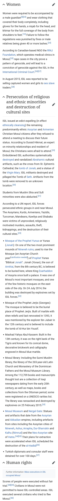

> 本文由 [简悦 SimpRead](http://ksria.com/simpread/) 转码， 原文地址 [www.zhihu.com](https://www.zhihu.com/question/281363955/answer/2650473476) 思有涯

并不是 “有了自由” 而是 “自由了”（are free）题目是对的 但很多人会引错

我理解的这里的自由并不是自由民主主义中非常崇高、理念化的自由 而是和 “从监狱获释” 或“免于某种负担”中的 free 同意 这里的 free 更多描述[摩苏尔](https://www.zhihu.com/search?q=%E6%91%A9%E8%8B%8F%E5%B0%94&search_source=Entity&hybrid_search_source=Entity&hybrid_search_extra=%7B%22sourceType%22%3A%22answer%22%2C%22sourceId%22%3A2650473476%7D) free from daesh 的这种状态

此外 即使你觉得她说的自由就是自由民主的自由 反正任何人欣喜于伊拉克人民拥有更多民主的自由也是十分正常的 最重要的是 自由不是他们一无所有的理由 isis 才是 对这句话断章取义仿佛是说自由是用一无所有换的 而其实明明是本来就一无所有 但解放后至少有了自由 而至于现在是否还一无所有 我明确回答不是 摩苏尔重建取得了颇多进展

而且我倒问问你 女性可以自由上街 不会被贩为性奴 基督徒和什叶派不会被劫持和折磨 没有人会被当街枪杀 想逃走就得死 这是不是确实是即使 “一无所有” 也该有的自由？你们说自由没命重要 有没有可能 他们得到的就是保命的自由？

再来说说一无所有 这里的一无所有显然不是说 “政府军解放了他们 所以他们一无所有了” 而是他们本来就一无所有 怎么着 他们原来在 [daesh](https://www.zhihu.com/search?q=daesh&search_source=Entity&hybrid_search_source=Entity&hybrid_search_extra=%7B%22sourceType%22%3A%22answer%22%2C%22sourceId%22%3A2650473476%7D) 治下丰衣足食？那为什么四百万跑了一百万？

至于那些说 daesh 是美国搞出来的 病入膏肓了就别和我对线了 见一个拉黑一个

而摩苏尔民众现在还一无所有么？在 “自由” 之后他们有了什么？摩苏尔各处的重建我根本无法完全列举 也只能推荐自己去谷歌 Mosul reconstruction 吧 你有兴趣 可以一篇一篇看下来

毕竟这一句话的前一句是 “看 他们很开心” 而至于你们想替他们不开心 我是拦不住的