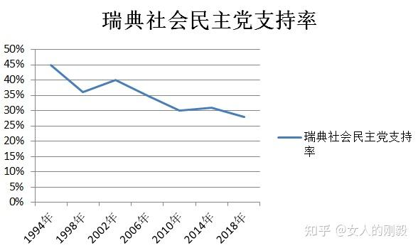

> 本文由 [简悦 SimpRead](http://ksria.com/simpread/) 转码， 原文地址 [www.zhihu.com](https://www.zhihu.com/question/21823700/answer/2300689790) 女人的刚毅

反对

@吗啡哥 的回答。

一、北欧仍然有高税收——民主社会主义的寒冬
---------------------

吗啡哥说：

实际上，**北欧不但不是社会主义的典范，反而是新自由主义的典范**。当然北欧仍然是[社民主义](https://www.zhihu.com/search?q=%E7%A4%BE%E6%B0%91%E4%B8%BB%E4%B9%89&search_source=Entity&hybrid_search_source=Entity&hybrid_search_extra=%7B%22sourceType%22%3A%22answer%22%2C%22sourceId%22%3A2240473208%7D)路线，只不过不是那种传统意义上的对富人企业征高税对穷人发福利的旧社民了，而是与新自由主义相结合产生的**新自由主义社民（Neoliberal Socialism / Neoliberal Social Democracy）。所以[伯尼桑德斯](https://www.zhihu.com/search?q=%E4%BC%AF%E5%B0%BC%E6%A1%91%E5%BE%B7%E6%96%AF&search_source=Entity&hybrid_search_source=Entity&hybrid_search_extra=%7B%22sourceType%22%3A%22answer%22%2C%22sourceId%22%3A2300689790%7D)给北欧错发了[民社](https://www.zhihu.com/search?q=%E6%B0%91%E7%A4%BE&search_source=Entity&hybrid_search_source=Entity&hybrid_search_extra=%7B%22sourceType%22%3A%22answer%22%2C%22sourceId%22%3A2240473208%7D)的帽子了**，北欧不是民主社会主义，跟在资本主义框架内发福利改良的社民相比，民社就是走民选路线上台然后实现公有社会主义的康米。[1](1)(#ref_1)

为了应对资本主义全球化所导致的资本外移，北欧社会党不得不降低富人税，但这并不意味着北欧不是通过向富人企业征收高税来给穷人发福利——瘦死骆驼比马大。就目前而言，北欧五国的贫富差距全球最小，如果没有 “劫富济贫” 的征税，我很难想象这是怎么搞出来的。

另外，在吗啡哥的回答中，吗啡哥努力列举出北欧的投资状况，却没有列举出北欧的税收——对此我感到很好奇，吗啡哥到底是怎么搞的，你知道观点需要数据支持，但是你一边声称北欧没有通过税收来 “劫富济贫”，一边却不把北欧的税收列举出来。哦，反正数据与你的观点相冲突，数据实在无法通过扭曲的逻辑来论证你的观点，你就不将起列举出来。

我想吗啡哥需要更多训练，毕竟只要你的逻辑扭曲到一定程度，你不仅可以将北欧的投资直接简化成对外剥削，并将其作为北欧社会民主主义的结果，你还可以声称北欧没有向富人征收高税，当然还可以将房子吹到天上，或者说 2+2=5。

北欧税收的实际情况为：

行普遍社会福利和高比例的公共开支的基础和前提是高税收。**由于实行累进所得税，因此，使得个人收入的边际税率很高。如芬兰最高所得税率近 70%。瑞典税收占 GDP 的比重为 53%，**西欧平均为 40%-50%。瑞典对现金福利也同样征税。按照规定，所有退休金收入原则上都应缴纳所得税，对只领取基本退休金，或也领取少量补充退休金但其年收入不到 9 万克朗者，可给予免税或减税，而且可申请住房津贴或退休金补贴等。病休津贴和父母津贴均也需按比例缴纳所得税和保险税。北欧国家的税收不是以家庭为单位，而是以个人为单位，男女平等。这在目前是一个正在争论的问题。[2](2)(#ref_2)

二、依靠对外投资来建设福利社会？——吗啡哥的寻医问药
--------------------------

吗啡哥声称北欧是通过对外投资、剥削全球，来实现福利社会：

所以到这里国内自由派的领头人物秦晖先生也弄错了，北欧的高福利不是贫富分配的结果，而是全球化跨国剥削的结果。[3](3)(#ref_3)

这实在是站不住脚的说法。毕竟全球每个国家都可以进行对外投资，但除了北欧五国之外，你基本上看不到类似于北欧的福利社会——实际上，许多领袖根本就没有建设福利社会的打算——比起把投资赚到的钱用来建设福利社会，领袖们更喜欢把钱塞到自己的口袋里。

由此可见，对外投资或许能够促进北欧的经济发展，但对外投资不是北欧实现福利社会的决定性因素。

吗啡哥将北欧的对外投资称之为剥削全球，这真是不令人意外——反正北欧人对外投资就是剥削全球，而俄罗斯等对外投资就是伟大的国际主义精神。将投资等同于剥削（你能不能 “剥削” 我几个小目标？）！天哪！搞得好像西班牙没有社会党和工会是因为北欧人压迫了西班牙人一样。其实资本主义全球化给北欧乃至全球的社会主义运动造成了严重的危害，资本转移能力的提高降低了北欧社会党和工会的议价权——每当社会党和工会想要控制资本、让资本与市场经济相分离时，资本家就会威胁说：“你再搞左翼运动，再提高税收，我就把资本转移到没有工会、没有社会党的超大经济体！”对此的唯一解决办法就是全球左翼运动联合起来，而在全球左翼运动联合起来之前，至少西班牙要有社会党和工会——因此，包括北欧人在内的欧美左翼团体，甚至是拉美左翼团体都巴不得西班牙人能够早日站起来。

三、北欧的民主社会主义已经危在旦夕
-----------------

正如前文所述，我们已经看到，北欧人，至少北欧的大多数人实则是资本主义全球化过程中的利益受损者；并且由于很多地方没有社会党和工会，导致全球左翼运动无法推进。新自由主义的力量越来越强，民主社会主义的力量越来越弱。北欧人渐渐对民主社会主义丧失信心，至少对社会党不再有信心。近年来，瑞典社会党的支持率不断降低。

资本主义全球化使小制胜联盟的新自由主义领导人以及大资本家的钱包越来越膨胀，而大制胜联盟的领导人以及绝大多数老百姓的利益都在受损。全球的贫富差距都在扩大。北欧虽然是世界上最平等的国家，但近年来北欧的贫富差距也在扩大。为了生存，北欧社会党不得不接纳部分新自由主义的内容，但北欧社会党更多地与共产党（左翼党）和绿党结盟，而不是与资产阶级政党结盟——现在，就算是红绿联盟也渐渐难以与资本主义抗争了。

北欧的科技创新能力、基本同等的医疗和教育和护理、全球最清廉的社会结构以及浓厚的左翼文化等等，为社会动荡提供了些许缓冲时间。但如果西班牙人不站起来，如果真实的消息无法传播，如果全球的左翼运动没能展开，那就…… 无论是北欧、西欧还是拉美，无论是发达地区还是发展中的地区，都会随着资本主义心脏的跳动而走向毁灭，因为那跳动的声音就是定时炸弹的倒计时。

参考
--

1.  [^](#ref_1_0)[https://www.zhihu.com/question/21823700/answer/2240473208](https://www.zhihu.com/question/21823700/answer/2240473208)
2.  [^](#ref_2_0)[http://www.reformdata.org/2002/0720/12890.shtml](http://www.reformdata.org/2002/0720/12890.shtml)
3.  [^](#ref_3_0)[https://www.zhihu.com/question/21823700/answer/2240473208](https://www.zhihu.com/question/21823700/answer/2240473208)