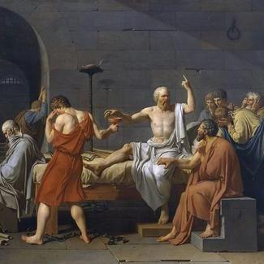

原文地址 [www.zhihu.com](https://www.zhihu.com/question/35156893/answer/3042812139) 

陈某人语冰

丁副委员长最出圈的言论就是跟柴静讨论 “什么是公平的减排方案”，我支持他的结论，但是不同意他的思路。

丁副委员长认为发达国家设计的减排方案限制了[发展中国家](https://www.zhihu.com/search?q=%E5%8F%91%E5%B1%95%E4%B8%AD%E5%9B%BD%E5%AE%B6&search_source=Entity&hybrid_search_source=Entity&hybrid_search_extra=%7B%22sourceType%22%3A%22answer%22%2C%22sourceId%22%3A3042812139%7D)的经济增长，我同意。

但是他将[碳排放权](https://www.zhihu.com/search?q=%E7%A2%B3%E6%8E%92%E6%94%BE%E6%9D%83&search_source=Entity&hybrid_search_source=Entity&hybrid_search_extra=%7B%22sourceType%22%3A%22answer%22%2C%22sourceId%22%3A3042812139%7D)视为发展权、基本人权，我觉得不恰当。

我认为将任何权利定性为 “[发展权](https://www.zhihu.com/search?q=%E5%8F%91%E5%B1%95%E6%9D%83&search_source=Entity&hybrid_search_source=Entity&hybrid_search_extra=%7B%22sourceType%22%3A%22answer%22%2C%22sourceId%22%3A3042812139%7D)” 都是很危险的。

最著名的 “发展权” 解释发生在计划生育运动的高峰。当时[西方文明](https://www.zhihu.com/search?q=%E8%A5%BF%E6%96%B9%E6%96%87%E6%98%8E&search_source=Entity&hybrid_search_source=Entity&hybrid_search_extra=%7B%22sourceType%22%3A%22answer%22%2C%22sourceId%22%3A3042812139%7D)指责 “中国的计划生育侵犯了人的生育权”，美国甚至为受到强制节育的中国妇女提供 “政治庇护”。

对此，中国学者回应 “生存权和发展权是高于生育权的基本人权”。这个论述在当时得到了广大中国人的认可。

但是，中国妇女受到的伤害并没有因为她在思想上接受了 “发展权高于生育权” 而减小。

同样的 “发展权” 解释还发生在其他领域，例如每周 6 天工作制。

现在的年轻人应该不知道，我国职工曾经长时间处于一周工作 6 天，每天 8 小时的工作环境，加班加点更是常态，中国直到 1995 年 5 月 1 日起才正式实行 [5 天工作制](https://www.zhihu.com/search?q=5%E5%A4%A9%E5%B7%A5%E4%BD%9C%E5%88%B6&search_source=Entity&hybrid_search_source=Entity&hybrid_search_extra=%7B%22sourceType%22%3A%22answer%22%2C%22sourceId%22%3A3042812139%7D)。

对于工作时间的规定其实也反映了 “发展权” 意识。多工作就是多发展，少工作就是少发展，这种思维方式直到时任国科委科技[发展研究](https://www.zhihu.com/search?q=%E5%8F%91%E5%B1%95%E7%A0%94%E7%A9%B6&search_source=Entity&hybrid_search_source=Entity&hybrid_search_extra=%7B%22sourceType%22%3A%22answer%22%2C%22sourceId%22%3A3042812139%7D)中心主任胡平多次出差欧美后，才有所转变。

后来中国试行 5 天工作制，最常见的反对声音是 “七天都干不完，你还五天！”。可见大多数人没有意识到工作成果与工作时间的关系会在不同行业里有不同的表现，即工作效率会不同，人们对“发展权” 的认识很片面。

前些年的 “996 是福报”，其底层逻辑也是把“发展权” 看得比其他一些基本人权更高。

综上所述，我认为 “发展权” 在很多场景中实际上成为了“遮羞布”，它以宏伟的愿景迷惑了普罗大众，减损了民众的现实感，让民众不再去关注现实本身，而是从未来汲取营养。

中国人需要一个公平的减排方案，但是我们不能以 “发展权” 做为争取权利的理由，它并不是个伟光正的名号。
