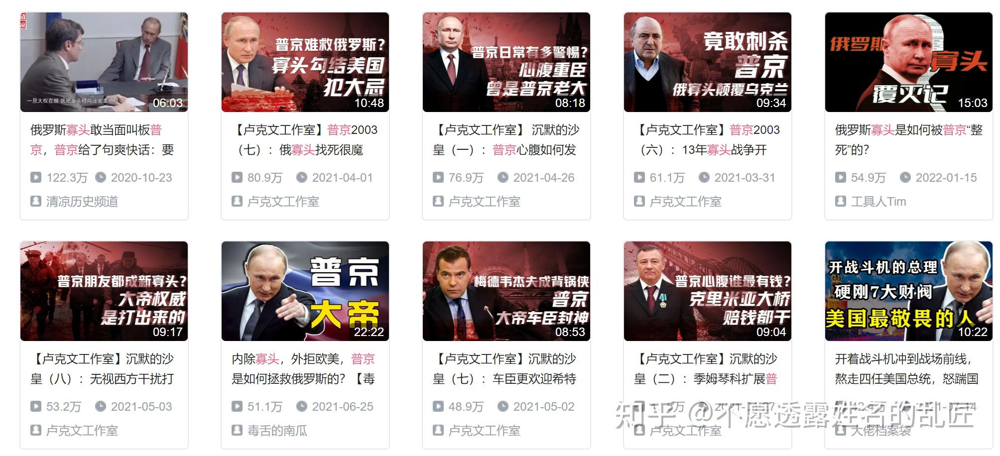

> 本文由 [简悦 SimpRead](http://ksria.com/simpread/) 转码， 原文地址 [www.zhihu.com](https://www.zhihu.com/question/494704471/answer/2363901766) 不愿透露姓名的乱匠​

大概两三年前，简体中文网络流行过一阵 “韩八股”，大致就是勾勒出一个韩国的 “左派神话”，老一辈穷人左派政治家卢武铉倒下了，新一辈的文在寅起身复仇。虽然博主 “[卢克文](https://www.zhihu.com/search?q=%E5%8D%A2%E5%85%8B%E6%96%87&search_source=Entity&hybrid_search_source=Entity&hybrid_search_extra=%7B%22sourceType%22%3A%22answer%22%2C%22sourceId%22%3A2363901766%7D)”靠着炮制 “韩八股” 发了财，但他其实不是这个故事的发明人。在简体中文网络长期就流传着“财阀把持韩国论”，只是文在寅的当选给了八股写手们一个绝佳的机会。

而造成[韩八股](https://www.zhihu.com/search?q=%E9%9F%A9%E5%85%AB%E8%82%A1&search_source=Entity&hybrid_search_source=Entity&hybrid_search_extra=%7B%22sourceType%22%3A%22answer%22%2C%22sourceId%22%3A2363901766%7D)的土壤，在我看来是两个因素。一个是 “左派好右派坏” 这种叙事相对来说是不容易删帖的，对于想把 “做号” 当成饭碗的那些人来说是个合理的选择；另一点则是思想政治教育生产出了一批喜欢听这种观点的人。

除了 “左 - 右” 参考系外，在简体中文世界写世界历史政治还有一个密码，就是吹嘘“民族派”，反对“国际派”——当然这里有一个细节，如果这两个维度同时生效时，给苏联人当傀儡就可以归到左派名下，可以豁免被指责为国际派。

而在最近一两年，一种 “俄八股” 也很流行，就是将普京同时塑造为俄罗斯民族主义者和左派。而建构左派形象的论据就是“普京反寡头（也就是韩国语境下的财阀）”。

而这些作者经常暗示普京的 “左” 和苏联的 “左” 能联系起来——就如同文在寅和卢武铉一样——说得夸张一些，普京是苏联最后的忠臣孝子。

我觉得这些花了很多时间查资料、剪视频的博主不可能不知道普京虽然曾经对一些苏联时期的文化符号展示过善意，但内心是个地地道道的皇俄派，之所以睁着眼睛说瞎话，纯粹就是[流量公式](https://www.zhihu.com/search?q=%E6%B5%81%E9%87%8F%E5%85%AC%E5%BC%8F&search_source=Entity&hybrid_search_source=Entity&hybrid_search_extra=%7B%22sourceType%22%3A%22answer%22%2C%22sourceId%22%3A2363901766%7D)用得太舒服了。

即便普京亲口怒斥了列宁，这帮人还是会不断复制粘贴出新的俄八股，而它的读者们也还是会继续买账。