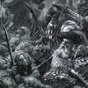

> 本文由 [简悦 SimpRead](http://ksria.com/simpread/) 转码， 原文地址 [www.zhihu.com](https://www.zhihu.com/question/524984251/answer/2927772113) 奸奇大魔里德逊

有没有一种可能，审美 “权 “这种说法本来就类似于话语 “权”，是一群极度狭隘容不得和自己不同的审美的存在、神经敏感、笃信阴谋论的[被害妄想症](https://www.zhihu.com/search?q=%E8%A2%AB%E5%AE%B3%E5%A6%84%E6%83%B3%E7%97%87&search_source=Entity&hybrid_search_source=Entity&hybrid_search_extra=%7B%22sourceType%22%3A%22answer%22%2C%22sourceId%22%3A2927772113%7D)与认为世界必须围着自己旋转的[巨婴症](https://www.zhihu.com/search?q=%E5%B7%A8%E5%A9%B4%E7%97%87&search_source=Entity&hybrid_search_source=Entity&hybrid_search_extra=%7B%22sourceType%22%3A%22answer%22%2C%22sourceId%22%3A2927772113%7D)患者，为了制造对立而强行发明出来概念？

只要这个世界上不是只有样板戏（同时还得强制你观看），谁能剥夺的了你的审美权？不喜欢看不看就是了，艺术家们何德何能摁着你的头逼你去看他们的作品？

只要资本主义和[自由市场](https://www.zhihu.com/search?q=%E8%87%AA%E7%94%B1%E5%B8%82%E5%9C%BA&search_source=Entity&hybrid_search_source=Entity&hybrid_search_extra=%7B%22sourceType%22%3A%22answer%22%2C%22sourceId%22%3A2927772113%7D)还是世界的主流，艺术家和涉及文化产业的资本就最多只能为了自己的利益，适当的把主流审美往自己需要的方向引导，最终做选择的依旧是普通人（非从业者）自己，根本做不到真正垄断所谓的审美 “权”。如果你就是看不惯他们的东西，你完全可以选择不看，跟自己的朋友自娱自乐，只要别杀人放火、[坑蒙拐骗](https://www.zhihu.com/search?q=%E5%9D%91%E8%92%99%E6%8B%90%E9%AA%97&search_source=Entity&hybrid_search_source=Entity&hybrid_search_extra=%7B%22sourceType%22%3A%22answer%22%2C%22sourceId%22%3A2927772113%7D)，最亚的亚文化也能有自己的圈子———除非你觉得自己喜欢的东西必须是主流和正统，世界必须围绕着你旋转，所有妄图在结果上将你的审美观相对过去边缘化的人，都是妄图篡夺你审美 “权” 的用心险恶之徒。

艺术家在自己的圈子里搞[先锋艺术](https://www.zhihu.com/search?q=%E5%85%88%E9%94%8B%E8%89%BA%E6%9C%AF&search_source=Entity&hybrid_search_source=Entity&hybrid_search_extra=%7B%22sourceType%22%3A%22answer%22%2C%22sourceId%22%3A2927772113%7D)，你主动贴过去辱骂。艺术家说他们只是在自己的圈子里搞，和你[井水不犯河水](https://www.zhihu.com/search?q=%E4%BA%95%E6%B0%B4%E4%B8%8D%E7%8A%AF%E6%B2%B3%E6%B0%B4&search_source=Entity&hybrid_search_source=Entity&hybrid_search_extra=%7B%22sourceType%22%3A%22answer%22%2C%22sourceId%22%3A2927772113%7D)，你就说他们现在是在搞[审美霸凌](https://www.zhihu.com/search?q=%E5%AE%A1%E7%BE%8E%E9%9C%B8%E5%87%8C&search_source=Entity&hybrid_search_source=Entity&hybrid_search_extra=%7B%22sourceType%22%3A%22answer%22%2C%22sourceId%22%3A2927772113%7D) / 抢夺普通人的审美权的第一步，舆论的阵地我们不占领敌人就要去占领。艺术家反驳你一句，你就说艺术家创作出[艺术品](https://www.zhihu.com/search?q=%E8%89%BA%E6%9C%AF%E5%93%81&search_source=Entity&hybrid_search_source=Entity&hybrid_search_extra=%7B%22sourceType%22%3A%22answer%22%2C%22sourceId%22%3A2927772113%7D)就是应该让 “人民群众” 去评价的，同时开始扯一堆和[艺术批评](https://www.zhihu.com/search?q=%E8%89%BA%E6%9C%AF%E6%89%B9%E8%AF%84&search_source=Entity&hybrid_search_source=Entity&hybrid_search_extra=%7B%22sourceType%22%3A%22answer%22%2C%22sourceId%22%3A2927772113%7D)八竿子都打不着的上个世纪中叶的蹩脚理论。艺术家懒得跟你浪费时间，关了自己私人社交账号的评论区，你就说艺术家干预了你的言论自由，因为他们不让你骂人，你很难受。

你说吊梢眼 / [眯眯眼](https://www.zhihu.com/search?q=%E7%9C%AF%E7%9C%AF%E7%9C%BC&search_source=Entity&hybrid_search_source=Entity&hybrid_search_extra=%7B%22sourceType%22%3A%22answer%22%2C%22sourceId%22%3A2927772113%7D)是威斯屯的刻板印象、傲慢和审美霸凌，老二是不会骗人的。别人拿 p 站前十的亚裔女演员的照片给你看，你又说掌握了审美权真可怕，把自己的老二都给骗了… 确实是完美的闭环。

实际上比真的全然信阴谋论的壬更坏的是那种其实不信阴谋论本身的内容（至少潜意识里不信），但因为相信 “在舆论战里，你不占领舆论的高地敌人就要占领” 和“桶蘸[嘎值](https://www.zhihu.com/search?q=%E5%98%8E%E5%80%BC&search_source=Entity&hybrid_search_source=Entity&hybrid_search_extra=%7B%22sourceType%22%3A%22answer%22%2C%22sourceId%22%3A2927772113%7D)就是比谁拳头大、不要脸、能打能闹”而 “要求” 自己信阴谋论，然后四处胡咧咧的壬。

可悲的是真的有那种真养成了阴谋论的思维模式，并在生活中的和政治无关的地方到处运用，最终害人害己。。

