原文地址 [www.zhihu.com](https://www.zhihu.com/question/579199864/answer/3195165010) 

Akira Taka

**完全属于根本就不用浪费时间查证，一眼假的水平。**

茧中特供官窑 / 民谣大概都是属于山猪吃不了细糠型的——不仅受众吃不了细糠，投料的本身也是山猪。为什么这么说呢？

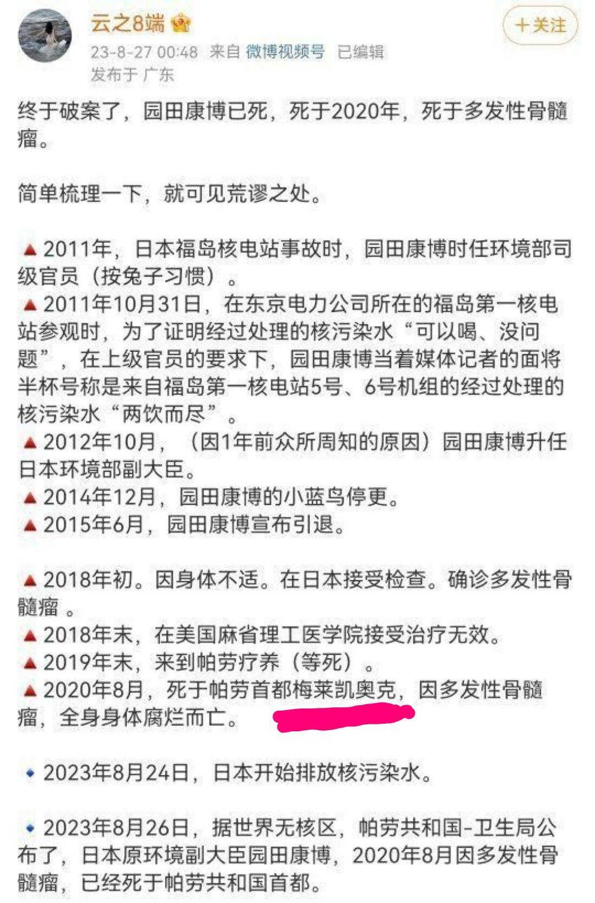

你发现一眼假在哪了吗？就是这个梅莱凯奥克。知道的朋友应该不用我说下去了，以下内容给还不知道的朋友写的。

很容易想到，投料人这次的剧本大致是找一个本身在茧中信息难查证又唱白脸的角色来跳反增强戏剧效果——帕劳正好符合这些条件：本身网络都几乎没建设起来（甚至机场刷 POS 机购物都难，因为网络信号不稳）信息超级闭塞，而且还和 ROC 建交，简直完美。

但是架不住投料人自己也是山猪啊——做这行的的人怎么可能亲身去过帕劳呢？所以想当然的觉得[小岛国](https://www.zhihu.com/search?q=%E5%B0%8F%E5%B2%9B%E5%9B%BD&search_source=Entity&hybrid_search_source=Entity&hybrid_search_extra=%7B%22sourceType%22%3A%22answer%22%2C%22sourceId%22%3A3195165010%7D)连城市都没有，那资源肯定都集中在『首都』吧。所以编一个死在首都的结局很正常。你看，还写出来梅莱凯奥克这种一般人没听过的名字，说服力更强了吧？

**可惜稍有常识的人都知道帕劳的居民和所有基础设施几乎都集中在『[科罗尔](https://www.zhihu.com/search?q=%E7%A7%91%E7%BD%97%E5%B0%94&search_source=Entity&hybrid_search_source=Entity&hybrid_search_extra=%7B%22sourceType%22%3A%22answer%22%2C%22sourceId%22%3A3195165010%7D)』。**『梅莱凯奥克』是纯粹的[行政首都](https://www.zhihu.com/search?q=%E8%A1%8C%E6%94%BF%E9%A6%96%E9%83%BD&search_source=Entity&hybrid_search_source=Entity&hybrid_search_extra=%7B%22sourceType%22%3A%22answer%22%2C%22sourceId%22%3A3195165010%7D)——纯到什么程度呢？只有政府办公大楼，而几乎没有居民。没有商店，没有酒店，没有餐厅。**更没有医院。**真的没有。至于为什么如此荒芜，自行查一下梅莱凯奥克被定都的历史缘由就简单知道了。

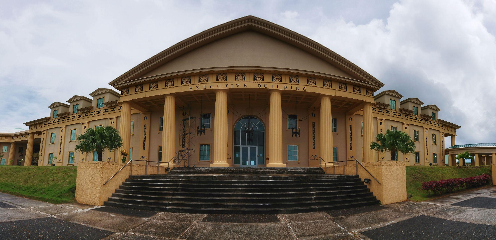

**你要一个外国人留在梅莱凯奥克，和有没有癌症没关系，可能会先饿死。**

**写出『xxx（某[政治人物](https://www.zhihu.com/search?q=%E6%94%BF%E6%B2%BB%E4%BA%BA%E7%89%A9&search_source=Entity&hybrid_search_source=Entity&hybrid_search_extra=%7B%22sourceType%22%3A%22answer%22%2C%22sourceId%22%3A3195165010%7D)）病逝在帕劳首都梅莱凯奥克』这种描述的，直接观感大致相当于『xxx 病逝于[大唐芙蓉园](https://www.zhihu.com/search?q=%E5%A4%A7%E5%94%90%E8%8A%99%E8%93%89%E5%9B%AD&search_source=Entity&hybrid_search_source=Entity&hybrid_search_extra=%7B%22sourceType%22%3A%22answer%22%2C%22sourceId%22%3A3195165010%7D)』或者『xxx 病逝于 xx 门城楼』。**

**你还需要浪费时间去查证 xxx 是谁，有什么经历，到底死没死吗？**

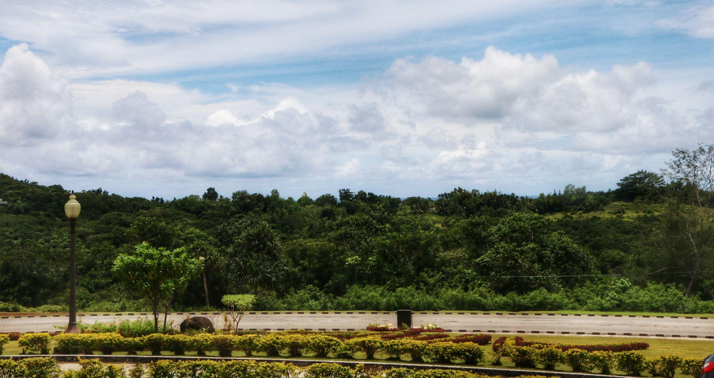

不是金鱼的朋友应该还记得住前不久的『Reconciliation』=『对账』吧？和梅莱凯奥克本质就是一回事。之前有个问题问为什么润人迷之自信，原因只有一个：**当你每天都看到山猪拱着[观音土](https://www.zhihu.com/search?q=%E8%A7%82%E9%9F%B3%E5%9C%9F&search_source=Entity&hybrid_search_source=Entity&hybrid_search_extra=%7B%22sourceType%22%3A%22answer%22%2C%22sourceId%22%3A3195165010%7D)，还幻想着皇帝每餐都吃红烧肉的时候，真的很难绷得住。**

另外再分享一点帕劳豆知识。帕劳最大的商场建筑（自然也位于科罗尔）上方 3 层就是 ROC [大使馆](https://www.zhihu.com/search?q=%E5%A4%A7%E4%BD%BF%E9%A6%86&search_source=Entity&hybrid_search_source=Entity&hybrid_search_extra=%7B%22sourceType%22%3A%22answer%22%2C%22sourceId%22%3A3195165010%7D)。ROC 商人在帕劳旅游业占比很大——以前的 Palau Pacific Airways 就是台资酒店商配套做起来的（湿租[东欧](https://www.zhihu.com/search?q=%E4%B8%9C%E6%AC%A7&search_source=Entity&hybrid_search_source=Entity&hybrid_search_extra=%7B%22sourceType%22%3A%22answer%22%2C%22sourceId%22%3A3195165010%7D)航司的飞机，以包机航班形式运行，在 PRC 下架境内帕劳[旅游产品](https://www.zhihu.com/search?q=%E6%97%85%E6%B8%B8%E4%BA%A7%E5%93%81&search_source=Entity&hybrid_search_source=Entity&hybrid_search_extra=%7B%22sourceType%22%3A%22answer%22%2C%22sourceId%22%3A3195165010%7D)后就不做了）。

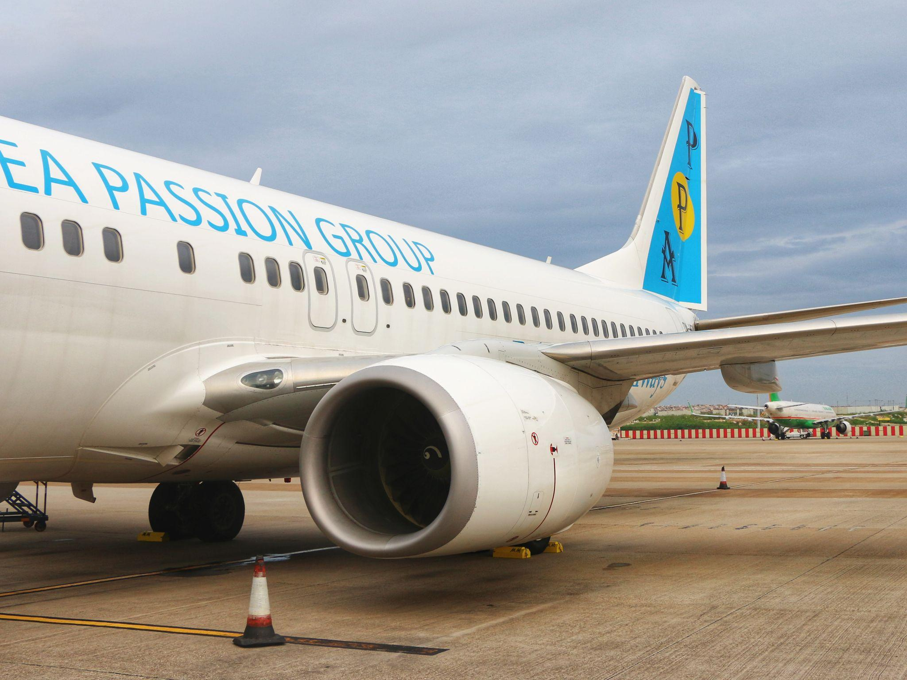

帕劳总统和议员有个什么疾病都是找台商的飞机跑去日本或者 ROC 治疗的。你跑去帕劳疗养？（笑

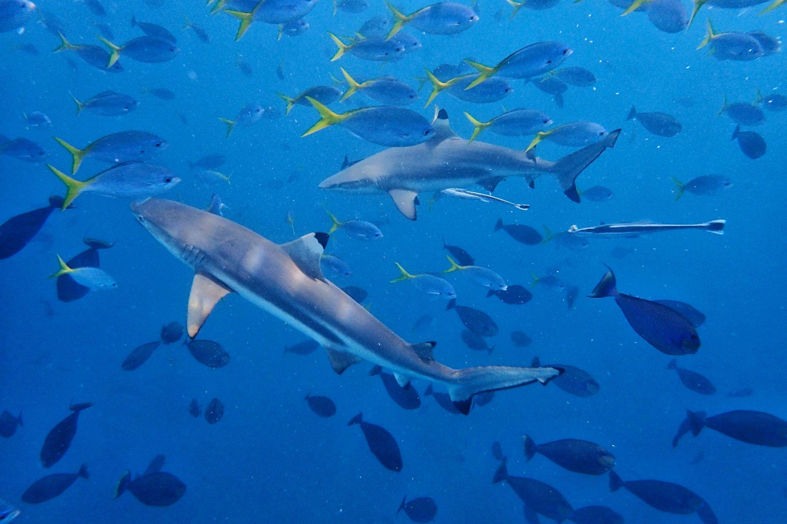

**当然，山猪们还可以说粗糠没有辐射，比较健康。**

* * *

有朋友对帕劳本身感兴趣，那再多分享一些帕劳的豆知识：

* * *

帕劳的警车基本都是[纳智捷](https://www.zhihu.com/search?q=%E7%BA%B3%E6%99%BA%E6%8D%B7&search_source=Entity&hybrid_search_source=Entity&hybrid_search_extra=%7B%22sourceType%22%3A%22answer%22%2C%22sourceId%22%3A3195165010%7D)提供。（没留下照片）

* * *

帕劳即使和 ROC 建交了，因为是旅游业立国所以依然对 PRC 护照免签。当然现在因为众所周知的原因造成从 PRC 直接出发到达帕劳很麻烦，这个不展开讲了。帕劳的出入境章造型很有意思，是当地特有的一种水母：

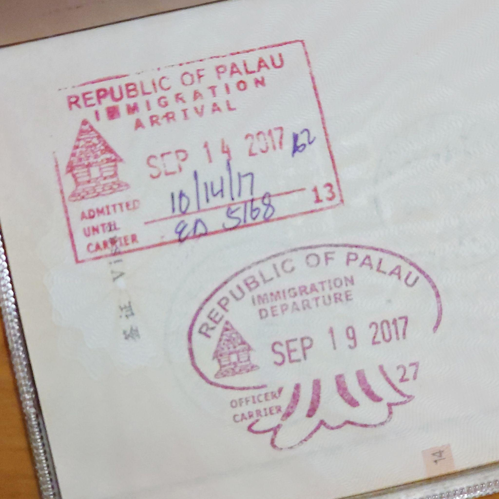

* * *

帕劳是钓鱼佬天堂——在这里就算你是[姜太公再世](https://www.zhihu.com/search?q=%E5%A7%9C%E5%A4%AA%E5%85%AC%E5%86%8D%E4%B8%96&search_source=Entity&hybrid_search_source=Entity&hybrid_search_extra=%7B%22sourceType%22%3A%22answer%22%2C%22sourceId%22%3A3195165010%7D)用直钩恐怕也没法空军。

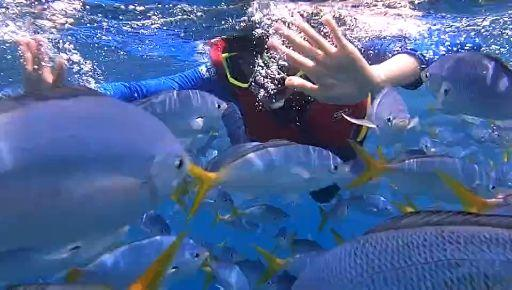<video src="blob:https://www.zhihu.com/395c6501-7d83-4751-909d-0723f65611f6" control></video>

00:00/ 00:06下载播放速度画中画视频信息镜像画面循环播放[X]DeviceId:web_4273298405D131BFPlayerVersion:1.0.27SessionId:76fd1bb2-aff2-4352-ae16-16dc8caab6c3StreamHost:vdn3.vzuu.comRes:mse mp4 h264 848x478@25.00Color:(tv gbr/unknown/reserved)Codec:avc1.640028Frames:0/0 4/0VideoBuffered:6560 msAudioBuffered:0 msSpeed:0.00 KB/sTotalReceive:1398.04 KBGPU:ANGLE (Apple, Apple M2, OpenGL 4.1)播放 (k)00:00 / 00:06倍速2.0x1.5x1.25x1.0x0.75x0.5x画中画 (p)网页全屏 (t)全屏 (f)

但是要注意外国游客在帕劳钓鱼是要交税的。以购买一个[时限卡](https://www.zhihu.com/search?q=%E6%97%B6%E9%99%90%E5%8D%A1&search_source=Entity&hybrid_search_source=Entity&hybrid_search_extra=%7B%22sourceType%22%3A%22answer%22%2C%22sourceId%22%3A3195165010%7D)的形式，偶尔遇到海警（前附图那艘小船就是海警）会查卡。并且不同州的钓鱼税不通用——你买的科罗尔的卡，去[梅莱凯奥克地界](https://www.zhihu.com/search?q=%E6%A2%85%E8%8E%B1%E5%87%AF%E5%A5%A5%E5%85%8B%E5%9C%B0%E7%95%8C&search_source=Entity&hybrid_search_source=Entity&hybrid_search_extra=%7B%22sourceType%22%3A%22answer%22%2C%22sourceId%22%3A3195165010%7D)钓鱼那就要被抓包了。以及不同季节时间有些鱼种处于保护期不能钓，等等细节法规。

* * *

帕劳本地还有一道传统名菜——[炖蝙蝠汤](https://www.zhihu.com/search?q=%E7%82%96%E8%9D%99%E8%9D%A0%E6%B1%A4&search_source=Entity&hybrid_search_source=Entity&hybrid_search_extra=%7B%22sourceType%22%3A%22answer%22%2C%22sourceId%22%3A3195165010%7D)。

嗯，溯源爱好者值得一去。

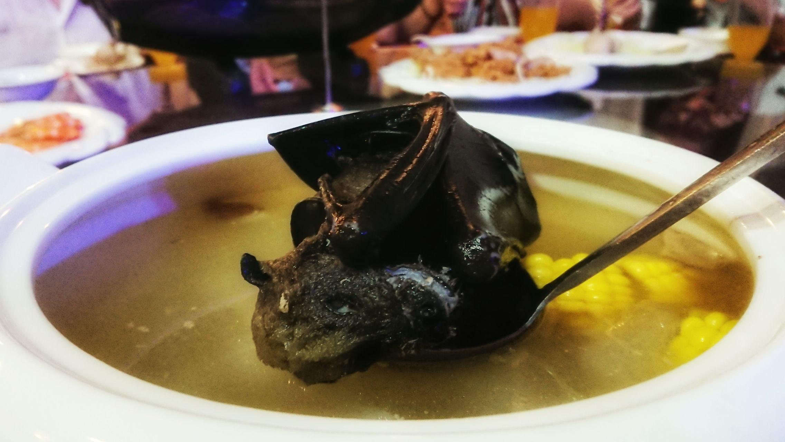

帕劳本地人传统上把炖蝙蝠汤作为孕妇的营养补充食品。

有钱的老板还是吃[椰子蟹](https://www.zhihu.com/search?q=%E6%A4%B0%E5%AD%90%E8%9F%B9&search_source=Entity&hybrid_search_source=Entity&hybrid_search_extra=%7B%22sourceType%22%3A%22answer%22%2C%22sourceId%22%3A3195165010%7D)吧...

* * *

帕劳因为是火山形成的群岛所以白细沙很多。

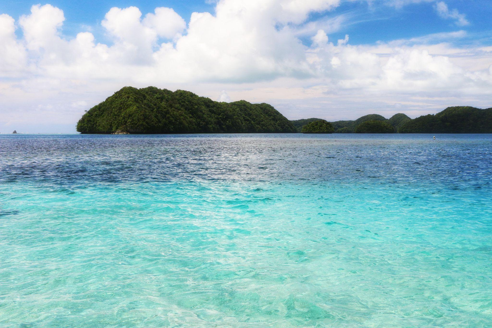

海底的火山细泥沙可以捞上来泡天然火山泥浴。

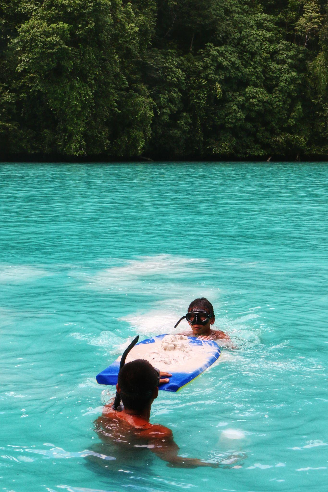

差不多就这些。想起来还有的再补充。谢谢观看。

* * *

承蒙各位朋友赏脸，追更一点。

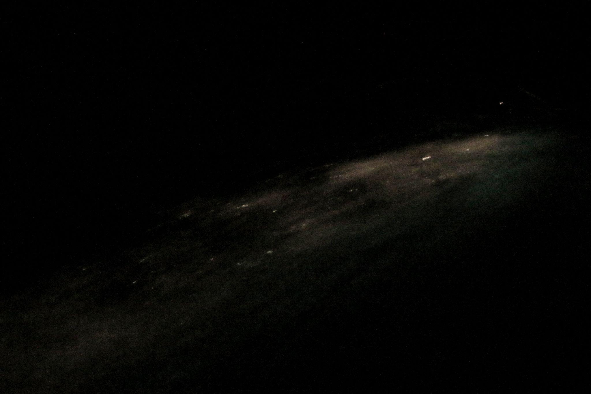

上图拍的其实是夜间出海看到的发光藻类，海水被搅动就会产生反应发出淡光。光量的绝对值很暗很暗（上图是 30s 长曝光快艇的尾流叠加），但是放在没有[光污染](https://www.zhihu.com/search?q=%E5%85%89%E6%B1%A1%E6%9F%93&search_source=Entity&hybrid_search_source=Entity&hybrid_search_extra=%7B%22sourceType%22%3A%22answer%22%2C%22sourceId%22%3A3195165010%7D)的当地，对于肉眼已经足够清晰——所以正确玩法是跳进水里用四肢不断搅动，在船上看来你就是一个粒子光人。

附近用电筒照照还能看到飞鱼跳出水面。

* * *

虽然到这里基本从嘲笑山猪跑偏成旅游软文了，不过对于想问开销的朋友，我只能粗略的和你们说帕劳的消费水平介于东南亚和[马尔代夫](https://www.zhihu.com/search?q=%E9%A9%AC%E5%B0%94%E4%BB%A3%E5%A4%AB&search_source=Entity&hybrid_search_source=Entity&hybrid_search_extra=%7B%22sourceType%22%3A%22answer%22%2C%22sourceId%22%3A3195165010%7D)之间。很容易想到你选择不同档次的酒店开销也不一样，出海玩不同的项目开销也不一样... 而且境内旅游平台和[旅行社](https://www.zhihu.com/search?q=%E6%97%85%E8%A1%8C%E7%A4%BE&search_source=Entity&hybrid_search_source=Entity&hybrid_search_extra=%7B%22sourceType%22%3A%22answer%22%2C%22sourceId%22%3A3195165010%7D)不给销售帕劳的产品，意味着还可能涉及到支付问题——比如你直接转账靠谱怎么保证？V/M [信用卡](https://www.zhihu.com/search?q=%E4%BF%A1%E7%94%A8%E5%8D%A1&search_source=Entity&hybrid_search_source=Entity&hybrid_search_extra=%7B%22sourceType%22%3A%22answer%22%2C%22sourceId%22%3A3195165010%7D)有没有？etc...

所以我要真的给一个数字给你，那我也是山猪了。不双标从自己做起。

因为我这点分享对帕劳产生兴趣的朋友，还请自己根据自己的情况做功课。自己动手的过程本身就是一个自主思维的过程，保持这个动力，我们才能远远的摆脱山猪。

