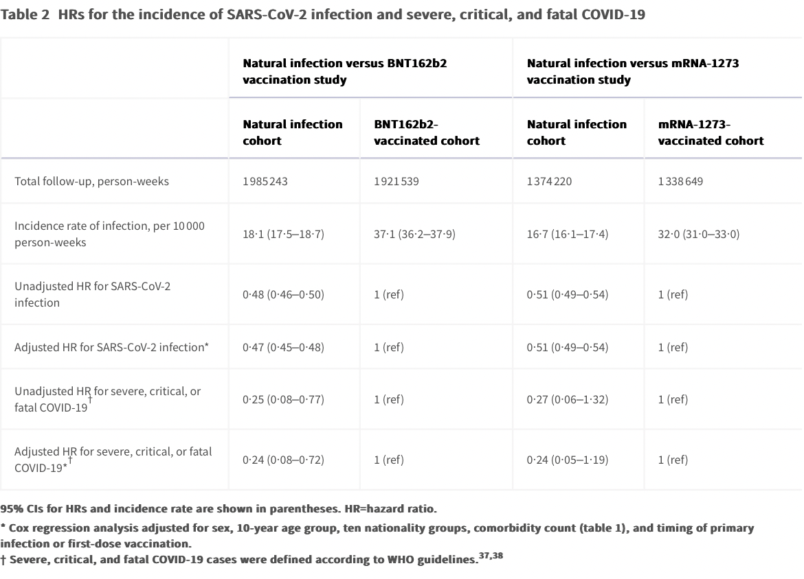
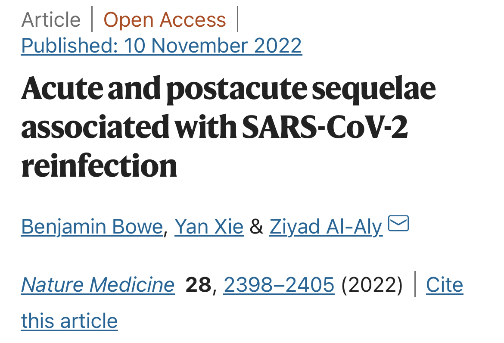

> 本文由 [简悦 SimpRead](http://ksria.com/simpread/) 转码， 原文地址 [www.zhihu.com](https://www.zhihu.com/question/573355274/answer/2814402998) Corbicula​

知乎是我目前遇到的唯一一个地方一帮子人异口同声说[二次感染](https://www.zhihu.com/search?q=%E4%BA%8C%E6%AC%A1%E6%84%9F%E6%9F%93&search_source=Entity&hybrid_search_source=Entity&hybrid_search_extra=%7B%22sourceType%22%3A%22answer%22%2C%22sourceId%22%3A2814402998%7D) “肯定” 比第一次严重的，而且都是一些想当然的逻辑，甚至还有胡编乱造论据的。

问题是已经过调查并发表出来的数据体现的正相反，这个问题的答案是：大概率会。

比如今年 11 月刚发表的一项大规模调查研究：

[https://doi.org/10.1016/S2666-5247(22)00287-7](https://link.zhihu.com/?target=https%3A//doi.org/10.1016/S2666-5247%2822%2900287-7)Our results showed that previous natural infection was associated with an overall lower incidence of SARS-CoV-2 infection than mRNA primary-series [vaccination](https://www.zhihu.com/search?q=vaccination&search_source=Entity&hybrid_search_source=Entity&hybrid_search_extra=%7B%22sourceType%22%3A%22answer%22%2C%22sourceId%22%3A2814402998%7D), including among [individuals](https://www.zhihu.com/search?q=individuals&search_source=Entity&hybrid_search_source=Entity&hybrid_search_extra=%7B%22sourceType%22%3A%22answer%22%2C%22sourceId%22%3A2814402998%7D) aged 50 years or older. **Natural infection was also associated with lower incidence of severe COVID-19 than mRNA vaccination**

感染过一次显著降低感染新冠的可能性和二次感染的重症风险，效果堪比 mRNA 疫苗。

当然研究都有滞后性，已经发表的研究肯定不是正在流行的毒株。不过更凶猛的毒株尚且如此，凭什么把 Omicron 形容得像艾滋病一样？吓唬人好玩还是闲得慌？

Omicron 今年上半年毒株的研究和数据其实找一找也有，只不过还是[预印本](https://www.zhihu.com/search?q=%E9%A2%84%E5%8D%B0%E6%9C%AC&search_source=Entity&hybrid_search_source=Entity&hybrid_search_extra=%7B%22sourceType%22%3A%22answer%22%2C%22sourceId%22%3A2814402998%7D)，我一般不太爱引用预印本数据。有兴趣的可以参考：

这还是从感染 Omicron 以后再感染 Omicron 的人里专门研究短期二次感染的例子，症状轻微且无人重症。二次感染 Omicron，中度症状的减少，轻度和无症状的增加。

也有免疫学研究表明：与没有感染过 Omicron 比，三针 mRNA 疫苗加上 Omicron 感染经历对 Omicron 产生的免疫效应是更高的。

[https://doi.org/10.1126/science.abq1841](https://link.zhihu.com/?target=https%3A//doi.org/10.1126/science.abq1841)

之前有人歪曲 Science 上的研究成果，称 Omicron 感染不但不会得到还会削弱免疫力。当时我就已经通过直接解读原文辟谣过了：

[如何解读美国《Science》杂志最新论文，通过感染奥密克戎，不会得到免疫力，反而是削弱?](https://www.zhihu.com/question/537863163/answer/2531776899)

世界上有没有二次感染更严重的？我相信有。甚至有没有第一次没事儿，第二次挂掉的？我相信也有。这种第二次挂掉的**倒霉情况有没有可能发生在现在任何一个人头上？我同样相信有可能。这些都是你在感染过一次以后应该继续维持防护措施的理由。**

**但所有这些可能性都与上面提及的数据不矛盾，都无法支撑新冠二次感染比第一次严重成为普适性的规律。**

有人问如果感染过真的对二次感染有防护力，为什么欧美新冠疫情还是居高不下。我刚看了一下 NHS 的数据，上周英国新冠住院人数是流感住院的大约一半，今年冬季 NHS 的医疗资源紧张的原因已经是以流感大流行为主了。假设 Omicron 比流感重症率略高或接近，如果不是疫苗和之前几波大流行形成的免疫效应在起作用，那什么时候 Omicron 的传染力已经被流感比下去了？

PS. 任何二次感染的可能性和后果都在限定时间内看待才有意义。随着病毒变异，初次感染对二次感染的防护意义会随着毒株的差异性变化，到目前为止，Omicron 虽然已经显著地能从过往毒株（[原始毒株](https://www.zhihu.com/search?q=%E5%8E%9F%E5%A7%8B%E6%AF%92%E6%A0%AA&search_source=Entity&hybrid_search_source=Entity&hybrid_search_extra=%7B%22sourceType%22%3A%22answer%22%2C%22sourceId%22%3A2814402998%7D)、Alpha、Delta 等）感染（或相关疫苗）造成的免疫效应中逃逸，但感染过之前这些毒株（或接种过相关疫苗），依然对 Omicron 感染和重症有一定防护力。我们总说新冠是无法被消灭的，会像流感一样不断变异再一次次流行，不排除未来某一年，某个强力毒株会突然出现，正如[新冠病毒](https://www.zhihu.com/search?q=%E6%96%B0%E5%86%A0%E7%97%85%E6%AF%92&search_source=Entity&hybrid_search_source=Entity&hybrid_search_extra=%7B%22sourceType%22%3A%22answer%22%2C%22sourceId%22%3A2814402998%7D)出现时那样，但那已经不是人们一般讨论的二次感染的范畴。

——————————

有人联系我问我怎么看下面这篇文章：

这篇文章是依托美国退伍军人数据库进行的研究，主要针对中老年男性，年轻人占比很低。结论是对于这个群体，多次感染者的全因住院、死亡、后遗症风险上升。由于研究对象限定和探讨的风险类别差异很大（关于这篇文章的解读之前知乎上已经有专门的问题各方人士吵过一波了），这与其它研究的结论并不见得矛盾。比如年龄可能可以解释这种矛盾，免疫系统相对弱的中老年人可能有更高机会受到二次感染危害。

另外，又有人情绪激动骂上门来。我再次讲清楚：我没有任何妨碍你们强调新冠严重性的意思，我唯一做的就是让读者对新冠严重性的认知不要建立在片面的逻辑和说法上。中国的人口基数很大，任何统计学上小比例的人群都会是一个巨大的数字，包括二次感染和二次感染更加严重的情况，讲到这种可能性就足以令人警惕了，这并不等于有必要通过把话说夸张和绝对以提醒人们警惕。

我在国内的亲戚朋友这个月来问我英国新冠的情况，我是这样说的：“按照英国放开以后的情况，乘以中国人口，未来的死亡大概相当于每 3 个月发生一次[汶川地震](https://www.zhihu.com/search?q=%E6%B1%B6%E5%B7%9D%E5%9C%B0%E9%9C%87&search_source=Entity&hybrid_search_source=Entity&hybrid_search_extra=%7B%22sourceType%22%3A%22answer%22%2C%22sourceId%22%3A2814402998%7D)且看不到头。但同时我也可以说，如果你过去每年朋友圈里平均有 2 个人离世，那么将来会变成平均每年 2.1 个。” 这两种说法描述的后果是一样的，但给人的感觉大相径庭。前者是为了让他们知道要警惕，后者是为了让他们理解西方社会的状态以及不要过度恐慌。

在我看来，这两种说法都是需要的，但唯独不需要错误地吓唬他们说 “新冠是小艾滋，你们玩完了”