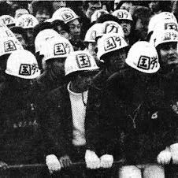
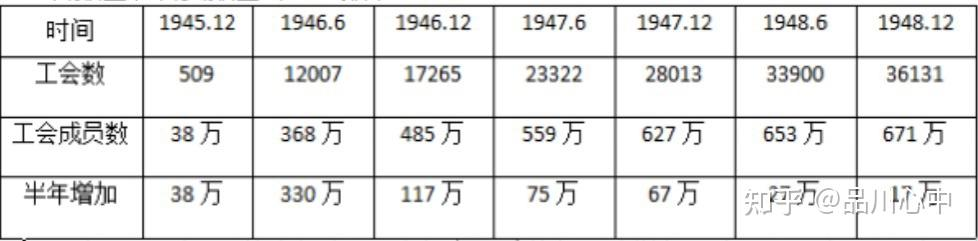
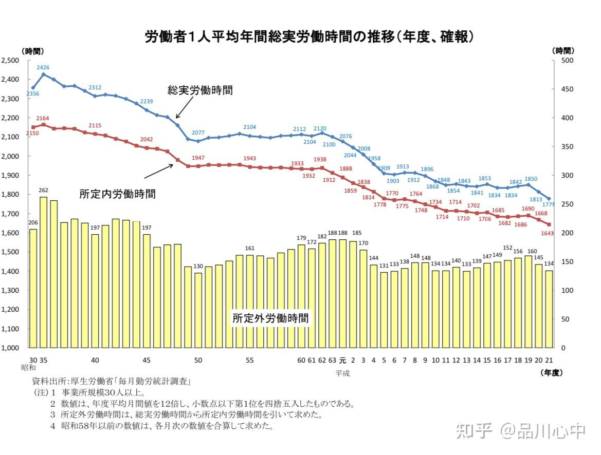
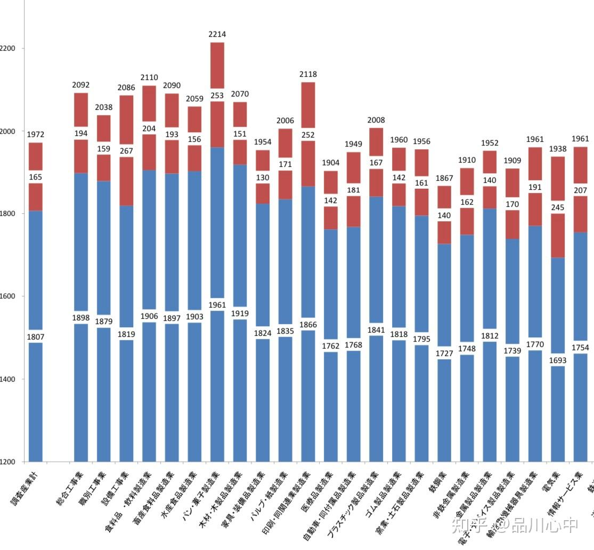

> 本文由 [简悦 SimpRead](http://ksria.com/simpread/) 转码， 原文地址 [www.zhihu.com](https://www.zhihu.com/question/423025055/answer/2958700468) Nashi-Pleak​

这个题目倒也不能说完全说错，只是不全面罢了。

先说结论，日本有工会，有些行业非常抵制加班，而有的行业不能抵制或不想抵制加班。

终战之后，在饱受战争之苦的日本人民的期盼和 GHQ 的推动下，日本的工会数目从刚终战时的 0 个飙升至 1948 年末的 36131 个，组织工人总数达到 671 万，一度达到日本产业工人总数的百分之八十以上。

那么，他们抵制长时间加班了吗？当然抵制了，闹得还挺大的。

根据厚劳省这幅图，我们可以推算出总工作时间从昭和 30 年（1955 年）的工作日日均 9.29H 工作时间降低至平成 21 年（2009 年）的 7.11H 工作时间。

继续看这幅图，工作时间迅速下降主要有两个时间段，第一段时间是昭和 35 年（1960 年）到昭和 49 年（1974 年）。在这段时间内，工会运动整体在左派优位的日本劳动组合总评议会的领导之下，他们多次掀起反加班和要求升薪的斗争运动。从 1960 年春斗成功开始，至 1975 年スト権スト失败为止，年均劳动时长下降了 349 个小时。

第二段时间则是昭和 62 年（1987 年）到平成 6 年（1994 年）。在这段时间内，尽管左派优位的总评已被右派优位的联合所取代，但由于日本经济处于泡沫经济的虚假繁荣之中，以及联合此时尚未彻底放弃的斗争手段。年均劳动时长下降了 217 个小时。

那么，对于日本企业疯狂加班的指控来源于哪里呢。我们放两个图出来

大家可以注意到，总工作时间相较于其他行业较长的大致有道路旅客运送业，道路货物运送业，饮食批发业，饮食业，宿泊业，印刷业，点心制造业。这类行业有大致有几个共同特点，一是这类企业工作时长不甚固定，多有依时节改变工作时间的特点，二是工人不集中，分布零散，三是——这些行业的企业或产业工会大多都在当时最大的黄色工会同盟，也就是总评最大的对手——全日本劳动总同盟手上。或是根本就没有成立一个统一的行业工会甚至企业工会

那么，这类行业缺乏组织撑腰，被 “自愿” 增加劳动时长不是很正常的吗