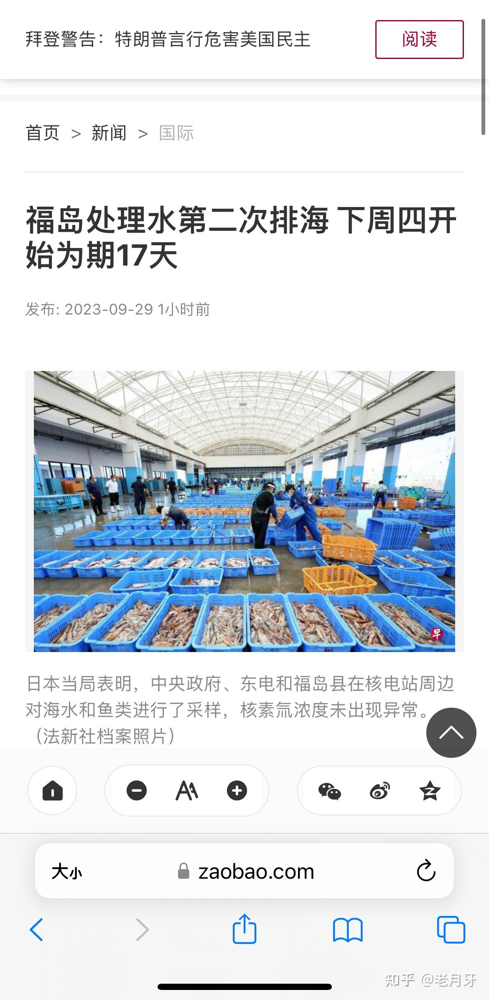

> 本文由 [简悦 SimpRead](http://ksria.com/simpread/) 转码， 原文地址 [www.zhihu.com](https://www.zhihu.com/question/623569570/answer/3231464958) 老月牙​

我倒是觉得，从这个做法可以进一步澄清，还原若干被扭曲的事实。会让原本支持，不反对排放的绝大部分国家继续维持原来的决定。因为

**第一，之前一些媒体称所谓 “覆水难收”，其实是一个意义不大的伪命题，宣传话语。**之前很多吃瓜群众被引导得有误解，总以为排放是一次性，一轮过的，一旦开排，就再也停不下来，其实这完全是加戏。既然排水可以控制开始日期，那么即便是开始排放之后，只要关闭阀门马上就可以停止排放，不存在所谓 “覆水难收” 的局面。

因为按第一轮，8.24 日 - 9.11 日，7788 吨被的情况看，在这 17 天里，包括国际原子能机构说法和其他媒体报道，至少是按每周在实时同步检测周边水质。**所以万一将来真的出现某轮某周超标，可以立即关停阀门，技术上完全做得到，这次一二轮交接也等于印证这点。**这样这个动作可能会延迟最多 3-7 天，超排 4000 吨左右，但这点水量仅占 130 万吨总计划量的千分之三，而且不是完全未处理高度超标的 “原液污水”，而是过滤不够，有所超标水。在全球范围的海洋背景下，其“富集” 的效应基本可以忽略。

**第二，排放是分轮次的，之前以 “没有先例” 为由反对排放，先入为主认定 ALPS 不可靠，未来 30 年时间过长，无法保证不出意外等等论点，理论上来说更加不利。**为何？

因为目前看，模式是排放十几天，排放 8000 多左右，停工检修测试十几天，这叫一轮周期。人有生老病死，就需要定期体检。机器使用到一定小时，就需要定期维护。车辆每 5000 公里保养，要年检。军舰要日常维护，25 年要中期大修。**这些现实例子都表明，定期停工检修，并不意味着这个设备机器交通工具它是质量不合格，用着很心虚，不敢长时间用。而是这是保障这个东西在能够长时间最大可能的安全合理使用的重要步骤，为长时间可靠使用增加一重保障。**

所以实际看，**排放时间长达三十年，不是为了增加不确定性，而是因为过滤，稀释，排放和设备维护检修本身需要消耗必要时间成本。**所以不会根据什么地缘变化之类出现所谓 “赶着排放”“拖着排放” 之类，都是胡乱联想。但是不排除有可能因为遇到强台风，地震等极端恶劣天气时暂停排放。所以第二轮开启后，理论上支持排放国家信心会更高，反对排放的一方来说则是“利空消息”。

我看到有的评论还在坚持 “观察未来 30 年” 的，恐怕还是强行想把不败金身赖到几十年后。当然，从可能性上不能排除任何意外可能，但这是因为世上基本上无法百分百排除任何事情，一种哲学概念，而不是这种科学可能性在某件事情上真的很大。

因为如果在持续的监督下，每轮排放，辐射都是明显低于既定标准，比如低于 100 贝克勒尔每升，远低于 WHO 的饮用水 10000 贝克勒尔每升，也低于大陆核电站周边海水标准，那么理论上无论观察多少个三十年，都不会富集到影响健康。因为海水不是纯净水，本身就是有各种元素杂质，微生物和相关背景辐射当量的，当重新融入全球海洋的处理水，电站废水本身放射标准低于正常海洋背景时，低浓度不会在加入高浓度环境后被单独 “富集”。就像你在又咸又辣但是符合标准的螺蛳粉里加入几勺子生理盐水，虽然汤盐分，或者说钠含量总量似乎增加了，但并未使得汤更咸，或者粉，笋，腐竹更咸。

我想起今年之前很多人信誓旦旦 “重复感染症状越来越重”，现在开放大家普遍两三阳，加重破功之后，又转向强调“八阳夺命，反复感染摧毁免疫系统” 这样的阴谋诅咒。你会发现常规路径下，需要对这些谣言进行证伪，时间等待越来越长，虽然大概率都会破功的，但它们的制造者仍然可以一次次创造新的说法，修改，推迟 deadline，通过 “交给时间来检验” 的大法去拖延验证，赖住这个论点不败金身，让反对者证伪时间成本越来越高。在我看来这不但是有罪推定，而且很赖皮。

何况很多结果是综合多种因素结果，根本无法证实只是其中某个因素起决定作用，不能强行证明存在因果关系，尤其是时间跨度过长时候，需要多个参照组，很复杂。但是无论如何，本身也说明对于现实里相对的那个最大可能性，他们是没有证据驳斥的，只能抓着这个 “理论上不能百分百排除” 的反面在赖着。

显然现实里，**无论是排海，还是新冠开放，绝大多数国家正常情况下都是会根据那个 99.99% 的现实去做出自己的战略决定，而不是押宝那个 0.01% 的 “未来不能排除” 去做相关决定，或者拖鞋迟迟不做决定，因为这才是符合社会整体向前运行正常逻辑的，能有正常效率的，而不是所谓“躺平”，除非它有别的目的。**这也是为什么日本这次排海在官方层面只有个别国家反对的内在逻辑之一。

参考：新加坡《联合早报》2023.09.29

