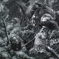

> 本文由 [简悦 SimpRead](http://ksria.com/simpread/) 转码， 原文地址 [www.zhihu.com](https://www.zhihu.com/question/548410715/answer/2977212219) 奸奇大魔里德逊

我是不太懂某些土味社达了，如果他们讨厌非洲裔是因为非洲裔 “智商低、性欲强、没有责任感、更像动物而不是智人”，那么非洲裔如果真的能获得法国的政权，这就完全可以说明非洲裔并不是像他们说的那样。

如果他们讨厌非洲裔只是因为他们长得黑和 “非我族类”，他们又何必拿类似“智商低、性欲强、没有责任感、更像动物而不是智人” 这样的指责来给自己找补呢？还不是觉得自己的诉求多少有点不上台面？

退一万步来说，如果非洲裔掌握法国的政权的原因只是因为他们的数量而非质量，通过出生率来完成 “腾笼换鸟”，不也恰好符合土味社达追求的“弱肉强食适者生存” 吗？如果你连这都阻止不了，不也恰好说明你就该被淘汰吗？