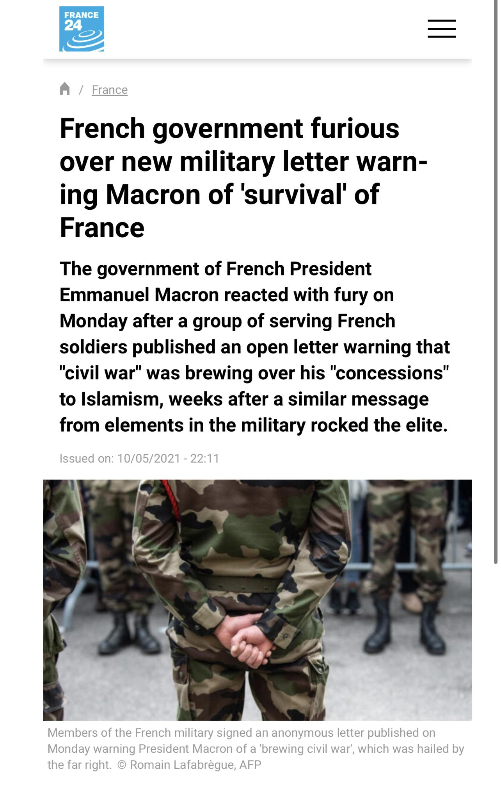
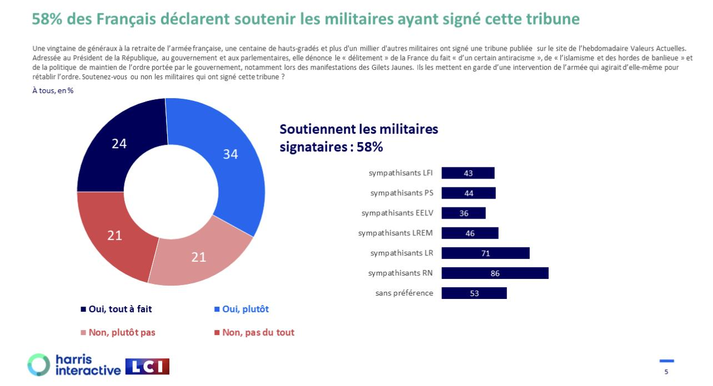
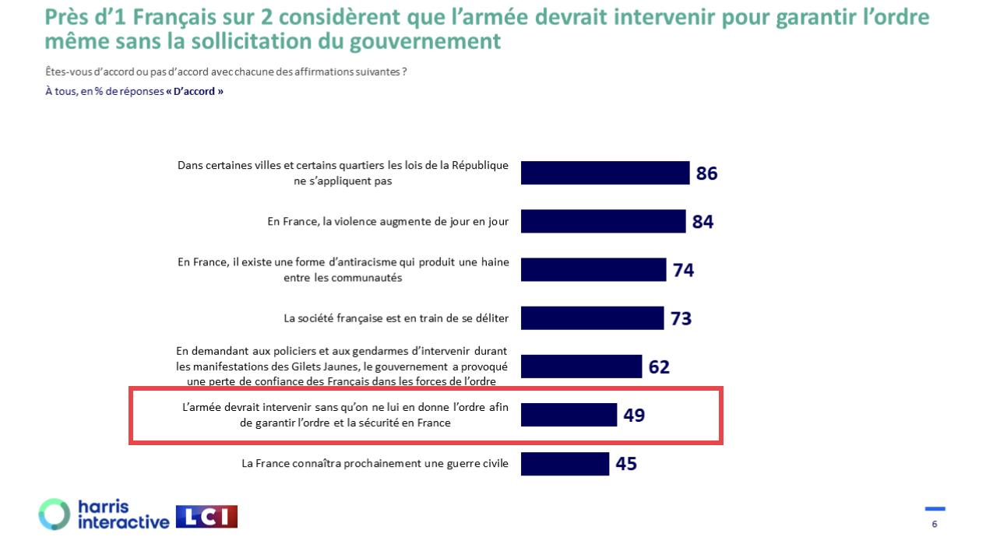

原文地址 [www.zhihu.com](https://www.zhihu.com/question/609749253/answer/3100331716) 

床单军团菲利克斯​

骚乱短期内如此不受控制，反而证明了法国社会的一些深层问题，尤其是法国警方的表现非常值得怀疑——根据 6.29、6.30 视频中法国除了巴黎以外几乎无任何警方人员出现、在宣布紧急状态后，马赛警察局所有警察都反常地没事一样下班，任由警察局被精神小伙 GTA 来的 “攻城锤” 重载卡车撞门攻破、武器被[零元购](https://www.zhihu.com/search?q=%E9%9B%B6%E5%85%83%E8%B4%AD&search_source=Entity&hybrid_search_source=Entity&hybrid_search_extra=%7B%22sourceType%22%3A%22answer%22%2C%22sourceId%22%3A3100331716%7D)抢走、小伙们在街上朝天放枪，还是不作为。在诺曼底、香槟、[布列塔尼](https://www.zhihu.com/search?q=%E5%B8%83%E5%88%97%E5%A1%94%E5%B0%BC&search_source=Entity&hybrid_search_source=Entity&hybrid_search_extra=%7B%22sourceType%22%3A%22answer%22%2C%22sourceId%22%3A3100331716%7D)、阿基坦等大区警察都被拍到在政府机构附近无所事事，坐视在城市其他街区的无政府情况。如果我是马克龙，绝对不信这些人不在故意摆烂让本可以在源头上被控制的事态扩大。必须要一查到底。

讲个笑话，法国精神小伙三天之内击毁的大型机动载具车辆可能已经超过乌克兰战场 2023 年的总和了。。。

巴黎的战果，弃车以后被摧毁的[摩托化步兵](https://www.zhihu.com/search?q=%E6%91%A9%E6%89%98%E5%8C%96%E6%AD%A5%E5%85%B5&search_source=Entity&hybrid_search_source=Entity&hybrid_search_extra=%7B%22sourceType%22%3A%22answer%22%2C%22sourceId%22%3A3100331716%7D)纵队 PTSD.mp4

这里能延伸出对于法国内部对需要被防范的危险分子暗流涌动的推测难以被忽视。从第三共和国开始，法国警方、军方 [1](1)(#ref_1) 长期被批评者认为内部存在不小数量的传统[公教保守派](https://www.zhihu.com/search?q=%E5%85%AC%E6%95%99%E4%BF%9D%E5%AE%88%E6%B4%BE&search_source=Entity&hybrid_search_source=Entity&hybrid_search_extra=%7B%22sourceType%22%3A%22answer%22%2C%22sourceId%22%3A3100331716%7D)、正统主义派、法兰西行动派（奥尔良主义，支持过戴高乐）[2](2)(#ref_2)，敌视 3/4/5 共和国，被清洗整肃了好几遍还是得不到完全解决。注意这三个派别互相之间也不对付，不能统称为极右，历史上幸亏因为他们派系内斗，共和国才没有遇到可能颠覆的危机。

今天（7.1）法国警方终于在摸鱼 48 小时以后开始大规模尚武忠正作战，在街头集体出现执行宵禁、围捕精神小伙们，至少在大城市中心的街头秩序有所恢复。不过由此可见此次事件的发展规律，还在可以控制的范围内，应该不会发展到黄马甲最高潮的程度，10-20 天内应该就平息了。不怕毒奶。法国社会在现在和将来一段时间内尚无如部分军人警告那样真的 “陷入内战” 的可能性，马克龙也没有必要出动军队。现在所有 “疑似军车” 的视频，都被证实只是国家宪兵、国民自卫军部队而已。

（2021 年 5 月法国军队部分人搞了个超级搞笑的行为艺术，20 余名军官发布公开信，警告如果 “国家进入接近崩溃的事实内战状态”，“不一定排除武力介入恢复秩序的可能性”，结果自然是引发马克龙大怒，有关人员被军事法庭立案侦查）

后来有人搞了个民调，结果更加令人大跌眼镜。。。58% 完全或者部分支持公开信的内容

然后在恢复国家秩序的各种方式之中，竟有足足 49% 受访者支持军方在没有文官政府许可情况下介入——这绝对让可以让人开始颠覆之前对法国的一切印象了，在整个泛西方阵营正常运作的[德谟克拉西国家](https://www.zhihu.com/search?q=%E5%BE%B7%E8%B0%9F%E5%85%8B%E6%8B%89%E8%A5%BF%E5%9B%BD%E5%AE%B6&search_source=Entity&hybrid_search_source=Entity&hybrid_search_extra=%7B%22sourceType%22%3A%22answer%22%2C%22sourceId%22%3A3100331716%7D)之中我不觉得调查其他任何一个国家就算是巴尔干、东欧、日韩，这个数字能上哪怕 20%？？？在五眼绝对上不了 10%。就算假设在俄罗斯（这个倒真能 unironically 算是接近 “国家秩序危险” 状态的）搞个民调明天就让[普利戈任](https://www.zhihu.com/search?q=%E6%99%AE%E5%88%A9%E6%88%88%E4%BB%BB&search_source=Entity&hybrid_search_source=Entity&hybrid_search_extra=%7B%22sourceType%22%3A%22answer%22%2C%22sourceId%22%3A3100331716%7D)、绍伊古、格拉西莫夫任何一方 “介入”，我都不觉得能接近 50%。

一个国会选举中进步派 + 左派（比五眼要左得多）得到 70% 以上席位的国家，怎么会统计出这样玄幻的结果。。。他们在想什么？如果真的这么想，也没见勒庞支持率多高啊？

一般来说，国家整体偏右有长期劳保传统的国家右派多 / 左派长期进步传统的国家社民多 / 威斯敏斯特制长期温和传统的国家中道多，都比较可以理解。但是法国这样极左和极右、激进进步主义和激进反动主义——法国特色的 réactionnaire，也不能完全算英美定义下的保守派——作为政治力量都强大，最后却一直选出中间派的例子，别的地方是真找不到。。。法兰西连续三个共和国以来，是教育、日常生活中强调 “共和国价值观”、“世俗价值观” 世界上相对最频繁的国家没有之一。证所谓越缺什么就越要强调什么，我觉得这个问题下面对法国一水的“革命老区”、“进步先锋”，只不过是外国人刻板印象而已，并不利于真实认识第五共和国的政治。FN/RN 肯定比 AfD、PiS、土耳其的 AKP、美国共和党要右一个次元（AfD 的经济自由主义温和程度放在美利坚搞不好能融入蓝狗民主党），即使放在 1930 年代也肯定是距离国家法团主义比距离保守主义更近的政党。

美国政治撕裂再严重，双方再势同水火，啥时候需要一遍遍强调自己是共和国的？用另一个视角来看，英国、西班牙、加拿大（过去有）、澳大利亚、新西兰、荷兰、挪威、瑞典等等什么时候得发表声明警告反王室共和主义严重威胁国家安全了？南欧脱离君主制更晚的意大利、希腊、葡萄牙，正统派分子也已经接近不存在了。反而法兰西政府针对 “共和国的敌人” 斗争了 200 多年，一直如打不死的小强一般消灭不掉，真是奇了怪了，难道法国人脑回路真的特别不一样？

* * *

其他很多回答已经提到了法国舆论的反移民、本土主义声浪进一步达到高潮。在这里并不想谈论法国是否 “黑化”、“绿化”，因为单单从比例上看，这就是个伪命题，即使法国从来不统计族裔人口（二战 IBM 身份[卡片机](https://www.zhihu.com/search?q=%E5%8D%A1%E7%89%87%E6%9C%BA&search_source=Entity&hybrid_search_source=Entity&hybrid_search_extra=%7B%22sourceType%22%3A%22answer%22%2C%22sourceId%22%3A3100331716%7D)的 PTSD，不过这也挺有意思，因为德国人和波兰人都搞族裔统计），大部分对于法国本土 “移民背景人口” 的估计也最多停留在 14-17% 区间——而德国是 28%、英国是 21%，至于新大陆，美国非拉丁裔白人比例现在已经跌到 59.3%、加拿大 69.8%（2023 年第一季度）。这些国家理论上都比法国更加 “多元化”，但是为什么没有出现如法国那样严重（每 1-2 年就来一次大规模骚乱）的族裔冲突问题？巴黎的非高加索人种比例（32-35%）远不如温哥华（45%），巴黎移民人群会讲流利法语的比例也多于温哥华移民人群会讲流利英语的比例，怎么没人整天喜欢感叹温哥华“已经不是白人城市了”？注意，这些“是否感叹的人” 是包括法国人、加拿大人自己的。

试图 “科普” 法国 “X 化” 的知乎答主们一般采用两种话术：1. 法国其实黑绿很少，不用“担心”，用来针对劳保。2. 法国是包容多元的地上进步神国，任何移民，无论是合法还是非法的，都很快能够融入当地文化，过一代都是法国人了，用来针对左翼。搞笑的是两种话术有的时候会自己先打架起来，既“黑绿不多，说很多的都是谣言”、又“多了也没事”，如果坚信法国多元化社会实验没有问题，干嘛得先着急否认移民数量？

现在对法兰西第五共和国政治的讨论，似乎已经陷入了来回隧道声音、重复刻板印象的死胡同。比如无论是左派右派还是自由派都一致默认法国比美国多元、“左”，刷 “革命老区”，实在是非常奇怪的，这还不是中文互联网的特有现象，欧洲人都经常会这么觉得。如果法国是“革命老区”，那么“反革命老区” 也是一样成立的。至少法国强力部门之中还一直存在被秘密监视、高度警惕其活动的波旁正统派、[奥尔良派](https://www.zhihu.com/search?q=%E5%A5%A5%E5%B0%94%E8%89%AF%E6%B4%BE&search_source=Entity&hybrid_search_source=Entity&hybrid_search_extra=%7B%22sourceType%22%3A%22answer%22%2C%22sourceId%22%3A3100331716%7D)人员，就是外人肯定会觉得不可思议的事实。搞不好 2023 年法国君主主义者可能比英国这个真的有君主传统的国家还要多。。。甚至 “revolutionary” 在法语语境下是不是一定形容 “进步的革命”、“reactionary” 是不是“倒退”，也都很成疑问（看这两个词原本的词义好了），起码法国右翼历史上一直都很喜欢把自己的社会运动命名为“revolution”。

还有法国移民融入问题，有没有一种可能，**法国移民确实 “不多”，但是法国也没有想象中的那么进步？**移民族群其实并没有融入当地社会，未来的二代、三代也越发展现出不能融入的倾向，在法国是具有极大地区特殊性的现实，完全无法照搬新大陆式、甚至英德的多元化阶段性成功经验来描述法国？承认法国的 Laïcité 并没有法国人自己吹的那么厉害、融入外来移民比其他主要欧洲大陆和英美系国家显得失败又什么大不了的。难道是真的一开始因为默认法国就必须是进步主义灯塔，不可能出现问题、起码不可能有比北美要严重的问题，所以下不来台了？

参考
--

1.  [^](#ref_1_0) 不得不吐槽的是纵观历史法军自称保皇总是让人忍不住想笑，历史上 1815 年以后每一次皇帝真的需要你们来保卫的时候，法军到哪里去了？每次总是在共和国的时候才开始装模作样保皇，早干嘛去了？德二容克也是一样，先利用总参谋部把威廉二世架空，1918 年皇帝命令你们对付乱党，一个不奉诏，结果魏玛一成立又开始玩 cosplay 保皇，逗谁玩呢？
2.  [^](#ref_2_0) 五共成立后波拿巴派基本式微了
