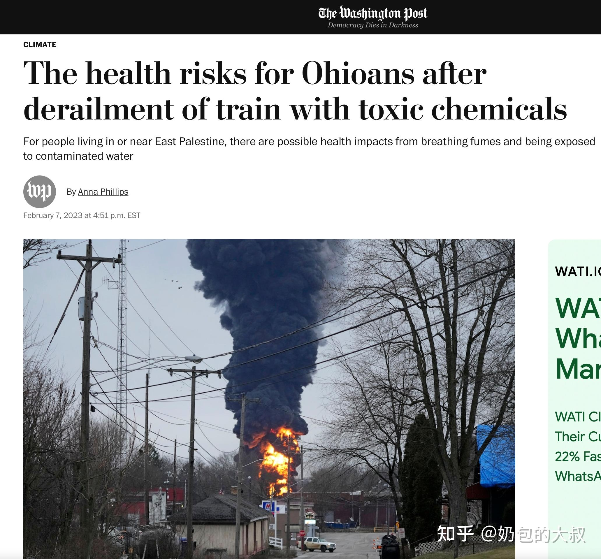

> 本文由 [简悦 SimpRead](http://ksria.com/simpread/) 转码， 原文地址 [www.zhihu.com](https://www.zhihu.com/question/583774398/answer/2892947446) 观察者网​

在 21 世纪的今天，关于同一事件的新闻，竟然还存在着 10 天的 “时间差”。

对于早已进入网络信息时代的人类文明来说，这完全是一个充满了 “迷之神奇” 的事情。

事实上，在[俄亥俄州](https://www.zhihu.com/search?q=%E4%BF%84%E4%BA%A5%E4%BF%84%E5%B7%9E&search_source=Entity&hybrid_search_source=Entity&hybrid_search_extra=%7B%22sourceType%22%3A%22answer%22%2C%22sourceId%22%3A2892947446%7D)火车脱轨事件发生的当天，《纽约时报》、CNN、《[华盛顿邮报](https://www.zhihu.com/search?q=%E5%8D%8E%E7%9B%9B%E9%A1%BF%E9%82%AE%E6%8A%A5&search_source=Entity&hybrid_search_source=Entity&hybrid_search_extra=%7B%22sourceType%22%3A%22answer%22%2C%22sourceId%22%3A2892947446%7D)》等美国所有主流媒体就进行了专题报道。

第二天，CCTV 也对此进行了（转发式）报道。

当时，无论是在美国本土、还是在 14000 公里之外的东方大国，这个火车脱轨的新闻都没有太大的热度。

* * *

3 天后（2 月 7 日），《华盛顿邮报》又发了一篇关于有毒化学物质的专题文章。

该文章指出：

[氯乙烯](https://www.zhihu.com/search?q=%E6%B0%AF%E4%B9%99%E7%83%AF&search_source=Entity&hybrid_search_source=Entity&hybrid_search_extra=%7B%22sourceType%22%3A%22answer%22%2C%22sourceId%22%3A2892947446%7D)也是一种致癌物质，与肝癌风险增加有关。 美国 CDC 警告称，长期吸入氯乙烯 “可能与” 脑癌、肺癌和某些血液癌症有关。一些氯乙烯可以溶于水，并且可以迁移到地下水或通过其他化学物质的分解传播；但与其他一些化学物质不同，氯乙烯不太可能在人们食用的植物或动物体内积聚。

* * *

直到 10 天后，该事件才突然 “后知后觉” 地登上了东方大国热搜榜的榜首。

并且，在各种宣传口径中，该事件已经被东方大国 “有关人群” 直接单方面定性为“[切尔诺贝利](https://www.zhihu.com/search?q=%E5%88%87%E5%B0%94%E8%AF%BA%E8%B4%9D%E5%88%A9&search_source=Entity&hybrid_search_source=Entity&hybrid_search_extra=%7B%22sourceType%22%3A%22answer%22%2C%22sourceId%22%3A2892947446%7D) 2.0”。

如果按照这种宣传口径中 “绘声绘色” 的描述，那么整个俄亥俄州至少一半地区都将无法居住、整个州至少三分之一人口都需要疏散撤离。

但实际上，俄亥俄州 East Palestine 的疏散令范围仅仅只有詹姆斯街火车交叉口一英里范围内。

事实上，该事件中的列车一共载有 100 多节车厢，其中只有 20 节车厢装有危险物品。

发生脱轨的，是这 20 节车厢中的 10 节车厢，其中只有 5 节车厢携带了氯乙烯；并且只有 1 节车厢通过安全阀（安全释放阀门）释放了一些氯乙烯，“除了压力释放装置外，还没有确认氯乙烯已经被释放出来（泄漏）。”

根据俄亥俄州环境保护局的现场检测，也并没有在社区中检测到任何有害水平的化学物质。

由于根据[美国国家癌症研究所](https://www.zhihu.com/search?q=%E7%BE%8E%E5%9B%BD%E5%9B%BD%E5%AE%B6%E7%99%8C%E7%97%87%E7%A0%94%E7%A9%B6%E6%89%80&search_source=Entity&hybrid_search_source=Entity&hybrid_search_extra=%7B%22sourceType%22%3A%22answer%22%2C%22sourceId%22%3A2892947446%7D)的数据显示，接触（无色气体）氯乙烯会增加患某些癌症的风险，因此该州对当地人员发布了就地避难令，俄亥俄州环保局也表示：

“环保局已经采取措施以限制消防水流对当地溪流和河流造成任何损害。只要有必要，环保局将留在现场，空气监测器也将留在原地。”

* * *

那么，为什么俄亥俄州这起伤亡人数为零的火车脱轨事件，在事发 10 天后却突然成了东方大国热搜榜第一呢？

时间倒回 20 天之前。

2023 年 1 月 15 日，辽宁盘锦市盘锦浩业 [1](1)(#ref_1) 化工厂起火爆炸 [2](2)(#ref_2)，现场火灾和浓烟程度远远超过了俄亥俄州火车脱轨事件。

根据盘锦浩业的官网信息显示，该公司的主要产品为国 VI、京 VI 标准成品油、高等级道路沥青、石油焦、[异辛烷](https://www.zhihu.com/search?q=%E5%BC%82%E8%BE%9B%E7%83%B7&search_source=Entity&hybrid_search_source=Entity&hybrid_search_extra=%7B%22sourceType%22%3A%22answer%22%2C%22sourceId%22%3A2892947446%7D)、丙烷、丙烯、芳烃类等产品。

而一旦吸入高浓度烷烃，则会直接导致人或动物在短时间内死亡，死因多为心脏停搏或呼吸麻痹。中碳烷烃能引起[强直性痉挛](https://www.zhihu.com/search?q=%E5%BC%BA%E7%9B%B4%E6%80%A7%E7%97%89%E6%8C%9B&search_source=Entity&hybrid_search_source=Entity&hybrid_search_extra=%7B%22sourceType%22%3A%22answer%22%2C%22sourceId%22%3A2892947446%7D)，如己烷、庚烷、异庚烷、异辛烷可使动物在发生轻度麻醉前，突然发生强直性痉挛而死亡。

尤其是芳烃 [3](3)(#ref_3) 燃烧后，还会产生一级致癌物：苯。

由此，也引发了一个更加深邃的哲学问题：火车上运输的有害化学物质都来自于化工厂，如果一节车厢发生氯乙烯泄漏属于 “切尔诺贝利 2.0”，那么一座化工厂发生爆炸又属于什么呢？

* * *

如果时间倒回 8 年前，那么这个问题将变得更加不忍直视。

要知道，2015 年的天津港火灾爆炸事故，在东方大国的官方定性名称是：“8.12” 特别重大危化品仓库火灾爆炸事故 [4](4)(#ref_4)。

如果按照这次美国俄亥俄州的 “切尔诺贝利 2.0” 标准，那么现在的天津应该早已成了无人区。

于是，现在的问题就变成了：为什么俄亥俄州火车脱轨事件会在事发 10 天后突然 “变成” 东方大国热搜榜第一呢？

由于涉及 highly sensitive 内容（* 远超上次 7 天[小黑屋](https://www.zhihu.com/search?q=%E5%B0%8F%E9%BB%91%E5%B1%8B&search_source=Entity&hybrid_search_source=Entity&hybrid_search_extra=%7B%22sourceType%22%3A%22answer%22%2C%22sourceId%22%3A2892947446%7D)的严重程度），【此处删除 3099 字】。感兴趣的童鞋可以在公众号或 new base[5](5)(#ref_5) 中查看《2023 房地产[沉思录](https://www.zhihu.com/search?q=%E6%B2%89%E6%80%9D%E5%BD%95&search_source=Entity&hybrid_search_source=Entity&hybrid_search_extra=%7B%22sourceType%22%3A%22answer%22%2C%22sourceId%22%3A2892947446%7D)》update 07、08 原稿。

参考
--

1.  [^](#ref_1_0) 该公司是 2020 年全国民营企业 500 强、2021 年全国石油化工企业 500 强。
2.  [^](#ref_2_0) 事故原因及伤亡数字未明
3.  [^](#ref_3_0) 在多环芳烃类化合物中，苯并芘是毒性最大的一种致癌物，人体接触后会损害神经系统。
4.  [^](#ref_4_0) 全称为：天津港 “8·12” 瑞海公司危险品仓库特别重大火灾爆炸事故
5.  [^](#ref_5_0) 通过 WX（naibaodedashu）加入。