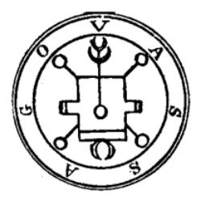

> 本文由 [简悦 SimpRead](http://ksria.com/simpread/) 转码， 原文地址 [www.zhihu.com](https://www.zhihu.com/question/563442550/answer/2869138758) 桐生院幸直

　　“媚宅” 没有标准，是一个恶意构陷阿宅的词。

　　因为阿宅不仅喜欢美少女，阿宅或部分阿宅还喜欢以下事物：

　　巨大机器人、电车及其它工程器具、枪支、坦克、战斗机、舰船、假面骑士、超级战队、光之美少女、昆虫、天竺鼠车车、猫及其他动物、动物拟人、天体、游戏机、游戏机拟人化、R18 及其他 R18G 标签等。

　　但没人说高达媚宅，没人说 black sun 最后一话致敬 blackOP 媚宅，没人说天竺鼠车车媚宅，没人说无用男搞厄介大会是媚宅。

　　为什么呢？因为这个词是个 “构陷”，臆造出这个词的人不知道为什么宅男喜欢巨大机器人，不知道宅男为什么喜欢天竺鼠车车，不知道为什么宅男喜欢用浑浊的声音喊家虎。他们只是想批判罢了。