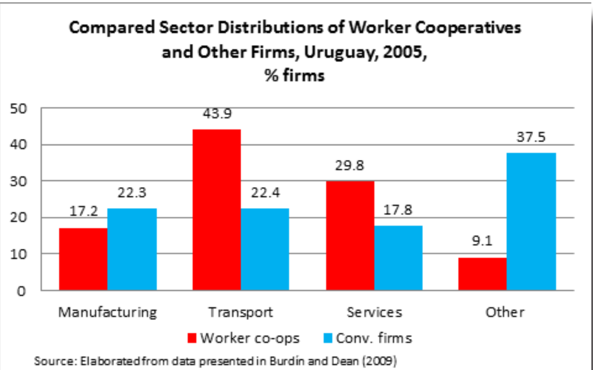

> 本文由 [简悦 SimpRead](http://ksria.com/simpread/) 转码， 原文地址 [www.zhihu.com](https://www.zhihu.com/question/566821532/answer/2794997937) F-Hreinskilin​

我们对工人合作社真正了解多少？
---------------

作者：Virginie Pérotin[1](1)(#ref_1) 译者 (采用机器翻译)：我。

引言
--

员工可以经营公司的想法对许多人来说听起来不现实。即使他们接受由员工拥有和管理的企业存在，大多数人仍然认为这些企业不算企业。工人合作社传统上被视为小型、专业化和资本不足的组织。人们普遍认为，它们在不寻常的条件下茁壮成长，不可能成为传统企业的严肃替代品。长期以来，许多基于经济理论和相对有限的实证观察来研究劳动力管理企业的经济学家都认同这一观点。

在过去二十年中，关于工人合作社和传统公司的大型代表性样本或总体性的数据越来越多。因此，越来越多的国际经济研究提出了对这两类公司的比较分析，并且，这些研究和数据提供了关于公司特征和行为的大量资料。所以，本文根据这些研究提供的信息和其他汇总数据检验了之前被人们所接受的关于工人合作社的观点是否得到了证实。国际上关于薪酬和雇佣行为、生产力、投资和传统企业和工人合作社企业生存的研究结果也被回顾。有人认为，这些不同类型的证据表明，关于工人合作社的普遍观念应该立即得到修正。

本文将工人合作社定义为具有以下特征的企业 [2](2)(#ref_2)：所有或大部分资本由员工单独或集体拥有；各类员工均可成为会员；大多数员工是合作社社员；根据合作原则，每个成员都有一票表决权 [3](3)(#ref_3)，无论他们在企业中投入了多少资本；且会员于年度股东大会上就策略性议题投票，并选举行政总裁。除了对公司事务的基本参与外，公司日常活动的民主程度因公司而异。例如，非常大的合作社往往不那么直接，而是有更多的代议制民主（就像大国那样）。并且，本文中所研究的工人合作社通常是为了利润，尽管利润目标可能会在不同程度上受到成员利益的其他方面的影响，例如就业、社会或道德考虑和目标等。

工人合作社在大多数国家的所有公司中只占很小的比例。然而，它们的数量比通常认为的要多。意大利至少有 2.5 万家工人合作社，西班牙约有 1.7 万家（为约 21 万人提供就业），法国约有 2600 家）约为 5.1 万提供就业），英国约有 500 至 600 家工人合作社。[4](4)(#ref_4)

在下一节中，将介绍工人合作社的规模及其与其他企业的行业分布的描述性统计。关于比较公司的创建和生存模式，资本密集度和投资的国际证据总结在下一节。倒数第二节则简要审查了劳工管理公司和其他公司的比较生产率、就业和薪酬调整的结果。

关于工人合作社特征的新描述性证据
----------------

### 工人合作社一定比其他公司小吗?

也许关于工人合作社最普遍接受的想法是它们必须很小。人们通常认为工人合作社必须在财务上受到限制，小规模有时被认为是工作场所民主发挥作用的条件。标准经济理论还预测， 追求每个成员 利润最 大化的劳动管理企业 在短期内 (尽管不是长期) 将比传统企业规模小 。在这种观点下，劳动力管理的企业不像传统企业那样具有无限增长的动力 ，因为每个成员的最大利润 可能与 规模无关(Vanek 1970, Schweickart 1996)。

人们通常也会说，非常大的工人合作社是极其罕见的。例如西班牙的工人合作组织[蒙德拉贡公司](https://www.zhihu.com/search?q=%E8%92%99%E5%BE%B7%E6%8B%89%E8%B4%A1%E5%85%AC%E5%8F%B8&search_source=Entity&hybrid_search_source=Entity&hybrid_search_extra=%7B%22sourceType%22%3A%22answer%22%2C%22sourceId%22%3A2794997937%7D) (The Mondragon Corporation) 确实在全球雇佣了约 8 万名员工，而英国员工持股的约翰 · 刘易斯合伙公司 (John Lewis Partnership)(运营方式略有不同)[5](5)(#ref_5) 有超过 9.3 万名合伙人员工，但人们通常认为这两家公司可能只是例外。[6](6)(#ref_6) 然而，没有被广泛理解的是，大多数公司实际上都非常小。在至少有一名员工的公司中，约 90% 的公司在英国 (93.7%)、美国(89.6%) 和法国 (90.4%) 的员工不到 20 人，在西班牙的员工不到 10 人 [7](7)(#ref_7)。大公司非常罕见。在拥有员工的公司中，只有 0.3% 的公司在英国和美国拥有 500 名或以上员工，法国为 0.2%，西班牙为 0.1%。

在我们有工人合作社数据的地方，我们观察到合作社实际上比其他公司更大。Pencavel 等人 (2006) 使用了意大利 2000 家工人合作社和 15 万家其他公司的数据，观察了 13 年。他们发现，无论是员工的平均人数还是中位数，合作社都比其他企业大(例如，在样本的最后一年 1994 年，合作社的平均就业人数为 284 人，其他企业为 228 人，两组企业的中位数就业人数分别为 153 人和 72 人)。

类似地，由 Craig 和 Pencavel(1992) 提供的关于美国太平洋西北地区胶合板行业的数据表明，工人合作社比其他公司更大。在他们的提供的数据中，所有公司在整个行业中平均雇用了 233 人，但其中工人合作社平均雇用了 257 名员工。在西班牙，2014 年有所有员工的公司平均雇用了 9.2 名员工，但工人合作社平均雇用了 12.6 名员工。[8](8)(#ref_8)

对于法国和乌拉圭，我们可以比较工人合作社和企业的总体规模分布。使用了 Burdín 和 Dean(2009)提供的乌拉圭所有公司的数据，以及法国统计局 (Insee) 提供的至少有一名员工的公司的数据和法国工人合作联合会 (CG Scop) 提供的数据。图一 (2007 年的法国) 和图二 (2005 年的乌拉圭) 展示了这一信息。在这两种情况下，很明显，与其他企业相比，工人合作社中的微型企业占比更低。合作社多见于规模较大的团体。

2006 年对法国企业规模的更详细的分析显示，如果我们为企业规模选择一个更高的分界点，这种差异仍然存在。在至少有一名员工的法国公司中，0.04% 的公司当年有 2000 名或以上员工。在法国工人合作社中，这一比例为 0.05%(见图 3)。鉴于工人合作社的数量很少，这样的百分比代表了非常少的公司，这就是为什么很少看到大型工人合作社。

由于同样的原因，每年大型工人合作社的百分比可能比大公司的百分比变化更大，如果我们有其他年份的数据，我们很可能会发现，在传统公司中，大公司的百分比有时更高。然而，工人合作社在整体上显然似乎比传统企业大，主要是因为合作社中的微型企业比例较低。法国的更新的信息 (2013 年，如表 1 所示) 显示 [9](9)(#ref_9)，这种分布模式保持不变，在规模较大的集团中，工人合作社的比例远远高于一般公司的比例。250 人以上的工人合作社的比例是 250 人以上的其他企业的两倍以上。

创造规模差异的原因不太可能是合作社更多是由接管他们工作的公司的员工建立的。与其他公司相比，这种渊源在工人合作社中似乎不太常见。原因也许是在许多国家，法律规定，或者直到最近才规定，创建工人合作社的最低人数。这一点，再加上合作社实质上是集体企业这一事实，或许可以解释其初始规模与传统企业的差异。

### 工人合作社与其他公司在不同的行业存在吗?

另一个普遍持有的观点是，工人合作社只适用于特定的行业 (例如，资本密集度低或资本要求低的行业)。人们通常认为，劳动力管理的公司不会在其他行业蓬勃发展，因为，例如，工人合作社可能难以获得资本。也有可能，员工控制更适合于那些技能对公司绩效最重要的行业 (但与此同时，许多人似乎认为，在技能往往至关重要的高科技行业，很少会有工人合作社)。

跟据 Burdín 和 Dean(2009) 的数据，在实践中，大多数行业都有工人合作社。图 5 显示了 2005 年乌拉圭传统企业和工人合作社按广泛部门的比较分布。两者的分布明显不同，按比例来看，运输和服务业的合作企业比传统企业多，而制造业的合作企业较少。在法国，这两类企业的行业分布也不同 (图 6)。然而，与其他公司相比，这些工人合作社更多地出现在制造业，而较少的工人合作社出现在服务业。所以不同国家的差异也不同。

图 7 显示了基于 Clemente 等人 (2012) 提供的 2007 年数据，西班牙工人合作社和传统企业在各个广泛部门的就业份额的比较。该图表与乌拉圭和法国的图表不能直接比较，因为这两个国家使用的是企业份额而不是就业人数，因为各部门的平均规模不同。然而，该数据可以表明这两类公司在西班牙的行业分布与在其他国家的分布相当相似。

给定时间内观察到的企业的行业分布来自于企业在行业中的创新分布以及在每个行业中的生存程度。Arando 等人 (2009) 的研究提供了西班牙巴斯克地区新创建企业的行业分布数据，数据显示，工人合作社与其他企业在制造业 (合作企业的比例高于其他企业) 和一些服务业之间存在一些差异，但在建筑业或金融服务业中，新企业的比例没有或几乎没有差异 (见图 8)。Podivinsky 和 Stewart(2007) 提供的英国 1976—1985 年的数据再次显示了不同的模式，劳动力管理的企业在制造业中创造的比例相对较高，但在建筑业中创造的比例低于相应比例的传统企业(见图 9)。

如果工人合作社只适用于一小部分特殊行业，我们可以预期，在工人合作社在不同行业中的分布方式与其他公司的分布方式相比，不同国家会有一个明确的共同模式。没有任何这样的模式表明，这两组之间的差异更复杂。研究不同因素在创造这些模式中的作用的一种方法是观察行业特征对工人合作社和其他公司的企业创建和生存的影响。

关于企业生存、投资的国际调查结果
----------------

### 企业的创造与生存

Podivinsky 和 Stewart(2009) 利用 20 世纪 80 年代早期的英国制造业数据，研究了解释每个行业中由劳动力管理的新公司比例的因素。他们发现，正如理论预测的那样，在资本密集度高、风险高的行业 (通过该行业的利润差异来衡量)，新创建的公司中工人合作社的比例较低。

研究了乌拉圭的工人管理企业生存状况之后，Burdín(2014)将其归因于资本需求问题，即合作社在服务业比在制造业和运输业的生存优势更大。然而，他并没有发现合作社在这些领域表现不佳。在制造和运输中，这两组的关闭风险是相同的。如果考虑到行业、起始工资、规模和创建年份，工人合作社比其他公司整体生存时间更长，这是因为在其他条件相同的情况下，工人合作社的关闭风险 (危害) 比传统的服务业公司低得多 (Burdín 2014)。Burdín(2014) 的发现与其他国家的不太严谨的证据一致，这些证据表明，劳动力管理的公司至少与其他公司一样生存 (见 Dow 2003 的评论)。工人合作社存活一个多世纪并不罕见。法国的总数据(表 2) 显示，从长期来看，这两类公司的失败率相同，而工人合作社的创造率更不稳定。

劳动力管理公司和其他公司的行业分布之间的一些差异也可能是由于历史因素导致在某些行业中建立了大量合作社。Podivinsky and Stewart(2009)观察到，在 20 世纪 80 年代初，英国劳动力管理的企业创建比总体上的企业创建更集中。在鞋业和服装业以及造纸、印刷和出版行业，创建合作社的比例较高。Estrin 等人 (1987 年) 强调，这两个行业是英国工人管理公司的传统行业。法国传统上也有工人合作社集中在印刷和出版行业，遵循无政府主义合作社的历史传统，在建筑行业作为工人合作社受益于政府合同的优惠待遇。

基于巴斯克地区 (西班牙) 的数据，Arando 等人 (2012) 发现，合作社越多的行业就会形成更多的工人合作社。Pérotin(2006)在法国发现了类似的模式: 更多的工人合作社导致更多的创造。大多数国家缺乏关于工人合作社的信息，这造成了进入的障碍，因为企业家往往不知道合作社是什么，也不知道如何创建合作社。现有的工人合作社提供了一个例子，并向潜在的企业家表明，劳动力管理的公司可以是可行的企业。工人合作社的地理分布也与熟悉劳力管理的公司有关，这些公司有更多的劳力在运作。在有劳动力管理公司的地方，当地银行更有可能熟悉业务形式，合作社本身也可能形成支持机构。在美国、以色列和西班牙，新的工人合作社的创建与该地区现有的同类型公司数量正相关(Conte and Jones 1991, Russell and Hanneman 1992, Russell 1995, Arando et al 2009, Arando et al 2012, Díaz-Foncea 和 Marcello 2015)。

在美国、以色列、法国和西班牙，工人合作创造也比传统的公司创造更明显地反周期 (Conte 和 Jones 1991, Russell 和 Hanneman 1992, Russell 1995, Pérotin 2006, Arando 等人 2009,Díaz-Foncea 和 Marcuello 2015) [10](10)(#ref_10)。失业增加 (Pérotin 2006, Arando et al 2009, Díaz-Foncea 和 Marcuello 2015) 可能会在必要时创造出更多的潜在企业家。它也可能产生机会，因为裁员补贴，有时失业福利可能与一些税收优惠一起用于在一些国家建立新公司，例如在过去几十年的不同时期，在法国和西班牙的情况就符合这一点。

尽管如此，新的合作社似乎并不像之前假设的那样，主要源于工人对倒闭企业的救助 (Ben-Ner, 1988 年)。尽管在经济衰退期间，员工的救助收购经常被广泛宣传，但这种组建合作社的方式似乎相对罕见。至少在有数据可查的法国，工人合作社因救助式收购而产生的创新比其他公司要少。

表三显示，1993 年至 2001 年期间，该国新成立的工人合作社绝大多数是从零开始成立的。无论是倒闭的还是健全的企业，由收购而产生的合作社的比例都不到法国企业收购的一半。Insee 现在使用一种不同的方法来衡量公司的创建和收购，该方法将所有新公司的一小部分归因于收购。2014 年，尽管 2008 年金融危机之后出现了经济衰退，但为拯救一家濒临倒闭的传统企业而成立的新工人合作社仅占法国所有新工人合作社的 12%。

尽管与其他公司相比，工人合作社的创建更具反周期性，但工人合作社并没有像 Ben-Ner(1988)所假设的那样，在复苏过程中关闭。至少在法国，商业周期对企业关闭的影响在工人合作社和其他企业中是相同的 (Pérotin 2006)。更普遍地说，现有的证据表明，劳动力管理的公司可以和传统公司一样生存下来。然而，应该指出的是，许多关于生存的证据来自那些建立工人合作社的国家，这些国家的法律没有阻止工人合作社走向经济理论所确定的另外两种失败形式——因向资本主义形式退化而死亡(Ben-Ner 1984, Miyazaki 1984) 或因投资不足而死亡(Furubotn 和 Pejovich 1970, Vanek 1977)。

当成员在合作社员工中的比例下降，直到企业在所有意图和目的上都是一个传统企业时，就发生了退化。如果留在公司的成员用一个非成员员工取代任何离开公司的成员，从而为自己保留更多的利润，就可能发生这种情况 (Ben-Ner 1984)。有许多情况出现了退化和股份化 (合作社在股票市场上上市或出售给传统所有者而变成传统公司)，特别是但不限于美国 (见，例如，Pencavel 2001 年，2013 年)。针对这些问题的规定存在于大多数欧洲工人合作社的宪法中，并经常应合作社运动的要求被引入合作社法。[11](11)(#ref_11) 毫无疑问，Estrin 和 Jones(1992) 在法国没有发现退化的证据。现有证据也不支持经济理论提出的另一个失败假设——投资不足。

### 资本密集度和投资

多项研究发现，工人合作社的平均资本密集度 (即每个员工的固定资产) 低于传统企业 (Bartlett et al ., 1992; Pencavel et al., 2006; Maietta and Sena, 2008)。然而，Pencavel 等人(2006) 发现，在意大利，工人合作社的人均资本中位数更高 [12](12)(#ref_12)。此外，他们发现，与传统企业相比，合作社的资本密集度非常低和非常高的企业比例更高，合作社的资本密集度的分布更分散。例如，在法国，Fakhfakh 等人 (2012) 基于广泛行业群体的调查显示，传统企业的资本密集度在三个行业群体中都高于工人合作社，但在其他四个行业群体中，两类企业的资本密集度在统计上没有显著差异。

投资不足假说预测，由员工集体拥有并依赖内部资金的工人合作社将出现投资不足，因为成员的财产权被截断。当他们离开公司时，他们不会对未来的利润保持要求，因为如果资本市场是有效的，他们的股票会升值并反映未来利润的现值。(Furubotn 和 Pejovich 1970, Vanek 1977)。

针对这一问题提出的解决方案之一是要求合作社每年保留最低比例的利润 (Vanek 1977)。法国和意大利的工人合作社以及蒙德拉贡集团(Mondragon group) 都有这样的规定，所有这些公司的很大一部分资本都是集体所有的。然而，在实践中，工人合作社的利润比要求的要高得多 (Navarra 2013, Alzola 2010)，这可能是在经济衰退时防止失业的一种保险形式(Zevi 2005)。这表明，假设的投资不足过程本身并不与实际情况相吻合。法国工人合作社(Estrin 和 Jones, 1998 年) 和意大利工人合作社 (Maietta 和 Sena, 2008 年) 都没有发现投资不足的证据。在 Fakhfakh 等人 (2012) 观察的所有行业组中，以固定资产年增长率衡量的投资要么在两类企业 (三个行业组) 中相同，要么在合作社 (四个行业组) 中更快。对规模报酬的估计证实了这一模式，没有证据表明劳动力管理的公司像投资不足假说所暗示的那样以更小、更低效率的规模运营(Fakhfakh et al 2012)。

其他国际调查结果
--------

### 生产力

一些国际研究通过估计生产函数 [13](13)(#ref_13)，对工人合作社和其他公司的全要素生产率进行了比较。这些研究关注的是员工拥有的公司群体，它们的成立方式截然不同，因此，合作组织提供的一些财务激励在一个合作组织群体中比在其他合作组织中要强大得多。在美国太平洋西北部胶合板行业 (Berman and Berman 1989, Craig & Pencavel 1995)，成员拥有价值增值且部分可交易的股票。相比之下，在意大利(Estrin 1991, Jones 2007) 和法国 (Fakhfakh et al . 2012)，大部分资本由成员集体拥有，个人股票的股息很低，股票最多按名义价值(最多经通胀调整) 偿还。

在所有情况下，研究结果表明，工人合作社组织生产与其他企业不同: 两个群体的生产函数并不相同。克雷格和 Pencavel(1995)以及 Fakhfakh 等人 (2012) 的两项研究将这两种估计的生产函数都应用于每组企业的当前投入。两项研究都发现，平均而言，企业使用员工拥有的技术可以生产更多的产品。换句话说，工人合作社组织生产的方式更有效率。Fakhfakh 等人 (2012) 表明，在一些行业，如果采用员工拥有的企业组织方式，将可以在目前的就业和资本水平下生产更多的产品。

### 雇佣及薪酬调整

四项研究比较了员工持股公司和其他公司对市场条件变化的反应。Craig & Pencavel(1992,1993) 看看 1968- 1986 年美国太平洋西北地区的胶合板公司; Pencavel et al(2006) 研究了 1982—1994 年意大利传统企业和合作企业的大样本; Burdín 和 Dean(2009) 研究了 1996—2005 年乌拉圭的所有企业 (工人合作社等)。尽管这些国家之间的合作体制存在差异，但他们的发现惊人地一致。

研究发现，传统企业会根据产品价格的变化和需求的冲击来调整就业 (乌拉圭的研究表明，传统企业也会调整薪酬)。工人合作社根据产品价格变化调整工资，而不是就业 (在乌拉圭，只有成员的工资变化，而且这种变化比传统公司的工资变化大得多)。面对需求冲击，合作社对薪酬的调整大于对就业的调整，而合作社对就业的调整比其他企业更缓慢、更有限。这些发现表明，在增长时期，工人管理的公司可能比其他公司雇佣更少的人，但重要的是，在衰退时期，工人管理的公司也可能更好地保持就业。

需要指出的是，从这些结果中不能得出关于工人合作社和其他企业的相对工资和就业水平的结论，因为工资包括了工人合作社的利润。坊间证据还表明，在意大利和法国，当生意不好时，工人合作社首先从积累的留存利润中提取资金，以保住工作和工资，然后再削减工资。因此，这两个部门的相对薪酬水平可能取决于商业周期的阶段。

这种可能的差异性可以解释少数比较工人合作企业和传统企业薪酬的研究的矛盾结果，其中一些研究观察到合作企业的薪酬更高 (Bartlett 1992, Burdín 2015)，而另一些研究则观察到两组企业的时薪相等(Magne 2014)，或者合作企业的时薪较低(Pencavel 等 2006, Clemente 等 2012)。乌拉圭的 Burdín(2015)、法国的 Magne(2014) 以及西班牙的 Clemente 等人 (2012) 在一定程度上也观察到工人合作社比传统企业更平等。

### 结论

在过去的 20 年里，大型比较数据集的可用性使工人合作社和其他公司之间的系统比较成为可能。在本文中，这些数据被用来重新审视到目前为止关于工人合作社的” 程式化事实”。本文提供的证据描绘了一幅截然不同的画面，与人们普遍认为的工人合作社是小型、专业化、资金不足和不太可能的企业的观点截然不同。我们需要修正我们对工人合作社的看法。工人合作社比其他公司更大，资本密集度不一定更低，尽管在其他条件相同的情况下，它们可能比资本密集度较低的行业的其他公司更经常被创建。它们存在于大多数行业，传统公司的行业分布差异因国家而异。

国际证据表明，即使在资本密集型行业，工人合作社至少也能像其他公司一样生存下去。与传统公司相比，由劳动力管理的公司可能更有生产力，在衰退中可能会更好地保留工作岗位，创造更多可持续的就业机会。因此，促进工人合作社可以改善当地社区的就业，从而改善卫生和社会支出及税收收入 (Pérotin 2014)。

工人合作社最不寻常的特征 - 工人控制 - 可能是解释这里概述的关于生产力、投资、就业和薪酬的发现的关键。员工控制被认为可以提高生产力，在一个由劳动力管理的公司里，调整工资以保住工作对员工所有者来说是有意义的。工人成员做出调整工资的决定，他们获得了未来的利润 (然而，对于传统的公司来说，诱使员工同意减薪以换取保住工作是更困难的，因为公司的所有者有动机在业务恢复时不增加工资)。

在工人合作社工作可能特别有价值，因为在这种工作中，员工对影响就业风险的决定有发言权。员工对工作保障的关注可能解释了工人合作社通过分享利润而积累集体所有资本的原因，这些员工对利润的分享远远超过了意大利和法国法律所要求的最低限度，或者在蒙德拉贡的合作社公约中规定的最低限度。这些储备可以用来维持工资和就业。因此，工人在工人合作社中可以比传统企业在企业中保持更多的利润 (Zevi 2005)。

本文提出的一些证据涉及需要进一步复制的少数国家或商业周期中的特定阶段。然而，它一致地表明，工人合作社不仅是一种只适合于特殊情况的商业形式，而且是一种严肃的替代方案──一种适用于所有或非常广泛的行业的高绩效企业类型，而且可能比传统企业更可持续。然而，工人合作社只占商业部门的很小一部分，因为创建的工人合作社太少了。为了设计克服这一障碍的战略，我们需要更深入地研究意大利和西班牙的成功经验，那里的工人合作部门达到了与英国和法国部门完全不同的规模，雇佣了数十万人。

参考资料
----

1.  Alzola, Izaskun, Saioa Arando, Fathi Fakhfakh, Fred Freundlich, Mónica Gago, Virginie Pérotin, and Alberto Zevi, “Are Labour-Managed Firms All the Same? A Comparison of Incentives for Growth, Democracy and Institutional Sustainability in the Constitutions of Worker Co-operatives in Mondragon, Italy and France”, Paper presented at the 15th World Congress of the International Association for the Economics of Participation (IAFEP) Paris, France, July 2010.
2.  Arando, Saioa, Iñaki Peña and Ingrid Verheul, “Market entry of firms with different legal forms: An empirical test of the influence of institutional factors”, International Entrepreneurship and Management Journal, 5, 2009, 77–95.
3.  Bartlett, Will, John Cable, Saul Estrin, Derek C. Jones, and Stephen C. Smith, “Labor-Managed and Private Firms in North Central Italy: An Empirical Comparison”, Industrial and Labor Relations Review, 46(1), 1992, 103–18.
4.  Ben-Ner, Avner, “The life cycle of worker-owned firms in market economies: A theoretical analysis”, Journal of Economic Behavior & Organization 10 (3), 1988, 287-313.
5.  Ben-Ner, Avner, “On the Stability of the Co-operative Form of Organization”, Journal of Comparative Economics, 8(3), 1984, 247-260.
6.  Berman, Katrina V, and Matthew D Berman, “An Empirical Test of the Theory of the Labor-Managed Firm”, Journal of Comparative Economics, 13, 1989, 281–300.
7.  BIS (Department for Business, Innovation and Skills). Business Population Estimates for the UK and Regions 2012, BIS/12/92, Oct. 2012, available at [https://www.gov.uk/government/statistics/bisbusiness-population-estimates](https://link.zhihu.com/?target=https%3A//www.gov.uk/government/statistics/bisbusiness-population-estimates).
8.  Burdin, Gabriel, “Are worker-managed firms less likely to fail than conventional enterprises? Evidence from Uruguay”, Industrial and Labor Relations Review, 67 (1), 202-238, 2014.
9.  Burdín, Gabriel, “Equality under threat by the talented: Evidence from worker-managed firms”, Economic Journal, 2015, DOI: 10.1111/ecoj.12272.
10.  Burdίn, Gabriel, and Andrés Dean, “New Evidence on Wages and Employment in Worker Cooperatives Compared with Capitalist Firms”, Journal of Comparative Economics, 37, 2009, 517–33.
11.  CG Scop (Confédération générale des SCOP). Les chiffres-clés, 2014, available at [http://www.lesscop.coop/sites/fr/les-chiffres-cles/](https://link.zhihu.com/?target=http%3A//www.lesscop.coop/sites/fr/les-chiffres-cles/).
12.  Clemente, Jesús, Millán Díaz Foncea, Carmen Marcuello and Marcos Sanso Navarro, “The wage gap between co-operative and capitalist firms: Evidence from Spain”, Annals of Public and Co-operative Economics, 83 (3), 2012, 337–356.
13.  COCETA (Confederación Española de Cooperativas de Trabajo Asociado). Memoria de Actividades 2012. Madrid: COCETA, n.d., avail. at www.coceta.coop.
14.  Craig, Ben, and John Pencavel, “The Behavior of Worker Co-operatives: The Plywood Companies of the Pacific Northwest,” American Economic Review, 82(5), 1992, 1083–1105.
15.  Craig, Ben, and John Pencavel, “The Objectives of Worker Co-operatives,” Journal of Comparative Economics, 17, 1993, 288–308.
16.  Craig, Ben, and John Pencavel, “Participation and Productivity: A Comparison of Worker Cooperatives and Conventional Firms in the Plywood Industry”, Brookings Papers: Microeconomics, 1995, 121–74.
17.  Díaz-Foncea, Millán, and Carmen Marcuello, “Spatial patterns in new firm formation: Are cooperatives different?” Small Business Economics 44, 2015, 171–187.
18.  Estrin, Saul, “Some Reflections on Self-Management, Social Choice, and Reform in Eastern Europe”, Journal of Comparative Economics, 15, 1991, 349–66.
19.  Estrin, Saul, and Derek C Jones, “The Determinants of Investment in Employee-Owned Firms: Evidence from France,” Economic Analysis, 1(1), 1998, 17–28
20.  Estrin, Saul, and Derek C Jones, “The Viability of Employee-Owned Firms: Evidence from France,” Industrial and Labor Relations Review, 45(2), 1992, 323–38.
21.  Fakhfakh, Fathi, Virginie Pérotin and Mónica Gago, “Productivity, capital and labor in labormanaged and conventional firms”, Industrial and Labor Relations Review, 65 (4), 2012, 847-878.
22.  Furubotn, Eirek G, and Svetozar Pejovich, “Property Rights and the Behaviour of the Firm in a Socialist State: The Example of Yugoslavia,” Zeitschrift für Nationalökonomie, 30(3–4), 1970, 431–54.
23.  Hansmann, Henry. The Ownership of Enterprise. Cambridge, Mass: Harvard University Press, 1990.
24.  INE (Insituto Nacional de Estadística). “Empresas por estrato de asalariados y condición jurídica”, 2015, available at [http://www.ine.es/jaxiT3/Tabla.htm?t=299](https://link.zhihu.com/?target=http%3A//www.ine.es/jaxiT3/Tabla.htm%3Ft%3D299)).
25.  Insee (Institut national de la Statistique et des Etudes économiques). “Unités légales selon le nombre de salariés et l’activité en..”, Table NATTEF09203 (Tables for 2007, 2009 and 2013) Sirene, REE, 2015 available at [http://www.insee.fr/fr/themes/tableau.asp?ref_id=nattef09203](https://link.zhihu.com/?target=http%3A//www.insee.fr/fr/themes/tableau.asp%3Fref_id%3Dnattef09203).
26.  John Lewis Partnership, 2015, [http://www.johnlewispartnership.co.uk/about.html](https://link.zhihu.com/?target=http%3A//www.johnlewispartnership.co.uk/about.html).
27.  Jones, Derek C, “The Productive Efficiency of Italian Producer Co-operatives: Evidence from Conventional and Co-operative Firms,” in Sonja Novkovic and Vania Sena (eds.), Advances in the Economic Analysis of Participatory and Labor-Managed Firms. Vol. 9, Co-operative Firms in Global Markets: Incidence, Viability and Economic Performance, 2007, pp. 3–28.
28.  Magne, Nathalie, “Wage inequality in French worker co-operatives versus conventional firms”, paper presented to the congress of the European Association for Comparative Economic Studies, Budapest (Hungary) 2014.
29.  Maietta, Ornella Wanda, and Vania Sena, “Shadow price of capital and the Furubotn–Pejovich effect: Some empirical evidence for Italian wine co-operatives”, Applied Stochastic Models in Business and Industry,24, 2008, 495-505.
30.  Ministerio de Empleo y Seguridad Social. Avance. –Resumen Situación Empresas de Economía Social y sus Trabajadores en Situación de Alta en la Seguridad Social, 31 Dec 2014, available at [http://www.empleo.gob.es/es/sec_trabajo/autonomos/economia-soc/EconomiaSocial/](https://link.zhihu.com/?target=http%3A//www.empleo.gob.es/es/sec_trabajo/autonomos/economia-soc/EconomiaSocial/) estadisticas/SociedadesAltaSSocial/2013/indice.htm.
31.  Miyazaki, Hajime, “On Success and Dissolution of the Labor-Managed Firm in the Capitalist Economy”, Journal of Political Economy, 94(5), 1984, 909-931.
32.  Mondragon Corporation. Experiencia cooperativa / FAQs, 2015 available at [http://www.mondragon-corporation.com/experiencia-cooperativa/faqs/](https://link.zhihu.com/?target=http%3A//www.mondragon-corporation.com/experiencia-cooperativa/faqs/).
33.  Navarra, Cecilia, “How do worker co-operatives stabilize employment? The role of profit reinvestment into locked assets”, WP 1307, Department of Economics, Namur University, 2013.
34.  ONS (Office for National Statistics). “Analysis showing the count of VAT and/or PAYE based enterprises in the United Kingdom by UK SIC 2007”, provided at the author’s request on 31 March 2015.
35.  Pencavel, John, “Worker Co-operatives and Democratic Governance”, in Anna Grandori, ed., Handbook of Economic Organization (Northampton, Mass: Edward Elgar, 2013).
36.  Pencavel, John, Worker Participation: Lessons from the Worker Co-ops of the Pacific Northwest. New York, NY: Russell Sage Foundation, 2001.
37.  Pencavel, John, Luigi Pistaferri and Fabiano Schivardi, “Wages, Employment and Capital in Capitalist and Worker-Owned Firms,” Industrial and Labor Relations Review, 60(1), 2006, 23–44.
38.  Pérotin, Virginie, “Worker Co-operatives: Good, Sustainable Jobs in the Community”, Journal of Entrepreneurial and Organizational Diversity, 2 (2), 2014, 34-47.
39.  Pérotin, Virginie, “Entry, Exit and the Business Cycle: Are Co-operatives Different?” Journal of Comparative Economics, 34, 2006, 295–316. Schweickart, David. Against Capitalism. Boulder, Col.: Westview Press, 1996.
40.  Staber, Udo, “Age-Dependence and Historical Effects on the Failure Rates of Worker Co-operatives: An Event-History Analysis,” Economic and Industrial Democracy, 10, 1989, 59–80.
41.  US Census Bureau. Statistics of US Businesses (SUSB), Main, 2015, available at [http://www.census](https://link.zhihu.com/?target=http%3A//www.census). gov/econ/susb/
42.  Vanek, Jaroslav, The Labor-Managed Economy. Ithaca, NY: Cornell University Press, 1977. Vanek, Jaroslav. The General Theory of Labor-Managed Market Economies. Ithaca, NY: Cornell University Press, 1970.
43.  Zevi, Alberto, “Il finanziamento delle co-operative,” [The financing of co-operatives] in E Mazzoli and S. Zamagni, Verso una nuova storia della cooperazione [Towards a new history of cooperation], Bologna (Italy), Il Mulino, 2005, 293–332.

参考
--

1.  [^](#ref_1_0)Virginie Pérotin 是利兹大学商学院 (Leeds University Business School) 经济学教授，专门研究企业所有权和治理对绩效、工人合作、员工所有权和利润分享的影响。此前曾在国际劳工局、伦敦经济学院和法国总理办公室 Coûts (CERC)担任学术和研究职务。Pérotin 教授还曾担任欧盟委员会、世界银行和经合组织的利润分享、员工所有权和员工参与计划等问题的顾问。
2.  [^](#ref_2_0)In this paper I use interchangeably the terms “worker co-operative”, “labour-managed firm” and “em- ployee-owned firm” unless otherwise specified in the text.
3.  [^](#ref_3_0)By this definition, a law practice for example is not a worker co-operative even if all the lawyers are part- ners, unless the other staff categories, such as secretaries, cleaners, etc can also be members. This is an important difference with the view proposed by Hansmann (1990).
4.  [^](#ref_4_0)The estimate for Italy was communicated to the author by Alberto Zevi in 2012. The estimate for Spain includes the cooperativas de trabajo asociado (16,664 is given for 2012 by the Confederation of Spanish worker co-operatives in COCETA (n.d.) but not sociedades laborales, in which employees own at least 51.01% of the capital but voting is proportional to capital. In 2013 there were 11,322 sociedades laborales (Ministerio de Empleo y Segu- ridad Social 2014). The French figure is for 2013 and includes 2,040 sociétés coopératives et participatives or SCOPs and 212 sociétés coopératives d’intérêt collectif, or SCICs (CG Scop 2014). The UK estimate includes firms that identify themselves as workers’ co-operatives and other employee-owned firms that meet the definition provided in this paper.
5.  [^](#ref_5_0)The John Lewis Partnership has more than 93,000 permanent employees or “partners” but has a unique constitution organising the sharing of power between senior management and the other employees (see John Lewis Partnership, 2015).
6.  [^](#ref_6_0)Only 40.3% of Mondragon’s employees are members, though the percentage is considerably higher in the birthplace of the group in the Spanish Basque country (Mondragon’s rapid growth in the last two decades has resulted in a current structure that includes 289 non-co-operative subsidiaries and 110 co-operatives; the group has engaged in a “cooperativization” process for some of the non-co-operative parts of the group (see Mondragon Corporation 2015).
7.  [^](#ref_7_0)Unless otherwise specified, aggregate figures in this section come from the author’s computations from data provided respectively for the UK by the ONS (2015) concerning 2014 and for large firms by BIS (2012) con- cerning 2012; for the US by the US Census Bureau (2015) for 2012; for France by Insee (2015) for 2013 except for the share of firms with less than 20 employees, which concerns 2007; and for Spain by INE (2015) for 2014.
8.  [^](#ref_8_0)The averages are for firms registered with the Seguridad Social system (Ministerio de Empleo y Seguri- dad Social 2014). Only about half of worker cooperatives belong to this system, with the others operating under a different regime (autónomos). However, the figure for total employment in worker cooperatives given by COCETA ( n. d.) seems to use the average size for Seguridad Social worker cooperatives
9.  [^](#ref_9_0)Figures computed from data provided by INE (2015) and Ministerio de Empleo y Seguridad Social (2014). Data from the same source indicate that the initial average number of members for newly created sociedades laborales is identical to that of worker cooperatives. However, the average size of all sociedades laborales (six people) is smaller than that of worker cooperatives, perhaps because the cooperatives are older on average—the sociedad laboral is a recent business form, which only took off in the late 1990s.
10.  [^](#ref_10_0)Udo Staber (1989) finds no evidence of counter-cyclicality for worker cooperative creations in Atlantic Canada, but the methodology used in that paper is less solid.
11.  [^](#ref_11_0)Examples of provisions against degeneration problems include the following: in the Mondragon worker co-operatives, at least 75 per cent of workers must be members; in France, profit is shared with non-members as well as members; and in Italy, tax incentives lead many worker co-operatives to distribute surplus in the form of wage increases--which also benefit non-members--and retain all the resulting profit in the firm (Alzola et al 2010). In France as in the UK, Italy and Spain, worker co-operatives also have traditionally had an “asset lock” by which in case of closure the net assets of the co-operative devolve to another co-operative, a co-operative institution or a charity.
12.  [^](#ref_12_0)Fifty per cent of firms have less capital per employee than the median value, and fifty per cent have more.
13.  [^](#ref_13_0)Total factor productivity is the productivity of the firm taking into account the firm’s capital as well as its labour. These studies estimate the difference in production between the two types of firms once the firms’ employ- ment, capital, industries and other relevant factors are taken into account.